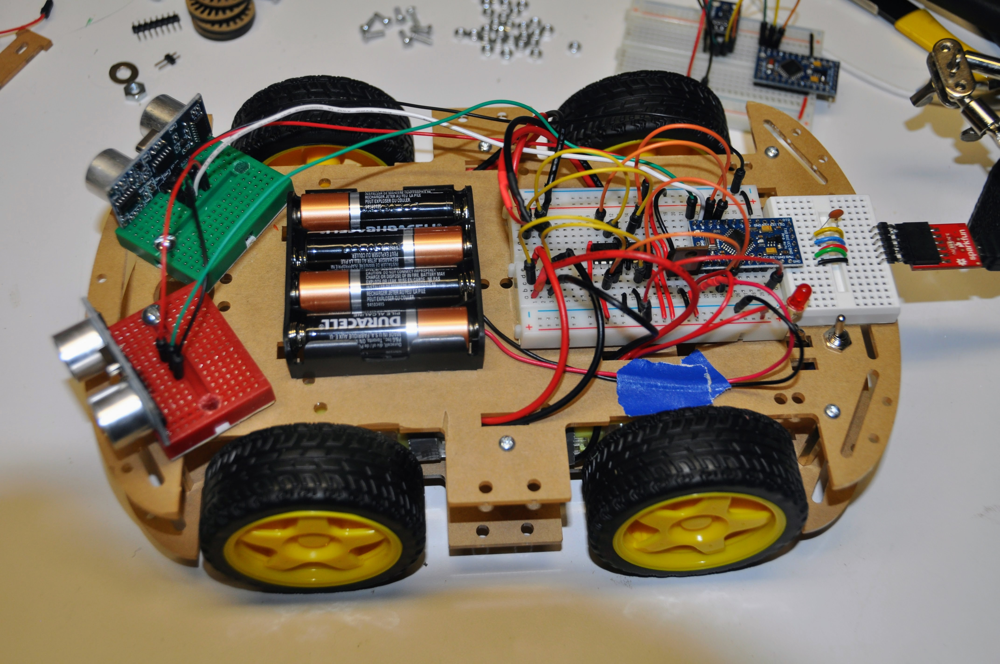
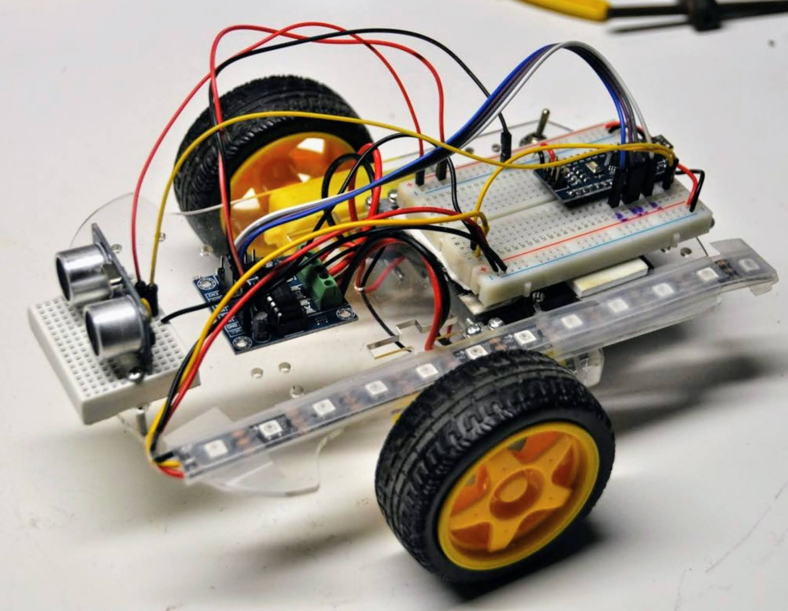

# About the STEM Robotics Program


This site was created to provide low-cost
yet fun ways that our students can learn computational thinking.
Over many years of organizing coding clubs, we have that kids
love robots!  When designed thoughtfully, robots combine
motion, color, sounds and displays that engage students
more than any other teaching tool we have tested.

But in the past, even simple robots offered by retailers
and promoted by commercial companies were designed first
to increase their stockholder value and second to
provide learning value.  A typical price for a retail
robot kit is $370.  They often justify this cost because
they claim that the lesson plans and program examples
took millions of dollars to create.  But generative
AI is changing this.  Today we have tools that can
generate customized lesson plans including working
programs for a small fraction of these costs.

We have heard many stories of schools that can't afford to give
each student their own robot.  But at $19 per robot, we can enable
many schools to dramatically decrease the robot-to-student ratios.

This site started in 2014 with our experiments on watching kids use
these projects.  Every year we would make small changes to increase
the fun and lower the cost.  We are convinced you don't need to spend
hundreds of dollars per robot to create a fun and engaging experience
that provides a measurable improvement in STEM engagement and interest in coding.

## Metrics for a Great STEM Robotics Curriculum

We use ChatGPT to come up with a way to measure the value of a STEM robotics
system.  Here is the prompt:

```linenums="0"
Our school is fed up with vendors trying to sell us $350 STEM
robots kits that use cheep parts and batteries that are not
replaceable. How can we come up with a simple set of objective
measures to rate the quality of STEM robots?  Include the
quality of instruction manuals and curriculum that can be
customized to the needs of teachers, volunteers and students.

Return the results in markdown level three headers.
```

Here is the response:

Developing objective measures to evaluate the quality of STEM robots, including the quality of instruction manuals and customizable curricula, is a great way to ensure value for money and educational effectiveness. Here are some key criteria you could consider:

### Hardware Quality

-   **Durability:** Assess the robustness of the robot's construction. Are the materials used sturdy enough for repeated use by students?
-   **Modularity:** Consider whether parts can be easily added or removed, which can aid in teaching different levels of complexity.
-   **Battery Life and Replacement:** Check the battery life per charge and ensure that batteries are replaceable and reasonably priced.
-   **Sensor and Actuator Quality:** Evaluate the performance and reliability of sensors and actuators, as these are crucial for the functionality of the robot.

### Cost Effectiveness

-   **Initial Cost vs. Part Quality:** Compare the cost of the robot with the quality and longevity of the components used.
-   **Maintenance Costs:** Consider long-term costs related to maintenance, part replacement, and upgrades.
### Ease of Use

-   **User-Friendly Design:** Is the robot easy to assemble and disassemble? This is important for younger students or those new to robotics.
-   **Documentation:** Look for clear, comprehensive, and well-organized instruction manuals that cater to different skill levels.
### Educational Value

-   **Curriculum Integration:** Evaluate how well the robot's features align with educational standards and curricular goals. Can it be integrated into subjects beyond technology, such as math, science, or arts?
-   **Progressive Learning:** Does the robot offer different levels of complexity for varied learning stages? This is essential to cater to both beginners and advanced students.
-   **Problem-Solving and Creativity:** Assess if the robot challenges students to solve real problems and encourages creativity.
### Customizability

-   **Software Customization:** Check if the software can be easily modified or programmed by teachers and students. Support for multiple programming languages can be a plus.
-   **Hardware Customization:** Determine if it's possible to modify or expand the hardware to meet different teaching needs or student projects.
### Support and Community

-   **Technical Support:** Reliable and accessible customer support is crucial for troubleshooting and guidance.
-   **Community Resources:** A strong user community can provide valuable support and resources such as shared lesson plans, tutorials, and project ideas.
### Feedback and Reviews

-   **User Feedback:** Gather feedback from other educators who have used the robots. User reviews can provide insights into reliability, usability, and educational impact.
-   **Pilot Testing:** Consider conducting a pilot test with a few robots in your school to see how they perform in real educational settings and gather firsthand feedback.

By establishing a rubric based on these categories, your school can systematically evaluate different STEM robots and select those that offer the best learning potential and value for money. This approach not only helps in making informed purchasing decisions but also supports the educational goals of your STEM programs.

## Why We Built This Website: Our Journey


Our journey to build an awesome STEM robotics website began with a simple
[blog post](https://datadictionary.blogspot.com/2014/10/motors-for-arduino-labs.html)
back in 2014 about repairing the motors in our old Arduino kits.  
Our insight was that by using a simple cable tie and some heat shrink, we prevented the
kids from breaking the wires to our motors.  This little change
lowered the frustration of broken kits
and allowed our labs with motors to be reliable.  Sometimes little changes
make a big difference.

We started wondering if other schools were also having these problems.  Why
didn't the people who supplied these kits realize how fragile the parts were?
Why did they skimp on quality and cause their kits to break so easily?

This was the first step on our journey.

## Our First Robot



Yes, kids love color and motion!  Robot classes were usually the first classes to get
full.
However, we were frustrated by the closed [Finch Robots](https://datadictionary.blogspot.com/2014/11/robot-kits-for-coderdojo-labs.html) and [here](https://store.birdbraintechnologies.com/collections/finch-robot/products/finch-robot-rohs-compliant) that were unreliable and had no
way to extend motors and sensors.
So we thought about building our own robot.

We did some research and ordered some random parts from
Amazon.  We used a four-motor chassis, a $35 Arduino Uno and a motor controller. 
It turns out that we only needed two motors by the way.
The total price was almost $70.  But our students loved the way we
had a breadboard on the top so they could add their own lights and sensors.
It was a hit!  But looking back, all those wires were difficult for the
kids to get right.  Pulling one wire out would make the robot
stop working.

## The Uno Robot: Cutting Costs and Increasing Content



After talking to several others in the Minnesota Arduino club
we came across a relatively low-cost Arduino Nano that could
be mounted directly on the breadboard.  The [Uno Robot](https://datadictionary.blogspot.com/2015/01/30-coderdojo-robot-version-3.html) was only about $30
and was far more extensible than any of the commercial robots
schools were buying!  We also started putting our
[lesson plans](https://dmccreary.github.io/coderdojo-robots/arduino/00-intro/)
on GitHub to make it easier for other organizations to
reuse our content.

But the Arduino Uno ecosystem was not kind.  The lower-cost
Arduino Uno chips used a driver that was not supported
and each new release of the MacOS would make our drivers
difficult to install.  It required admin rights to install
software and it was impossible for our students to
use some of their home computers.  Despite frequent
posts to the Arduino community, nothing was done because
the drivers were not supported and they wanted us to
pay $35 for the official Arduino hardware.  We were
looking for options.  We also wanted to use
Python which had become the de facto first language
for most high schools  The change finally happened
in [January 2021](https://www.raspberrypi.com/news/raspberry-pi-silicon-pico-now-on-sale/)!

## The Switch to Raspberry Pi Pico and MicroPython


The announcement of the [Raspberry Pi Pico](https://dmccreary.medium.com/how-a-small-charity-is-upsetting-the-trillion-dollar-silicon-chip-industry-ad8062e8c627) rocked
our world.  Not only was it only $4, but it also
fit right on our breadboard!  It ran MicroPython
and had the massive support of the entire Raspberry
Pi Foundation behind it.  We knew we had a solid
partner who would not try to hijack our education
to line the pockets of their shareholders.

By [May of 2021](https://dmccreary.medium.com/sustainable-classroom-robots-ea2399bb7abc)
we had started to upgrade old Arduino Nano robots to
the Raspberry Pi Pico.  We had a robot that had over 100 times as much
RAM and cost 1/8 of the Arduino UNO!

By [June of 2021](https://dmccreary.medium.com/raspberry-pi-pico-robot-in-micropython-51f956486270) we were sending
out robot kits to our COVID-era students in their homes.

Much of the content for this site has migrated from
the amazing [MicroPython for Kids](https://www.dmccreary.github.io/micropython/)
website.  Although there is a lot of useful content
on that site, some of our most popular STEM robot
content has got buried deep within the [Kits](https://www.dmccreary.github.io/micropython/kits/maker-pi-rp2040-robot/) structures.  So we decided that
the STEM robot really needed its own separate site.  Our
site will still link to the relevant pages on that site.

The Raspberry Pi Pico was not perfect.  Because the pin
labels were on the bottom of the board we could not
read any of them when they were on the breadboard.
This little "oversight" cause endless hours of headache
by forcing us to put colored marks on all our breadboards
and print out pin diagrams.  But wait.  There is more!

## The Cytron RP2040 Board


The next big advance came from a brilliant engineer from Malaysia
who worked at Cytron.  He developed the
[Cytron Maker Pi RP2040](https://dmccreary.medium.com/the-cytron-maker-pi-rp2040-robotics-board-b1dc7f0eab34).
This $12 board is so complete that has entirely changed
the ease of use of our robots.  Everything we need
is included on the board including buttons and LED
to test motor connections, a speaker and user
programmable buttons. WOW!  Now students
had far fewer wires to connect and fewer things
that could go wrong.  We have eliminated
all the need for soldering.  We could now spend more time
learning to code and teach computational thinking.

## The Time of Flight Sensor


The last small addition to our robot was to
upgrade the front distance sensor from the
old and fragile ultrasonic ping distance
sensor to the new shiny [time-of-flight sensor](https://dmccreary.medium.com/a-3d-printed-mount-for-time-of-flight-distance-sensor-8acea5480709).
This sensor uses the I2C bus and has both accuracy
and response times that are far better then
the ultrasonic sensors.  They are also about
the same price - about $3 each.

## The Rise of Generative AI

In December of 2022, ChatGPT rocked the world by
being able to generate large blocks of high-quality 
content just by giving it a small prompt.
Although we had been writing about [generating
lesson plans since 2020](https://dmccreary.medium.com/using-al-to-generate-detailed-lesson-plans-29a5af200a6a),
many people ignored us.  But after ChatGPT came out
everything changed.  We were teaching classes
on how to [generate highly personalized lesson plans](https://dmccreary.medium.com/chatgpt-brings-us-closer-to-the-diamond-age-b1469bee4949)
for not just STEM robotics classes but for many
other topics in schools.

## Adding MicroSims


We can also use Generative AI to create online simulators
to help our students visualize what is going on
within our robot.  For example, many
students have a difficult time visualizing how
pulse-width modulation works.  This
simple [MicroSim](https://editor.p5js.org/dmccreary/sketches/xaNSzbNLS) is allowing us to
[hyper-personalize](https://dmccreary.medium.com/genai-is-hyper-personalizing-education-e28019027944) both
lesson plans as well as interactive simulations that
are generated by teachers and run in your browser.

We now have also included sample Python scripts so
that you can generate high-quality lesson plans
on many topics in the course for any grade level.

## Conclusion

Here is a summary of what we learned:

1. Open systems are more sustainable
2. Vendors focus on selling you new robots, not building maintainable STEM robots
3. Using interchangeable parts will lower your maintenance and repair costs
4. Teach breadboarding skills early
5. Python rocks
6. Generating lesson plans, sample code, and simulations is revolutionizing STEM robots
7. Invest in your community and support open-source content

Good Luck!


