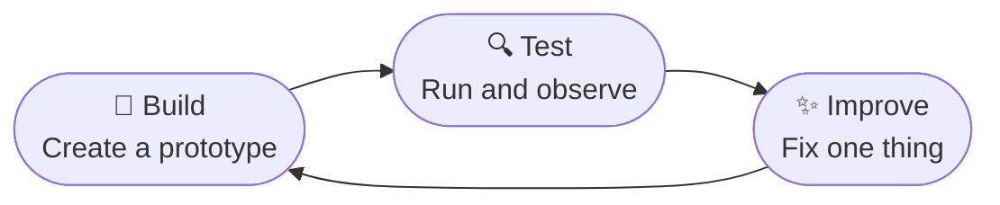

# Introduction to Computational Thinking and Physical Computing

!!! mascot-welcome "Hi — I'm Sparky, and I'll be with you all the way!"
    { class="mascot-admonition-img" }
    I'm **Sparky** — a cartoon version of the actual two-wheeled robot you will build in this course. I run on a Cytron Maker Pi RP2040 microcontroller, I have two big yellow wheels and an OLED display for a face, and I am genuinely excited to help you learn. I will pop into every chapter, but I do not show up randomly. I have exactly **six jobs**, and you will learn to recognize me by which one I am doing:

    1. **Welcome you** at the start of every chapter — that is what I am doing right now.
    2. **Think with you** when a concept is the kind that rewards slowing down and really picturing it.
    3. **Give you a tip** — the practical shortcut a working engineer would use but nobody writes down.
    4. **Warn you** about the exact spots where smart students trip up, so you can dodge the same pitfalls.
    5. **Encourage you** when a section is genuinely hard and it is completely okay to feel confused.
    6. **Celebrate with you** at the end of each chapter when you have earned it.

    That's it. If I'm not doing one of those six things, I'm not in the chapter. Computational thinking is YOUR superpower — let's activate it!

## Summary

This opening chapter establishes the intellectual foundation for the entire course.
Students learn the four pillars of computational thinking — abstraction, algorithm
design, decomposition, and pattern recognition — and discover how these ideas connect
to building and programming physical robots. The chapter also introduces the
engineering design process and basic electronics concepts (voltage, circuits, batteries)
that underpin every subsequent hands-on lab.

## Concepts Covered

This chapter covers the following 17 concepts from the learning graph:

1. Computational Thinking
2. Abstraction
3. Algorithm Design
4. Decomposition
5. Pattern Recognition
6. Problem Solving Strategy
7. Debugging Fundamentals
8. Testing and Iteration
9. Physical Computing
10. Experiential Learning
11. Voltage and Current
12. Basic Circuits
13. Smart Car Chassis
14. AA Batteries
15. Engineering Design Process
16. Build-Test-Improve Cycle
17. Prototyping Methods

## Prerequisites

This is the first chapter of the textbook. It assumes only the prerequisites listed
in the [course description](../../course-description.md): basic familiarity with a
keyboard and web browser.

---

## What Is Computational Thinking?

Imagine you need to get a robot from one side of a room to the other without hitting any walls. You can't just wave your hands and hope for the best. You need a plan. You need to think step by step. You need to predict what could go wrong.

That kind of careful, structured thinking has a name: **computational thinking**. Computational thinking is a way of solving problems that works everywhere — not just in robotics. Doctors use it to diagnose illness. Architects use it to design buildings. Scientists use it to study the natural world. And you are going to use it to make a robot move, sense its surroundings, and make decisions.

Computational thinking has four key pillars. Think of them as four mental tools you carry in your engineering toolbox. Let's look at each one using a simple challenge: *How do we make a robot drive forward, stop before hitting a wall, and try again in a different direction?*

### Decomposition: Breaking Problems Apart

**Decomposition** means taking a big problem and cutting it into smaller, manageable pieces. Big problems feel overwhelming. Small problems feel solvable.

Our robot challenge seems huge at first: *drive, detect walls, avoid them, keep going*. But decomposition helps us split it into just three tasks:

1. Make the motors spin forward.
2. Read the distance sensor every tenth of a second.
3. If the distance is too small, stop and turn.

Now each piece is something we can actually code. That is the power of decomposition.

### Abstraction: Hiding What Doesn't Matter

**Abstraction** means focusing on what matters and ignoring details that don't. When you drive a car, you press the gas pedal — you do not think about how the fuel injectors work. The pedal is an *abstraction* that hides the engine's complexity from you.

In robot programming, we use abstraction constantly. Instead of thinking about exactly which electrical signals flow through which pins, we write `motor_forward(speed=75)`. That one line hides dozens of low-level details. We focus on *what* the robot should do, not *how* the electricity makes it happen.

### Pattern Recognition: Spotting What Repeats

**Pattern recognition** means finding structure that repeats — and using it so you don't reinvent the wheel. Once you know how to read one sensor, you can probably read any sensor. Once you know how to write one loop, you can write any loop.

Patterns show up everywhere in robotics. The sequence "read a sensor, make a decision, move a motor" appears in collision avoidance, line following, and light tracking. Spot the pattern once and you understand all three behaviors.

### Algorithm Design: Writing the Steps

An **algorithm** is a precise set of steps that solves a problem. The word sounds intimidating, but you already know algorithms. A recipe is an algorithm. Directions to a friend's house are an algorithm. The steps to tie a shoelace are an algorithm.

In robotics, we write algorithms in MicroPython code. The collision avoidance algorithm might be: *Check distance. If it's less than 20 centimeters, stop the motors, wait half a second, reverse for one second, turn randomly left or right, then drive forward again.* Writing it precisely — so a computer can follow it without guessing — is algorithm design.

Before we continue, let's see how all four pillars work together as a team.

| Pillar | What It Means | Robot Example |
|---|---|---|
| **Decomposition** | Split big problems into small ones | Break "avoid walls" into: sense, decide, move |
| **Abstraction** | Hide details you don't need right now | Use `motor_forward(speed)` instead of pin-level code |
| **Pattern Recognition** | Find and reuse what repeats | The sense → decide → act loop appears in every behavior |
| **Algorithm Design** | Write the exact steps to solve the problem | Write the stop-reverse-turn sequence as runnable code |

!!! mascot-thinking "Hmm, think about this for a second…"
    { class="mascot-admonition-img" }
    Next time you do something in daily life — making breakfast, finding your way around school, packing a bag — try to catch yourself using one of the four pillars. You will be surprised how often your brain already thinks computationally. We're just giving those habits names so we can use them on purpose.

## Problem Solving and Debugging

Knowing the four pillars is great. Applying them to a real problem is where learning actually happens. In this course, you will run into problems every single day. Wires will be loose. Code will have typos. The robot will spin when you told it to go straight. That is not failure — that is engineering.

### A Strategy for Hard Problems

**Problem solving** is the skill of working through a challenge systematically, even when you don't know the answer yet. When you get stuck, it helps to have a plan. Here is a simple strategy used by engineers at every level:

1. **Understand the problem.** What exactly is supposed to happen? What is actually happening instead?
2. **Break it into pieces.** Which part is failing — the hardware, the code, or a specific line?
3. **Form a hypothesis.** Make a guess: "I think the problem is the motor speed value."
4. **Test one thing at a time.** Change only one thing, then check whether it fixed the problem.
5. **Learn from the result.** Whether it worked or not, you now know something you didn't before.

This strategy is a form of the scientific method. It works just as well in a robotics lab as it does in a chemistry lab.

### Debugging: What to Do When Things Break

**Debugging** is the process of finding and fixing errors in code. The word "bug" has been part of programming since the 1940s, when an actual moth got stuck in a computer relay and caused it to malfunction. Today, a "bug" is any error that causes code to behave unexpectedly.

Bugs fall into two main categories. A **syntax error** is a typo or grammar mistake — like a missing colon or a misspelled keyword. Python catches these before your code even runs. A **logic error** is harder to spot: your code runs without crashing, but it does the wrong thing. Logic errors are exactly what the problem-solving strategy above is designed to find.

Before you use the debugging checklist below, here is one mindset shift that will save you hours: every error message is useful information. It is the computer telling you where to look. Never delete your code in frustration. Read the error, narrow it down, and change one thing at a time.

| Debugging Step | Question to Ask | What to Do |
|---|---|---|
| **Read the error** | What does the error say, exactly? | Read it word by word — don't just skim |
| **Find the line** | Which line caused the error? | Go to that line in Thonny |
| **Check the obvious** | Any typos, wrong indentation, missing colons? | Compare to a working example |
| **Add a print statement** | What is the value of each variable? | Print variables at key points to trace the problem |
| **Undo the last change** | Did the code work before your last edit? | Revert that one change and test again |

### Testing and Iteration: Improve Every Time

**Testing** means deliberately checking whether your code does what you intended. **Iteration** means taking what you learned from testing and improving the code. Together, testing and iteration form a loop: build → test → improve → repeat.

The best engineers do not write perfect code on the first try. Nobody does. They write code, test it, find something to improve, fix it, and test again. Each pass through the loop makes the robot a little better.

!!! mascot-tip "Here's a trick that saves me a lot of trouble…"
    { class="mascot-admonition-img" }
    When testing your robot, change only **one thing at a time**. Under pressure it's tempting to fix three things at once. But if you do that and the robot suddenly works, you won't know which fix actually helped — or which of the other changes might cause problems later.

## Physical Computing: Where Code Meets the World

Most computer programs live entirely inside a machine. You type text, click buttons, and see results on a screen. Everything stays digital. **Physical computing** is different — it connects a program to the real, physical world through sensors and motors.

Your robot is a physical computing device. When it reads a distance measurement from its sensor, it converts a physical gap into a number your code can use. When it spins its motors based on that number, it turns a digital decision into a physical action. Code becomes movement.

### Inputs: The Robot's Senses

An **input** is any information flowing from the real world into the robot's computer. Your robot has several inputs:

- The **time-of-flight distance sensor** measures how far away the nearest object is.
- **Infrared line sensors** detect a dark line on a light surface.
- A **bump sensor** detects physical contact with an obstacle.

Every input converts something physical — light, distance, touch — into a number the microcontroller can read.

### Outputs: How the Robot Acts

An **output** is any action the robot takes in the physical world. Your robot's outputs include:

- **DC motors** that spin the wheels forward or backward.
- **NeoPixel LEDs** that display any color.
- The **piezo buzzer** that plays tones.
- The **OLED display** that shows text and graphics.

The robot's microcontroller constantly reads inputs, runs your code, and triggers outputs. That loop — sense, decide, act — is the heartbeat of every robot program you will write.

The diagram below shows how these three layers fit together. Click any component to learn what it does in the physical computing system.

#### Diagram: Physical Computing Explorer

Interactive diagram showing inputs, the microcontroller, and outputs forming the sense-decide-act loop

Type: MicroSim
**sim-id:** physical-computing-explorer 
**Library:** p5.js 
**Status:** Specified

**Learning objective:** Students will *identify* (Bloom L1: Remember) the three layers of a physical computing system — inputs, processor, and outputs — and *explain* (Bloom L2: Understand) how information flows through the sense → decide → act loop.

**Canvas size:** 700 × 380 px, responsive (fills container width on resize)

**Layout:** Three vertical columns separated by animated flowing arrows:

Left column — **Inputs**: Three sensor icons stacked vertically with labels: "Distance Sensor (ToF)", "Line Sensors (IR)", "Bump Sensor". Each icon is drawn as a simple geometric shape with a colored border. All three connect via dashed animated lines flowing rightward.

Center column — **Processor**: A rounded rectangle labeled "Cytron Maker Pi RP2040" with "MicroPython Code" in smaller text inside and a blinking cursor. Color: navy (#1a237e). Animated dashed lines flow in from the left and out to the right.

Right column — **Outputs**: Three output icons with labels: "DC Motors", "NeoPixel LEDs", "OLED Display". Each icon uses the appropriate visual metaphor (spinning wheel, colored dot grid, small screen).

**Interactions:**
- Clicking any input icon highlights it yellow (#f9a825) and opens a tooltip popup stating: the sensor name, what physical phenomenon it measures, and an example reading (e.g., "Time-of-flight sensor: measures reflected infrared light. Example: 24 cm to nearest obstacle.").
- Clicking the center processor box shows: "The microcontroller reads every input, executes your MicroPython code, and decides what outputs to trigger — all in milliseconds."
- Clicking any output icon shows: the output name, what physical action it produces, and an example value (e.g., "DC Motors: spin the wheels. Example: speed=75 means 75% of full power.").
- A "Play Loop" button (bottom-center, created with p5's `createButton()`) starts an animation where orange (#e65100) particles travel along the wire paths from left to right, illustrating the sense → decide → act cycle in motion. Clicking again pauses the animation.

**Visual style:** Bold flat illustration, thick black outlines, transparent background. Tooltips appear as navy (#1a237e) rounded rectangles with white text, positioned adjacent to the clicked element.

Implementation: p5.js sketch with icons drawn programmatically using `rect()`, `ellipse()`, and `line()`. Tooltip divs managed as HTML elements parented to the canvas container. `createButton()` for the Play Loop control. Canvas resizes by calling `resizeCanvas(windowWidth * 0.9, 380)` in `windowResized()`.

### Learning by Building

**Experiential learning** means learning by doing, not just by reading. In this course, you will not just hear about PWM motor control — you will write the code, run it on your robot, and watch the wheels spin. You will not just read about debugging — you will debug real errors in real code and feel genuinely satisfied when they are fixed.

The concepts in this textbook are the same ones found in university robotics courses. But you will understand them deeply because you will feel them happen on the hardware in your hands.

!!! mascot-encourage "This part is tricky. That's okay. You're doing it anyway."
    { class="mascot-admonition-img" }
    The connection between code and physical hardware is the hardest mental leap in this whole course. A number in your code actually makes a motor spin. A spinning motor actually moves a wheel. It feels magical at first. Give yourself permission to find it confusing — it will click, I promise. Every maker goes through this exact moment.

## Electronics Basics

Before you start wiring your robot, you need a mental model of how electricity works. You do not need an electronics degree. But three ideas will unlock everything else: **voltage**, **current**, and **circuits**.

### Voltage and Current

Imagine a water tower sitting on a hill. The height of the water creates pressure that pushes water through pipes. **Voltage** is like that pressure — it is the force that pushes electric charge through a wire. We measure voltage in **volts (V)**.

Now imagine the amount of water actually flowing through the pipe. **Current** is the amount of electric charge flowing per second. We measure current in **amperes, or amps (A)**. More voltage means more push. More current means more charge flowing.

Your robot gets its voltage from AA batteries. Each AA battery provides 1.5 volts. Four batteries connected end to end — called a **series** connection — give you 6 volts total. That 6 volts powers your microcontroller, your motors, and your sensors.

### Basic Circuits

A **circuit** is a complete loop for electricity to travel through. Electricity needs a continuous path from the positive terminal of a power source, through the components, and back to the negative terminal. If the path breaks anywhere — a loose wire, a disconnected plug — no current flows and nothing works.

Think of a circuit like a circular racetrack. The electrons can only keep moving if the track is a complete loop. Break the track anywhere and every car stops. In your robot, every component — the microcontroller, the motors, the sensors, the LEDs — is part of the circuit. When you wire the robot, you are building that racetrack carefully, making sure every connection is solid.

!!! mascot-warning "Heads up — this one tripped me up the first time too."
    { class="mascot-admonition-img" }
    **Always remove the batteries before changing any wires.** Connecting or disconnecting wires while the power is on can cause a **short circuit** — electricity takes a shortcut that bypasses your components. Short circuits can damage the microcontroller board and drain your batteries in seconds. Power off first, wire second, power on last. Every time.

### Your Battery Pack

**AA batteries** are small, cylindrical cells that store chemical energy and convert it to electrical energy. Your battery holder holds four AA alkaline batteries — the standard type found at any grocery store. Four batteries in series gives you 6 volts total to power the entire robot.

When your robot starts acting sluggish or the code behaves strangely, check your batteries first. A nearly-dead battery delivers less voltage than it should. Less voltage means motors spin slower, sensors read incorrectly, and the microcontroller may crash or reset unexpectedly. Fresh batteries fix a surprising number of "mysterious" problems.

## Meet Your Robot: The Smart Car Chassis

The **Smart Car Chassis** is the physical platform your robot is built on. It is a flat acrylic plate with mounting holes for motors, wheels, and a battery holder. The chassis gives your robot its structure — like a skeleton that everything else attaches to.

Your robot is powered by the **Cytron Maker Pi RP2040** board — a microcontroller designed specifically for controlling hardware. It has two DC motor drivers built in, a USB port for programming, and connectors for sensors and servos. It runs MicroPython, which means you program it in Python — one of the world's most popular and beginner-friendly programming languages.

Here is a map of the key components you will use throughout this course:

| Component | What It Does |
|---|---|
| **Cytron Maker Pi RP2040** | The brain — runs MicroPython code and controls all hardware |
| **DC Motors (×2)** | Spin the wheels forward or backward |
| **Yellow Wheels (×2)** | Roll the robot across the floor |
| **Time-of-Flight Sensor** | Measures distance to the nearest obstacle in centimeters |
| **NeoPixel LEDs (×2)** | Display any color — great for status and debugging |
| **Piezo Buzzer** | Plays tones and beeps |
| **Battery Holder** | Holds four AA batteries (6 V total) |

## The Engineering Design Process

Engineers do not sit down and write a perfect plan before they begin. They start with a rough idea, build something quick, test it, see what breaks, and improve it. This structured cycle for turning ideas into working things is called the **engineering design process**.

### Build, Test, Improve

The engineering design process has three core phases, and they repeat in a cycle:

1. **Build** — create a prototype (a quick, working version) of your idea.
2. **Test** — run the prototype and observe what happens. Does it do what you intended?
3. **Improve** — based on what you learned from testing, change one thing and build again.

This **build-test-improve cycle** is exactly what you will follow in every lab. You will never be asked to write a perfect program from scratch. You will always start from a working example, test it on your actual robot, and add one feature at a time.

The diagram below shows how the three phases connect. Click any phase to read what it involves.

### Prototyping Methods

A **prototype** is an early, rough version of something — built quickly to test an idea. In robotics, prototypes come in several forms:

- **Code prototypes** — a short program that tests one single behavior, such as spinning only the left motor.
- **Hardware prototypes** — a quick physical assembly that checks whether components connect and fit correctly.
- **Paper prototypes** — a sketch or diagram of an algorithm on paper before writing any code, to make sure the logic makes sense first.

In this course, you will use all three. Good engineers are not attached to their first prototype. They expect it to change. The goal of a prototype is to learn something — and then use that learning to build a better version.

!!! mascot-celebration "Double thumbs-up! You just built the foundation for everything!"
    { class="mascot-admonition-img" }
    You covered a lot of ground in this chapter. You know the four pillars of computational thinking. You have a strategy for tackling hard problems and debugging broken code. You understand how physical computing connects code to the real world. You know how voltage and circuits work well enough to wire your robot safely. And you have a clear picture of every component on the Smart Car Chassis. That is the complete foundation. You now think like an engineer.
