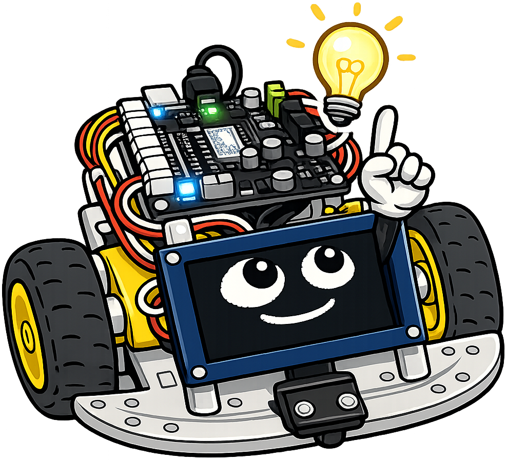

# Display Systems and Visual Output

!!! mascot-welcome "Welcome, maker — let's give your robot a face!"
    { class="mascot-admonition-img" }
    My OLED display is what makes me look alive — those two glowing oval eyes you see are drawn by code. This chapter teaches you how to light me up with color LEDs, draw anything you want on my screen, and show live sensor data as animated charts. Visual output is your robot's way of talking back to you.

## Summary

This chapter gives the robot a visual voice. Students program NeoPixel RGB LED strips
for color sequences and animations, then dive into the 128×64 OLED display: driver
chip, framebuffer model, and drawing primitives (text, lines, circles, rectangles).
Practical projects include bar charts of live sensor data, a scrolling distance meter,
an animated robot face, and a servo position display — all combining the display API
with the sensors and motors from prior chapters.

## Concepts Covered

This chapter covers the following 22 concepts from the learning graph:

1. NeoPixel LEDs
2. WS2816 LED Strip
3. RGB Color Values
4. NeoPixel Library
5. LED Animation
6. LED Status Indicators
7. OLED Display Overview
8. SSD1306 Driver Chip
9. I2C Display Mode
10. SPI Display Mode
11. Display Resolution
12. Framebuffer
13. Blit Operation
14. Display Text Output
15. Drawing Lines
16. Drawing Circles
17. Drawing Rectangles
18. Bar Chart on Display
19. Live Sensor on Display
20. Animated Faces on OLED
21. Distance Meter Display
22. Servo Meter Display

## Prerequisites

This chapter builds on concepts from:

- [Chapter 4: Control Flow, Functions, and Exception Handling](../04-control-flow-functions/index.md)
- [Chapter 5: Data Structures, Modular Programming, and Version Control](../05-data-structures-modular-code/index.md)
- [Chapter 6: Electronics, DC Motors, and Communication Protocols](../06-electronics-motors-protocols/index.md)
- [Chapter 7: PWM, Motor Speed Control, and Actuators](../07-pwm-motor-speed-actuators/index.md)
- [Chapter 8: Sensors and Data Input](../08-sensors-data-input/index.md)

---

## NeoPixel LEDs

A **NeoPixel LED** is a special type of RGB LED that contains a tiny controller chip inside the LED package itself. Unlike a standard LED that you control with voltage, a NeoPixel receives color and brightness commands through a single data wire. This means you can chain many NeoPixels together and control them all from a single GPIO pin.

The Cytron Maker Pi RP2040 has two built-in NeoPixel LEDs connected to GPIO pin 18. You can also attach external NeoPixel strips.

### WS2812B — The Chip Inside

The chip inside each NeoPixel is the **WS2812B** (sometimes listed as WS2816 for certain variants). It receives a serial data stream at a specific timing protocol. You don't need to implement this protocol yourself — the MicroPython `neopixel` library handles it. But knowing the chip name helps when reading datasheets and looking up compatible LED strips.

### RGB Color Values

Each NeoPixel LED has three color channels: **R** (red), **G** (green), and **B** (blue). Each channel takes a value from 0 (off) to 255 (full brightness). Mixing these three channels produces any color.

Before the table, here is the idea: `(255, 0, 0)` means full red, zero green, zero blue — a pure red. `(0, 0, 255)` is pure blue. `(255, 255, 255)` is white (all channels full). `(0, 0, 0)` is off.

| Color | R | G | B |
|-------|---|---|---|
| Red | 255 | 0 | 0 |
| Green | 0 | 255 | 0 |
| Blue | 0 | 0 | 255 |
| Yellow | 255 | 200 | 0 |
| White | 255 | 255 | 255 |
| Off | 0 | 0 | 0 |
| Orange | 255 | 80 | 0 |

### NeoPixel Library

The `neopixel` module is built into MicroPython. Before the code, here is what the parameters mean: `Pin(18)` selects GPIO 18, and `2` is the number of LEDs in the strip.

```python
import neopixel
from machine import Pin
import config

np = neopixel.NeoPixel(Pin(config.NEOPIXEL_PIN), config.NEOPIXEL_COUNT)

# Set LED 0 to red, LED 1 to blue
np[0] = (255, 0, 0)
np[1] = (0, 0, 255)
np.write()   # send the data to the LEDs
```

Always call `np.write()` after setting colors. The colors don't update until you write them.

### LED Animation

**LED animation** means changing the LEDs over time — fading, cycling colors, chasing patterns. A simple color cycle loops through hues:

```python
from time import sleep
import neopixel
from machine import Pin
import config

np = neopixel.NeoPixel(Pin(config.NEOPIXEL_PIN), config.NEOPIXEL_COUNT)

colors = [(255,0,0), (0,255,0), (0,0,255), (255,200,0), (0,200,255)]

try:
    while True:
        for color in colors:
            np[0] = color
            np[1] = color
            np.write()
            sleep(0.3)
except KeyboardInterrupt:
    pass
finally:
    np[0] = (0,0,0); np[1] = (0,0,0)
    np.write()
```

### LED Status Indicators

**LED status indicators** use specific colors to communicate robot state — a traffic light pattern that anyone can read at a glance.

A common convention:

- **Green** = running normally, path clear
- **Yellow/orange** = caution, obstacle getting close
- **Red** = stop, obstacle very close
- **Blue** = standby / idle
- **White flash** = sensor reading in progress

```python
def set_status_color(distance_cm):
    if distance_cm > 50:
        np[0] = (0, 255, 0)    # green — clear
    elif distance_cm > 20:
        np[0] = (255, 200, 0)  # yellow — caution
    else:
        np[0] = (255, 0, 0)    # red — stop
    np.write()
```

---

## The OLED Display

Your robot's "face" is a small screen called an **OLED display**. **OLED** stands for Organic Light-Emitting Diode. Unlike LCD screens, each pixel in an OLED display emits its own light — there is no backlight. This gives OLED displays high contrast and sharp images, even at small sizes.

The display on this robot is 128 pixels wide and 64 pixels tall — a **128×64** resolution. It looks small (about 0.96 inches diagonal), but it is plenty of space for text, graphs, and animated faces.

### SSD1306 Driver Chip

The **SSD1306** is the controller chip built into most small OLED modules. It handles the low-level task of refreshing each pixel. You communicate with the SSD1306 over I2C (or SPI) using the `ssd1306.py` driver library. Copy `ssd1306.py` to your board's flash storage before using the display.

### I2C Display Mode and SPI Display Mode

The SSD1306 supports both I2C and SPI connections. The module sold with this course uses I2C — four wires: VCC, GND, SDA, SCL. This is the simplest wiring.

**SPI display mode** uses six wires (VCC, GND, SCK, MOSI, DC, CS) but updates the screen faster — important for high frame-rate animations. For this course, I2C is sufficient.

### Display Resolution and the Framebuffer

The **display resolution** is 128×64 — meaning 128 columns and 64 rows of pixels. Each pixel is either ON (white) or OFF (black). There is no color.

The **framebuffer** is an array in the microcontroller's memory that mirrors the display. When you draw text or shapes, you write to the framebuffer first. Nothing appears on the screen until you call `show()`, which copies the entire framebuffer to the display at once. This prevents flickering — instead of updating pixels one at a time, the whole frame updates in one fast transfer.

Before the code, here is what the parameters mean: `I2C(0, ...)` creates the I2C bus. `SSD1306_I2C(128, 64, i2c)` creates the display object with 128-column, 64-row resolution on that I2C bus.

```python
from machine import I2C, Pin
import ssd1306
import config

i2c = I2C(0, scl=Pin(config.I2C_SCL_PIN),
             sda=Pin(config.I2C_SDA_PIN),
             freq=400000)

display = ssd1306.SSD1306_I2C(128, 64, i2c)
```

### Blit Operation

A **blit** (block transfer) copies a rectangular region of pixels from one framebuffer to another. You use it to draw sprites — pre-drawn images — onto the display at specific positions. For simple robot programs, direct drawing functions are more common than blitting, but it's useful for displaying icons or custom fonts.

---

## Drawing on the OLED

The `ssd1306` library provides drawing functions. Let's learn each one before putting them together in projects.

The pattern for every drawing operation: call the drawing function to update the framebuffer, then call `display.show()` to push the framebuffer to the screen.

### Display Text Output

Before the code, here is what the parameters mean: `text(string, x, y)` draws a string starting at column `x`, row `y`. The origin `(0, 0)` is the top-left corner. Each character is 8 pixels wide and 8 pixels tall (the built-in font).

```python
display.fill(0)              # clear the screen (0 = black)
display.text("Hello!", 0, 0)  # top-left corner
display.text("Distance: 25cm", 0, 16)
display.show()
```

### Drawing Lines, Circles, and Rectangles

The display library also draws shapes. Before the code, here is the parameter order for each: `line(x1, y1, x2, y2, color)`, `ellipse(x, y, xr, yr, color)`, `rect(x, y, w, h, color)`.

- `color=1` draws white (ON pixels)
- `color=0` draws black (erases pixels)

```python
display.fill(0)             # clear

# Draw a horizontal line across the top
display.line(0, 0, 127, 0, 1)

# Draw a circle (ellipse) centered at (64, 32), radius 20
display.ellipse(64, 32, 20, 20, 1)

# Draw an unfilled rectangle at (10, 10), 50 wide, 30 tall
display.rect(10, 10, 50, 30, 1)

# Draw a filled rectangle
display.fill_rect(70, 10, 50, 30, 1)

display.show()
```

!!! mascot-tip "fill(0) before drawing"
    { class="mascot-admonition-img" }
    Always call `display.fill(0)` before redrawing the screen in a loop. Without it, new content overlaps old content and the display turns into a muddy mess. Clear the framebuffer first, draw everything fresh, then call `show()` — that's the standard pattern for smooth-looking displays.

---

## Practical Display Projects

Now let's build four practical projects that combine the drawing API with sensors and motors.

### Bar Chart of Live Sensor Data

A **bar chart on display** shows the ToF sensor distance as a vertical bar that grows and shrinks in real time. This is a live data visualization — a simple version of the charts in scientific instruments.

Before the code, here is the math: if the max expected distance is 200 cm, we scale the current distance to fit in 50 pixels of bar height (0–50). `bar_height = int(distance_cm / 200 * 50)`.

```python
def draw_distance_bar(distance_cm, max_cm=200):
    display.fill(0)
    bar_height = int(distance_cm / max_cm * 50)
    bar_height = min(bar_height, 50)   # clamp to 50 max

    # Draw bar from bottom of area (y=63) upward
    display.fill_rect(20, 63 - bar_height, 20, bar_height, 1)

    # Label
    display.text(f"{distance_cm:.0f}cm", 45, 28)
    display.text("Distance", 0, 0)
    display.show()
```

### Distance Meter Display

A **distance meter display** shows the current distance as text in large format, updating every loop iteration:

```python
def draw_meter(distance_cm):
    display.fill(0)
    display.text("DISTANCE", 20, 0)
    display.text(f"{distance_cm:.1f}", 30, 28)
    display.text("cm", 90, 28)
    display.line(0, 20, 127, 20, 1)   # horizontal separator line
    display.show()
```

### Animated Faces on OLED

**Animated faces on OLED** use ellipses and rectangles to draw eyes and a mouth, then change their shape to show different robot states — happy, thinking, surprised. This is the same kind of code that makes Sparky's face change expression on the screen!

```python
def draw_face(state="happy"):
    display.fill(0)
    if state == "happy":
        # Eyes — two medium circles
        display.ellipse(40, 28, 12, 12, 1)
        display.ellipse(88, 28, 12, 12, 1)
        # Smile — arc approximated with a rect
        display.fill_rect(50, 45, 28, 4, 1)
    elif state == "alert":
        # Wide eyes
        display.ellipse(40, 28, 16, 16, 1)
        display.ellipse(88, 28, 16, 16, 1)
        # Straight mouth
        display.fill_rect(50, 48, 28, 3, 1)
    display.show()
```

#### Diagram: OLED Coordinate System Explorer


<iframe src="../../sims/oled-coordinate-explorer/main.html" width="100%" height="402px" scrolling="no"></iframe>
[Run OLED Coordinate System Explorer Fullscreen](../../sims/oled-coordinate-explorer/main.html)

<details markdown="1">
<summary>Interactive MicroSim showing the OLED pixel coordinate system and drawing primitives</summary>
Type: MicroSim
**sim-id:** oled-coordinate-explorer<br/>
**Library:** p5.js<br/>
**Status:** Specified

Create a p5.js MicroSim with a 700 × 400 canvas. Show a scaled-up representation of the 128×64 OLED display (rendered 4× actual size = 512×256 pixels on canvas).

Features:
- A black background rectangle representing the OLED screen.
- A grid overlay (toggle button "Show grid") showing pixel positions every 8 pixels.
- Mouse hover shows a tooltip: "Pixel: (x, y)" at the cursor position (in OLED coordinates, 0–127 x, 0–63 y).
- Four buttons: "Draw Text", "Draw Line", "Draw Circle", "Draw Rect".
  - Each button draws the corresponding element at a random position and displays the corresponding ssd1306 Python code in a code box below the display.
- A "Clear" button resets the display.

Learning objective (Bloom's Taxonomy — Applying): students practice placing drawing commands at specific coordinates and reading back the code equivalent.

Responsive: redraw on window resize.
</details>

### Servo Meter Display

A **servo meter display** shows the current servo angle as a gauge — a horizontal bar from left (0°) to right (180°) with a moving indicator. This makes it easy to see the physical servo position on the screen without watching the servo:

```python
def draw_servo_meter(angle):
    """Draw a gauge for servo angle (0-180 degrees)."""
    display.fill(0)
    display.text("Servo Angle", 20, 0)
    display.text(f"{angle:.0f} deg", 45, 48)

    # Draw gauge bar background
    display.rect(4, 20, 120, 16, 1)

    # Draw filled indicator
    fill_width = int(angle / 180 * 118)
    display.fill_rect(5, 21, fill_width, 14, 1)

    display.show()
```

---

## Putting It All Together — Live Sensor Dashboard

Here is a complete program that reads the ToF sensor and displays a live bar chart while the NeoPixels show status color. This combines displays, sensors, and LEDs in one program.

```python
from machine import I2C, Pin
from time import sleep
import neopixel, ssd1306
import vl53l0x
import config

# Set up display
i2c = I2C(0, scl=Pin(config.I2C_SCL_PIN),
             sda=Pin(config.I2C_SDA_PIN), freq=400000)
display = ssd1306.SSD1306_I2C(128, 64, i2c)
tof = vl53l0x.VL53L0X(i2c)

# Set up NeoPixels
np = neopixel.NeoPixel(Pin(config.NEOPIXEL_PIN), config.NEOPIXEL_COUNT)

def set_status(dist_cm):
    if dist_cm > 50:
        np[0] = (0, 200, 0)
    elif dist_cm > 20:
        np[0] = (200, 150, 0)
    else:
        np[0] = (200, 0, 0)
    np.write()

try:
    while True:
        dist_cm = tof.read() / 10
        set_status(dist_cm)

        display.fill(0)
        bar = int(min(dist_cm, 150) / 150 * 50)
        display.fill_rect(10, 63 - bar, 30, bar, 1)
        display.text(f"{dist_cm:.0f}cm", 50, 28)
        display.show()
        sleep(0.05)

except KeyboardInterrupt:
    pass

finally:
    np[0] = (0,0,0); np.write()
    display.fill(0); display.show()
    print("Display and LEDs off.")
```

!!! mascot-thinking "Frame rate matters"
    { class="mascot-admonition-img" }
    The `sleep(0.05)` gives 20 frames per second — smooth enough for a live chart. You could go faster, but the ToF sensor only updates reliably at about 50 Hz. Going faster than the sensor just wastes CPU time reading the same stale value. Always match your display refresh rate to your sensor's actual update rate.

---

## Key Takeaways

- **NeoPixel LEDs** use a single data wire to control color (RGB, 0–255 per channel) — call `np.write()` to update
- **LED status indicators** use color to communicate robot state (green=clear, yellow=caution, red=stop)
- The **OLED display** is 128×64 pixels, controlled by the **SSD1306** chip over I2C
- The **framebuffer** stores the image in RAM — draw to the framebuffer, then call `show()` to update the screen
- `display.text()` draws 8×8 characters; `display.line()`, `.ellipse()`, `.rect()`, `.fill_rect()` draw shapes
- Always call `display.fill(0)` before redrawing to clear the previous frame
- **Live sensor dashboards** combine sensors, displays, and LEDs for real-time data visualization

!!! mascot-celebration "Your robot has a face, a voice, and now a dashboard!"
    { class="mascot-admonition-img" }
    Double thumbs-up, engineer! NeoPixels, OLED drawing, live data visualization — you now have every output tool in the course. In Chapter 10, we wire sensors and motors together and the robot starts navigating on its own. That's the milestone the whole course has been building toward!

