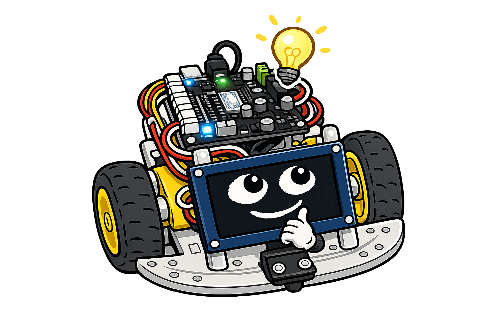

# Wireless Networking and Web Servers

!!! mascot-welcome "Welcome, maker — your robot is going online!"
    { class="mascot-admonition-img" }
    So far you've controlled me with Thonny over a USB cable. This chapter cuts the cord. The Raspberry Pi Pico W has a built-in WiFi chip, and we're about to use it to serve a control webpage — meaning you'll drive me from any browser, on any device, connected to the same network. That's IoT: the Internet of Things.

## Summary

This chapter upgrades the robot to a wireless, internet-connected device. Students
connect the Raspberry Pi Pico W to a WiFi access point using the WLAN object, retrieve
an IP address, and run ping tests to verify connectivity. They then build a socket-based
HTTP web server that generates an HTML control page and responds to GET and POST
requests — enabling browser-based control of motors and LEDs. The chapter closes with
the JavaScript Fetch API for asynchronous control and the secrets file pattern for
protecting WiFi credentials.

## Concepts Covered

This chapter covers the following 18 concepts from the learning graph:

1. WiFi Overview
2. Raspberry Pi Pico W WiFi
3. WLAN Object
4. Access Point Connection
5. WiFi isConnected Check
6. IP Address Retrieval
7. Ping Test Slow Mode
8. Ping Test Fast Mode
9. Web Server Concept
10. Socket Programming
11. HTTP Protocol
12. HTTP GET Request
13. HTTP POST Request
14. HTML Page Generation
15. JavaScript Fetch API
16. Port 80 HTTP Default
17. IoT Internet of Things
18. Secrets File for WiFi

## Prerequisites

This chapter builds on concepts from:

- [Chapter 2: Hardware Platform and Robot Assembly](../02-hardware-platform-assembly/index.md)
- [Chapter 4: Control Flow, Functions, and Exception Handling](../04-control-flow-functions/index.md)
- [Chapter 5: Data Structures, Modular Programming, and Version Control](../05-data-structures-modular-code/index.md)
- [Chapter 10: Robot Behaviors and Autonomous Navigation](../10-robot-behaviors-navigation/index.md)

---

## WiFi Overview and the Internet of Things

**WiFi** (Wireless Fidelity) is a wireless communication technology that lets devices connect to a local network and (optionally) the internet without cables. Your phone, laptop, and smart TV all use WiFi. Now your robot can too.

Before we connect, let's understand the concept of **IoT — the Internet of Things**. The IoT is the idea of connecting physical objects (things) to the internet so they can send and receive data. A smart thermostat, a fitness tracker, a connected light bulb — these are all IoT devices. Your robot, running a web server, is an IoT device. It has a network address, and anything on the network can communicate with it.

This matters beyond this course: IoT is a major part of modern engineering, manufacturing, agriculture, and healthcare. The skills you learn in this chapter — networking, HTTP, web servers — are the same skills engineers use to build real IoT products.

### The Raspberry Pi Pico W

The **Raspberry Pi Pico W** is the WiFi-capable version of the Pico microcontroller board. It adds a CYW43439 wireless chip alongside the RP2040 processor. This chip supports:

- **2.4 GHz WiFi** (802.11n) — standard home and school wireless
- **Bluetooth 5.2** (covered in Chapter 12)

The WiFi chip connects to the RP2040 over SPI. MicroPython's `network` module handles all the complexity — from your perspective, connecting to WiFi is just a few lines of code.

---

## Connecting to WiFi

### The WLAN Object

The **WLAN object** is MicroPython's interface to the wireless chip. Before the code, here is what the parameter means: `network.STA_IF` selects "station mode" — connecting to an existing access point as a client. The alternative, `AP_IF`, would make the board *create* its own hotspot.

```python
import network

wlan = network.WLAN(network.STA_IF)
wlan.active(True)   # power on the WiFi chip
```

### Access Point Connection

An **access point** (AP) is the router or WiFi hotspot the robot connects to. Your school's WiFi network is an access point. To connect, call `wlan.connect()` with the network name (SSID) and password:

```python
from secrets import WIFI_SSID, WIFI_PASSWORD

wlan.connect(WIFI_SSID, WIFI_PASSWORD)
```

We import the credentials from `secrets.py` rather than writing them directly in the code. (You set up `secrets.py` in Chapter 5.)

### WiFi isConnected Check and IP Address Retrieval

Connecting to WiFi takes a few seconds. We need to wait until the connection is established before using the network. The **`isConnected()`** method returns `True` once the connection succeeds.

Before the code, here is what `ticks_ms()` and `ticks_diff()` do: they measure elapsed time without pausing the program (you learned these in Chapter 4). This gives us a timeout — if the connection doesn't succeed within 10 seconds, we stop waiting and report an error.

```python
from time import ticks_ms, ticks_diff, sleep

start = ticks_ms()
while not wlan.isconnected():
    if ticks_diff(ticks_ms(), start) > 10000:   # 10 second timeout
        print("WiFi connection failed!")
        break
    sleep(0.1)

if wlan.isconnected():
    ip = wlan.ifconfig()[0]
    print(f"Connected! IP address: {ip}")
```

The **IP address retrieval** uses `wlan.ifconfig()`, which returns a tuple of four values: `(ip, subnet_mask, gateway, dns_server)`. We take index `[0]` for the IP address — something like `192.168.1.105`.

### Ping Test

Before building a web server, verify connectivity with a ping test. A **ping** sends a small network packet to a known server and measures the round-trip time. If the ping succeeds, the WiFi connection is working.

MicroPython doesn't have a built-in `ping` command, but you can test connectivity by attempting a simple DNS lookup or using the `uping` module if available on your firmware. Alternatively, use the **Thonny slow mode ping test**: open Thonny's network tools and enter the board's IP address in a browser — if the web server is running, the page loads.

**Fast mode ping test** uses the Arduino/MicroPython `network.ping()` function (firmware-dependent). Check whether your firmware version includes it:

```python
# Simple connectivity test — try connecting to a known address
import socket
try:
    addr = socket.getaddrinfo("google.com", 80)[0][-1]
    print("DNS working — network is connected:", addr)
except Exception as e:
    print("Network issue:", e)
```

---

## Building a Web Server

Now let's build the web server. Before diving into the code, we need to understand two key concepts: the HTTP protocol and socket programming.

### HTTP Protocol

**HTTP** (HyperText Transfer Protocol) is the language of the web. When you type a URL in your browser, it sends an HTTP request to a web server. The server reads the request and sends back an HTTP response with the content (an HTML page, an image, a JSON object, etc.).

Every HTTP conversation has two sides:

- **Client** (your browser) — sends a request
- **Server** (your robot) — receives the request and sends a response

### HTTP GET and POST Requests

Two types of HTTP requests matter for robot control:

An **HTTP GET request** asks for a resource. When you type `http://192.168.1.105/` in your browser, the browser sends a GET request for the root page. GET requests carry parameters in the URL: `http://192.168.1.105/action?cmd=forward`.

An **HTTP POST request** sends data to the server. When you click a form button that submits a motor command, the browser sends a POST request with the command in the request body. POST is more appropriate than GET for actions that change the robot's state.

For simplicity in this course, we handle both GET and POST. Many simple robot controllers use GET with URL parameters.

### Socket Programming

A **socket** is a software endpoint for sending and receiving data over a network. Your robot's web server listens on a socket. When a browser connects, it gets a client socket for that conversation.

Before the code, here is the flow: `socket.socket()` creates a socket object. `bind()` assigns it an address and port. `listen(1)` tells it to accept connections (up to 1 queued at a time). `accept()` blocks (waits) until a client connects, then returns a new socket and the client's address.

**Port 80** is the default port for HTTP. When you type a URL without a port number, the browser automatically uses port 80. This is why we bind to port 80 — no need to type `:8080` in the URL.

### HTML Page Generation

**HTML page generation** means building an HTML string in Python and sending it as the HTTP response. The robot doesn't serve static files from disk — it builds the page dynamically.

Before the code below, here is what the HTML does: the `<form>` sends a POST request back to the robot with the button value as form data. Each button sends a different `cmd` value: `forward`, `back`, `left`, `right`, or `stop`.

```python
def html_page(status="Ready"):
    return f"""HTTP/1.1 200 OK
Content-Type: text/html

<!DOCTYPE html>
<html>
<head><title>Robot Control</title></head>
<body>
<h1>Sparky Robot Control</h1>
<p>Status: {status}</p>
<form method="POST">
  <button name="cmd" value="forward">Forward</button>
  <button name="cmd" value="back">Back</button><br>
  <button name="cmd" value="left">Left</button>
  <button name="cmd" value="right">Right</button><br>
  <button name="cmd" value="stop">Stop</button>
</form>
</body>
</html>
"""
```

#### Diagram: Web Server Request-Response Flow


<iframe src="../../sims/http-request-response-flow/main.html" width="100%" height="720px" scrolling="no"></iframe>
[Run Web Server Request-Response Flow Fullscreen](../../sims/http-request-response-flow/main.html)

<details markdown="1">
<summary>Interactive diagram showing how the browser and robot exchange HTTP messages</summary>
Type: diagram
**sim-id:** http-request-response-flow<br/>
**Library:** Mermaid<br/>
**Status:** Specified

Create a Mermaid sequence diagram (sequenceDiagram) showing:

Participants: Browser, WiFi Network, Robot (Pico W)

Sequence:
1. Browser ->> WiFi Network: HTTP GET / (request root page)
2. WiFi Network ->> Robot: Forward the request
3. Robot ->> Robot: Build HTML response
4. Robot ->> WiFi Network: HTTP 200 OK + HTML page
5. WiFi Network ->> Browser: Deliver response
6. Browser ->> Browser: Render the HTML control page
7. User clicks "Forward" button
8. Browser ->> WiFi Network: HTTP POST /action?cmd=forward
9. WiFi Network ->> Robot: Forward the POST
10. Robot ->> Robot: Parse cmd, call go_forward()
11. Robot ->> WiFi Network: HTTP 200 OK (updated status page)
12. WiFi Network ->> Browser: Deliver new page

Every step has a click directive opening an infobox explaining what that step does and the relevant MicroPython code.

Canvas: 700 × 500 px. Responsive on window resize.
</details>

---

## The Complete Web Server

Now let's put everything together. This is the complete web-controlled robot program. Before the code, here is the structure: the server loop calls `accept()` to wait for a connection, reads the HTTP request to find the command, calls the appropriate motor function, and sends back an updated HTML page.

```python
import network, socket
from machine import PWM, Pin
from time import sleep
from secrets import WIFI_SSID, WIFI_PASSWORD
import config

# WiFi setup
wlan = network.WLAN(network.STA_IF)
wlan.active(True)
wlan.connect(WIFI_SSID, WIFI_PASSWORD)

while not wlan.isconnected():
    sleep(0.1)

ip = wlan.ifconfig()[0]
print(f"Server running at http://{ip}/")

# Motor setup (from Chapter 7)
right_fwd = PWM(Pin(config.RIGHT_FORWARD_PIN), freq=50)
right_rev = PWM(Pin(config.RIGHT_REVERSE_PIN), freq=50)
left_fwd  = PWM(Pin(config.LEFT_FORWARD_PIN),  freq=50)
left_rev  = PWM(Pin(config.LEFT_REVERSE_PIN),  freq=50)

FULL = 65535

def set_speed(pf, pr, speed):
    if speed > 0:   pf.duty_u16(speed); pr.duty_u16(0)
    elif speed < 0: pf.duty_u16(0);     pr.duty_u16(-speed)
    else:           pf.duty_u16(0);     pr.duty_u16(0)

def go_forward():
    set_speed(right_fwd, right_rev, FULL)
    set_speed(left_fwd,  left_rev,  FULL)

def stop_motors():
    set_speed(right_fwd, right_rev, 0)
    set_speed(left_fwd,  left_rev,  0)

def handle_cmd(cmd):
    if cmd == "forward": go_forward()
    elif cmd == "stop":  stop_motors()
    # add back, left, right as needed

# Socket server
addr = socket.getaddrinfo("0.0.0.0", 80)[0][-1]
s = socket.socket()
s.bind(addr)
s.listen(1)

status = "Ready"

try:
    while True:
        conn, client = s.accept()
        request = conn.recv(1024).decode()

        # Parse cmd from POST body: "cmd=forward"
        cmd = ""
        if "\r\n\r\n" in request:
            body = request.split("\r\n\r\n", 1)[1]
            if body.startswith("cmd="):
                cmd = body[4:].strip()
                handle_cmd(cmd)
                status = cmd.upper()

        conn.send(html_page(status).encode())
        conn.close()

except KeyboardInterrupt:
    pass

finally:
    stop_motors()
    s.close()
    print("Server stopped.")
```

---

## JavaScript Fetch API — Asynchronous Control

The button-form approach above works, but it reloads the page with every click — not ideal for driving a robot. A smoother approach uses the **JavaScript Fetch API** to send commands without reloading the page.

Before the code snippet, here is the idea: instead of a form that navigates away, JavaScript intercepts the button click, sends a POST request in the background, and updates just the status text on the page — no full reload.

```javascript
// JavaScript inside the HTML page (inside <script> tags)
async function sendCmd(cmd) {
    const response = await fetch('/action', {
        method: 'POST',
        body: 'cmd=' + cmd
    });
    const text = await response.text();
    document.getElementById('status').innerText = text;
}
```

This turns the robot controller into a real-time interface — press Forward, robot starts moving immediately. Press Stop, it stops. No page reload between commands.

!!! mascot-thinking "Your robot is now a web server"
    { class="mascot-admonition-img" }
    Think about what just happened: a $35 microcontroller is accepting HTTP connections from browsers, parsing requests, controlling motors, and sending back HTML responses. That's exactly what production web servers do — just at a much larger scale. The concepts are identical. You're learning real web server architecture.

---

## Secrets File for WiFi

We covered this in Chapter 5, but it deserves emphasis here because WiFi credentials are more sensitive than other config values.

The `secrets.py` file stores network credentials:

```python
# secrets.py — NEVER commit to version control
WIFI_SSID     = "SchoolRobotics"
WIFI_PASSWORD = "your-password-here"
```

Your `.gitignore` must include `secrets.py`:

```
secrets.py
```

If your school has a guest network, use that for robot WiFi rather than the main school network — it keeps the robot isolated and simplifies access. Ask your IT administrator which network is appropriate for student projects.

!!! mascot-warning "Separate networks for robots"
    { class="mascot-admonition-img" }
    A robot running a web server on port 80 is accepting connections from any device on the same network. On a home network, that's fine. On a shared school network with hundreds of students, make sure you're on an appropriate VLAN or guest network. Never run an open, unprotected web server on a network you don't control.

---

## Key Takeaways

- **WiFi Overview:** the Pico W adds a 2.4 GHz WiFi chip — enabling IoT (Internet of Things) connectivity
- **WLAN object** with `STA_IF` (station mode) connects the robot to an existing access point
- **`isconnected()`** and `ifconfig()[0]` verify connection and retrieve the IP address
- **HTTP protocol** — GET requests ask for pages; POST requests submit data to the server
- **Socket programming** — `bind()` port 80, `listen()`, `accept()` in a loop to handle browser connections
- **HTML page generation** — build HTML strings in Python and send them as HTTP responses
- **JavaScript Fetch API** — enables asynchronous commands (no page reload) for smoother robot control
- **secrets.py** keeps WiFi credentials out of version control — always list it in `.gitignore`

!!! mascot-celebration "Your robot is online — and browser-controlled!"
    { class="mascot-admonition-img" }
    Double thumbs-up, maker! You built a real web server on a microcontroller, served HTML to a browser, and controlled a robot over WiFi. That is genuinely impressive engineering. The next chapter adds Bluetooth — robot-to-robot communication that doesn't need a router at all. The robots are about to talk to each other!

