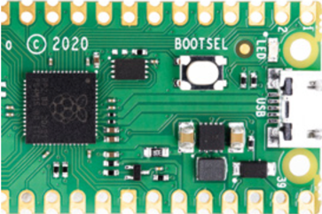
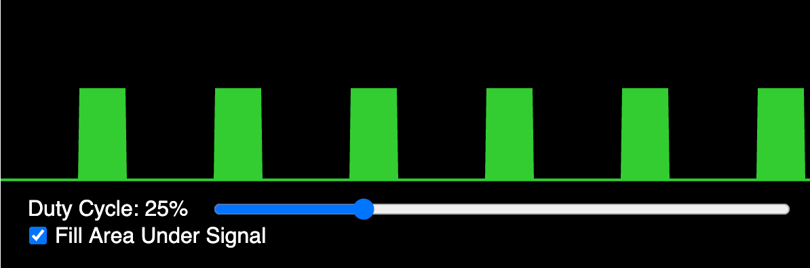

# STEM Robots Glossary of Terms

If you are new to STEM robotics, this glossary is a good place to review your terminology.

#### AA batteries

Standard size of dry cell battery typically used in portable electronic devices.

#### Abstraction

The process of identifying and retaining only the essential details of a system or problem while hiding irrelevant complexity. In robot programming, abstraction allows students to call `move_forward(speed)` without knowing the exact PWM register values being set.

**Example:** Writing a `turn_left()` function hides the details of which motor pins are pulsed at which duty cycle.

#### Access Point Connection

The process by which the Pico W's WLAN interface in station mode associates with an existing WiFi router or hotspot and obtains an IP address via DHCP. Successful connection is confirmed when `wlan.isconnected()` returns `True`.

**Example:** After `wlan.connect(SSID, PASSWORD)`, a `while not wlan.isconnected(): pass` loop waits for the DHCP lease to be assigned.

#### ADC Analog Digital Converter

A hardware peripheral that samples a continuous analog voltage and converts it to a discrete integer value. On the RP2040, the 12-bit ADC returns values from 0 to 4095, mapped by MicroPython's `read_u16()` to 0–65535.

**Example:** `from machine import ADC; pot = ADC(26); val = pot.read_u16()` reads a potentiometer connected to GPIO 26.

#### Algorithm Design

The process of specifying a finite, ordered sequence of unambiguous instructions that solves a defined problem. In this course, algorithm design includes planning motor timing, sensor polling intervals, and decision rules before translating them into MicroPython code.

**Example:** A collision-avoidance algorithm: read distance, if less than 20 cm then stop, reverse, turn randomly, else move forward.

#### Analog to Digital Converter
A component that takes an analogue signal and changes it to a digital one.

Every ADC has two parameters, its [resolution](#resolution), measured in digital bits, and its [channels](#channels), or how many analogue signals it can accept and convert at once.

* Also know as: ADC

#### Analog vs Digital Signals

Analog signals vary continuously over a range of values (e.g., 0–3.3 V proportional to sensor distance), while digital signals take only two discrete states (high or low). Understanding the distinction helps students choose the correct input function: `ADC.read_u16()` for analog, `Pin.value()` for digital.

**Example:** A potentiometer produces an analog voltage; a bump switch produces a digital signal.

#### Animated Faces on OLED

A visual feature that renders simplified face graphics on the OLED display using circles (eyes) and arcs or lines (mouth), changing expression in response to robot events. Animated faces make the robot more engaging and give students a creative outlet for display programming.

**Example:** Eyes wide open when the path is clear, squinting when an obstacle is near, gives the robot expressive personality.

#### Arithmetic Operators

Symbols that perform mathematical calculations on numeric operands: `+` (add), `-` (subtract), `*` (multiply), `/` (divide), `//` (floor divide), `%` (modulo), `**` (exponent). Students use arithmetic operators to compute scaled sensor values and PWM duty cycles.

**Example:** `duty = int(speed_percent / 100 * 65535)` converts a percentage to a 16-bit PWM value.

#### Asynchronous Programming

A programming paradigm in which operations that may take variable time (network I/O, sensor reads) are initiated without blocking the calling code, using callbacks, coroutines, or `asyncio` event loops. MicroPython's `asyncio` module allows students to run WiFi serving and motor control concurrently without threads.

**Example:** An `asyncio` coroutine handles incoming HTTP connections while another coroutine continuously reads sensors and updates motor speeds.

#### Bar Chart on Display

A visualization technique that represents a numeric sensor value as a filled horizontal or vertical rectangle whose length is proportional to the value, rendered on the OLED. Bar charts give students an intuitive real-time view of sensor data.

**Example:** A bar growing from 0 to 128 pixels as distance increases from 0 to 100 cm provides an at-a-glance range meter.

#### Basic Circuits

Electrical networks consisting of a power source, conductors, and one or more loads connected in series or parallel configurations. Understanding series and parallel circuits helps students wire motor power, sensor pull-ups, and LED connections correctly.

**Example:** All sensors share the same VCC and GND rails wired in parallel so each receives the full 3.3 V supply.

#### Battery Pack

An enclosure holding multiple cells wired in series or parallel that provides a portable DC power supply for a robot. In this course, a 4×AA or 6×AA battery pack powers both the motors and (through an onboard regulator) the microcontroller.

**Example:** Students connect the battery pack's red and black leads to the Cytron board's screw terminals labeled VIN and GND.

#### 16-Bit Duty Cycle Values

The integer range 0–65535 used by MicroPython's `duty_u16()` method to represent PWM duty cycle, providing fine-grained speed control. Zero produces no motor movement; 65535 produces maximum speed in the configured direction.

**Example:** Students map a 0–100 percent speed input to 0–65535 using the formula `int(percent / 100 * 65535)`.

#### BLE Advertising

The periodic broadcast of small data packets by a BLE peripheral device containing its identity and service information, allowing nearby central devices to discover it without an existing connection. A robot in peripheral role advertises its name and service UUID so follower robots can find and connect to it.

**Example:** `ble.gap_advertise(interval_us, adv_data)` causes the Pico W to broadcast its presence every 200 ms.

#### BLE Central Role

The BLE device role that initiates connections to peripheral devices, reads or writes their characteristics, and drives the data exchange. In the follower-leader swarm pattern, the leader robot may act as central, writing commands to follower peripherals.

**Example:** The central robot scans for the peripheral's advertisement, connects, and then writes command bytes to the motion characteristic.

#### BLE Connection Pairing

The process by which a BLE central device establishes a connection to a specific peripheral after discovering it through scanning, moving from the advertising state to the connected state. Once connected, the central and peripheral can exchange GATT data.

**Example:** After scanning finds the leader's advertisement, `ble.gap_connect(addr_type, addr)` initiates the connection handshake.

#### BLE Follower Robot Code

The MicroPython program running on a follower robot that scans for the leader's BLE advertisement, connects, reads the command characteristic, and executes the corresponding motor action. Follower code is simpler than leader code because all navigation decisions come from the leader.

**Example:** The follower's main loop reads the BLE characteristic and calls `turn_right()` when it receives `b"R"`.

#### BLE Leader Robot Code

The MicroPython program running on the leader robot that reads sensors, makes navigation decisions, broadcasts BLE advertisements or writes characteristics with movement commands, and drives its own motors. The leader code combines all prior motor, sensor, and BLE skills.

**Example:** The leader reads its ToF sensor, decides to turn right, drives its own right turn, and writes `b"R"` to the command characteristic.

#### BLE Message Sending

The act of writing a byte value to a GATT characteristic on a connected peripheral (from central) or notifying the central of a value change (from peripheral). Robot swarm commands are sent as single-byte messages: `b"F"` for forward, `b"S"` for stop, etc.

**Example:** `ble.gattc_write(conn_handle, value_handle, b"F")` sends a "move forward" command to the follower robot.

#### BLE Peripheral Role

The BLE device role that advertises its presence, accepts connections from centrals, and exposes GATT services and characteristics. Follower robots in the swarm project operate as peripherals, receiving command writes from the leader.

**Example:** `ble.gatts_register_services(services)` registers the robot's GATT service table and puts it in peripheral mode.

#### BLE Range and Power

The typical operating range of BLE in open space (10–30 meters) and its very low radio transmission power (typically 0 dBm or less), which enables months of battery operation for devices transmitting infrequently. BLE range is reduced by walls, interference, and body obstruction.

**Example:** Two robots on opposite sides of a classroom (about 10 m apart) can reliably exchange BLE messages if no metal obstacles intervene.

#### BLE Reliability

The characteristic of BLE communication under real-world conditions including retransmission of lost packets, connection supervision timeouts, and handling of dropped connections. Students add reconnection logic to swarm code because BLE links can drop when robots move apart or rotate.

**Example:** A `try/except` block around the BLE write detects a dropped connection and triggers a re-scan and reconnect sequence.

#### BLE Scanning

The process by which a BLE central device listens for advertisement packets from nearby peripherals to discover available devices. A follower robot scans for the leader's advertisement, identifies it by name or UUID, and initiates a connection.

**Example:** `ble.gap_scan(2000)` scans for 2 seconds and returns a list of advertising devices with their signal strengths and data.

#### BLE vs Classic Bluetooth

A comparison of two Bluetooth variants: Classic Bluetooth provides higher throughput continuous streams (audio, file transfer) at higher power, while BLE is optimized for small, infrequent data packets at very low energy cost. This course uses BLE because it is supported by the Pico W and sufficient for swarm command messaging.

#### BLE vs WiFi Comparison

A comparison of two wireless technologies: WiFi offers higher data rates and internet connectivity but consumes more power and requires a router; BLE is lower power and enables direct device-to-device communication without infrastructure. Students choose BLE for swarm robotics where no router is available and power efficiency matters.

#### Blit
A special form of copy operation; it copies a rectangular area of pixels from one framebuffer to another.  It is used in MicroPython when doing drawing to a display such as an OLED display.

#### Bluetooth Low Energy BLE

A Bluetooth specification variant optimized for low power consumption and periodic short data exchanges, suitable for battery-powered embedded devices. BLE uses a client-server model (GATT) and consumes significantly less power than Classic Bluetooth.

**Example:** A BLE peripheral robot advertises its sensor readings; a central robot scans, connects, and reads those values to coordinate behavior.

#### bluetooth Module

The MicroPython built-in module that provides access to Bluetooth Low Energy hardware on supported devices such as the Pico W. The `bluetooth.BLE` class exposes methods for advertising, scanning, GATT service registration, and characteristic reads and writes.

**Example:** `import bluetooth; ble = bluetooth.BLE(); ble.active(True)` initializes the BLE radio.

#### Bluetooth Overview

A short-range wireless communication standard operating in the 2.4 GHz ISM band, designed for low-power data exchange between devices within approximately 10 meters. The Pico W supports Bluetooth Low Energy (BLE), which is the variant used in this course's swarm robotics projects.

**Example:** Two robots exchange obstacle-detection data over BLE, enabling coordinated collision avoidance without a central controller.

#### Boolean Data Type

A data type with exactly two values, `True` and `False`, used to represent binary states and control conditional logic. Booleans are returned by comparison operators and used in `while` loop conditions and `if` statements throughout robot code.

**Example:** `obstacle_detected = True` triggers the avoidance branch of a collision-detection routine.

#### BOOTSEL

A button on the pico that when pressed during power up will allow you to mount the device as a USB drive.  You can then drag-and-drop any uf2 image file to reset or update the runtime libraries.



* Also known as: Boot Selection

#### Breadboard Layout

A reusable prototyping platform with a grid of clip-connected holes, organized so that each horizontal row of five holes is internally connected, enabling tool-free circuit assembly. Students use breadboards in early lessons to experiment with sensors and LEDs before committing to final wiring.

**Example:** Inserting both legs of a resistor in the same five-hole row shorts them together, a common beginner wiring mistake to avoid.

#### Build-Test-Improve Cycle

A rapid iterative development practice in which a working prototype is built quickly, tested against requirements, and incrementally improved based on test results. Each coding session in this course follows this cycle, with improvement driven by observed robot behavior.

**Example:** After testing reveals the robot misses narrow doorways, students reduce the turning radius and re-test.

#### Built-in Libraries

Modules included with MicroPython that provide access to hardware peripherals and common utilities without requiring additional installation. Key built-in libraries in this course include `machine`, `time`, `network`, `bluetooth`, and `math`.

#### Bump Switch

A mechanical contact switch that closes or opens an electrical circuit when a physical object presses a lever or button, providing tactile collision detection. Bump switches are wired to digital input pins with pull-up resistors and read with `Pin.value()`.

**Example:** A bump switch mounted on the robot's front bumper triggers a stop-and-reverse routine when it contacts a wall.

#### Button Debouncing

The software or hardware technique of filtering out rapid spurious transitions (bouncing) that occur when a mechanical switch makes or breaks contact. Without debouncing, a single button press may register as dozens of interrupts.

**Example:** After detecting a button press, ignoring all further interrupts for 50 ms suppresses mechanical bounce and counts each press exactly once.

#### Castellated Edge
Plated through holes or vias located in the edges of a printed circuit board that make it easier to solder onto another circuit board.


The word "Castellated" means having grooves or slots on an edge and is derived from the turrets of a castle.

#### Castellated Edge PCB

A printed circuit board design in which semicircular plated holes along the board edges allow the board to be soldered flat onto a larger PCB. The Raspberry Pi Pico uses castellated edges so it can be surface-mounted onto carrier boards for production use.

#### Closed-Loop Feedback

A control scheme in which sensor measurements of the actual system state are continuously compared to the desired state, and motor commands are adjusted to minimize the error. Line following is a simple closed-loop system: IR sensor readings continuously correct wheel speeds.

**Example:** When the left IR sensor detects the line, the control loop slows the left motor to steer back on track.

#### Code Documentation

The practice of writing comments, docstrings, and README files that explain the purpose, inputs, outputs, and behavior of code so that other developers (or future selves) can understand it without running it. Well-documented code is a professional expectation and a course requirement.

**Example:** A docstring `"""Read ToF sensor and return distance in cm, clamped to MAX_DIST."""` fully describes a sensor function.

#### Collective Obstacle Avoid

A swarm behavior in which multiple robots share obstacle-detection data so that when any one robot detects an obstacle, all robots stop or reroute, preventing group collisions. Collective avoidance demonstrates how local information sharing produces safe group behavior.

**Example:** The leader broadcasts `b"S"` (stop) when its ToF sensor triggers, halting all followers before they reach the obstacle.

#### Collision Avoidance

A robot behavior that detects obstacles in the robot's path using sensors and generates motor commands to stop and navigate around them without human intervention. Collision avoidance is the first fully autonomous behavior students implement in this course.

**Example:** The robot reads the ToF sensor every 100 ms; if distance drops below 20 cm, it stops, reverses, and turns before resuming forward motion.

#### Collision Avoidance Code

The MicroPython implementation of the collision avoidance behavior: a main loop that reads the distance sensor, compares to a threshold, and calls stop/reverse/turn functions when triggered. Students write and refine this code as a core project in the course.

**Example:** The main loop: `while True: d = tof.read() / SF; if d < THRESHOLD: stop(); reverse(300); turn_random(); else: forward()`.

#### Comments and Code Style

Annotations in source code preceded by `#` that explain intent, and the consistent formatting conventions (naming, spacing, indentation) that make code readable. Well-commented code helps teammates and instructors understand robot logic without running it.

**Example:** `# Stop both motors if obstacle detected` clarifies the purpose of the following if-block.

#### Comparison Operators

Operators that evaluate a relationship between two values and return a Boolean: `==`, `!=`, `<`, `>`, `<=`, `>=`. Comparison operators are the core of sensor-threshold decisions in robot control code.

**Example:** `if distance < 15:` triggers a stop command when the ToF sensor reads closer than 15 cm.

#### Computational Thinking

Computational thinking is a problem-solving methodology that involves applying concepts and techniques from computer science to understand and address complex issues.

Computational thinking encompasses skills such as algorithmic thinking, pattern recognition, abstraction, and decomposition. This approach encourages breaking down problems into manageable parts, identifying patterns, abstracting out details to focus on the core issue, and developing step-by-step solutions (algorithms). Computational thinking is not just for computer scientists but is a fundamental skill for everyone, applicable in various fields including business, education, and research. It aids in developing logical reasoning and efficient problem-solving approaches.

The lesson plans on this site put a strong focus on increasing computational thinking skills.  Many lessons start with a difficult problem and then proceed to divide the problem into smaller components.

[Computational Thinking Page](./instructors-guide/computational-thinking.md)

#### Config File Pattern

A software design convention in which hardware-specific constants (pin numbers, calibration values, speed limits) are stored in a separate `config.py` file that is imported by the main program. This pattern separates hardware configuration from application logic, simplifying porting to different boards.

**Example:** Changing `LEFT_PWM_PIN = 8` to `LEFT_PWM_PIN = 10` in `config.py` reassigns the motor pin without touching any control logic.

#### Convoy Following

A swarm behavior in which multiple robots travel in a line, each maintaining a fixed following distance from the robot ahead by reading distance sensors and adjusting speed accordingly. Convoy following combines closed-loop distance control with BLE communication.

**Example:** Each follower robot reads the distance to the robot in front and adjusts its speed to maintain a 20 cm gap.

#### Cytron Maker Pi RP2040

A robotics board featuring the Raspberry Pi RP2040 microcontroller, designed for use in educational and hobbyist robotics projects.

#### Data Logging

The practice of recording time-stamped sensor measurements to flash memory or a serial terminal for later analysis. Data logging allows students to review a robot's sensor history, diagnose intermittent problems, and verify calibration accuracy.

**Example:** Writing `f.write(f"{time.ticks_ms()},{distance}\n")` to a file on flash creates a CSV log of distance readings over time.

#### DC motor drivers

Electronic components that control the direction and speed of DC motors.

#### DC Motor Overview

A direct-current electric motor that converts electrical energy to rotational mechanical energy, with speed proportional to applied voltage and torque related to current draw. DC motors in this course drive the robot's wheels and are controlled by the Cytron board's onboard H-bridge driver.

**Example:** Increasing PWM duty cycle raises the average voltage across the motor, increasing wheel speed.

#### Debugging Fundamentals

The systematic process of locating and correcting errors in code or hardware by forming hypotheses, running tests, and interpreting results. Students learn to use Thonny's REPL and print statements to observe program state during execution.

**Example:** Adding `print(distance)` before an if-statement reveals whether the ToF sensor is returning valid values or zeros.

#### Decomposition

The technique of breaking a complex problem or system into smaller, more manageable sub-problems that can be solved independently and then combined. Students decompose a line-following robot into sub-tasks: read IR sensors, compare values, adjust motor speeds.

**Example:** A robot dance routine is decomposed into individual move segments, each coded as its own timed function call.

#### Dictionaries

An unordered collection of key-value pairs enclosed in braces, supporting fast lookup by key. Dictionaries map configuration names to values, sensor labels to readings, or BLE characteristic UUIDs to their handler functions.

**Example:** `config = {"speed": 40000, "threshold": 15}` stores multiple settings accessible by name.

#### Differential Drive

A locomotion system in which two independently driven wheels are positioned on opposite sides of a chassis, with steering achieved by varying the relative speeds of the two motors. All turning, arcing, and straight-line motion in this course's robot result from differential drive.

**Example:** Equal speeds produce straight motion; one motor stopped while the other runs produces a pivot turn.

#### Digital Input Pin

A GPIO pin configured to read the logic state of an external signal, returning either `1` (high, ~3.3 V) or `0` (low, ~0 V). Digital inputs read bump switches, IR sensor outputs, and push buttons in this course.

**Example:** `pin = Pin(16, Pin.IN, Pin.PULL_UP); state = pin.value()` reads whether a bump switch is pressed.

#### Digital Output Pin

A GPIO pin configured to drive a logic-level voltage (0 V or 3.3 V) to control external devices such as LEDs, motor enable lines, or signal inputs of driver ICs. Digital outputs directly switch on-off states in hardware.

**Example:** `Pin(25, Pin.OUT).high()` drives the output pin to 3.3 V, illuminating a connected LED.

#### Display Resolution

The number of addressable pixels in the horizontal and vertical dimensions of a display, expressed as width×height. The standard OLED module used in this course has 128×64 pixel resolution, providing a 128-column by 64-row drawing canvas.

**Example:** A horizontal bar spanning the full display width is drawn from x=0 to x=127 at a given y row.

#### Display Text Output

The rendering of ASCII characters at a specified pixel coordinate on the OLED display using the driver's `text()` method. Text rendering uses a built-in 8×8 pixel font, fitting 16 characters per row and 8 rows on a 128×64 display.

**Example:** `oled.text("Dist: " + str(d), 0, 0)` writes a distance reading at the top-left corner of the screen.

#### Distance Meter Display

A combined text and bar-chart display layout that shows the numeric distance reading alongside a graphical bar proportional to the measured value. This display pattern reinforces the connection between raw sensor numbers and visual representation.

**Example:** The top line shows "Dist: 23 cm" in text while a horizontal bar below fills 23/100 of the screen width.

#### Distance Threshold

A predefined numeric value against which a sensor reading is compared to trigger a behavior change; readings below (or above) the threshold activate the relevant action. Students choose threshold values experimentally based on their robot's speed and sensor characteristics.

**Example:** Setting `THRESHOLD = 15` (cm) means the avoidance routine activates when the sensor reads closer than 15 cm.

#### Distributed Systems

Computational systems in which multiple autonomous processing nodes communicate and coordinate over a network to achieve a shared goal without centralized control. The BLE swarm of Pico W robots is a small physical demonstration of distributed systems principles.

#### DPDT Switch

A Double-Pole Double-Throw mechanical switch that connects two common terminals to either of two pairs of contacts, effectively reversing two connections simultaneously. Understanding DPDT switches builds intuition for how an H-bridge reverses motor polarity electronically.

#### Drawing Circles

The rendering of a circle outline at a specified center coordinate and radius on the OLED framebuffer using the `ellipse()` method (or a custom Bresenham implementation). Circles are used in animated face graphics and radar-style displays.

**Example:** `oled.ellipse(64, 32, 20, 20, 1)` draws a circle with radius 20 centered in the display.

#### Drawing Lines

The rendering of a straight line between two pixel coordinates on the OLED framebuffer using the `line(x1, y1, x2, y2, color)` method. Lines are used to create axis marks, dividers, and simple diagrams on the display.

**Example:** `oled.line(0, 32, 127, 32, 1)` draws a horizontal line across the vertical center of the screen.

#### Drawing Rectangles

The rendering of a filled or outlined rectangle defined by its top-left corner coordinates, width, and height on the OLED framebuffer. Rectangles form the bars in bar charts and the borders of UI panels on the display.

**Example:** `oled.rect(10, 10, 50, 20, 1)` draws a rectangle outline; `oled.fill_rect(10, 10, 50, 20, 1)` fills it.

#### Dual IR Sensor Reading

The simultaneous sampling of two IR sensors positioned side-by-side at the front of the robot, producing a pair of digital values used to determine the robot's lateral position relative to a line. The four combinations of left/right sensor readings correspond to on-line, off-left, off-right, and lost states.

**Example:** `left=0, right=1` means the left sensor is on the line and the right has drifted off, so the robot should turn left.

#### Dupont Connectors

Pre-made low-cost used and used to connect breadboards to hardware such as sensors and displays.

The connectors are available in male and female ends and are typically sold in lengths of 10 or 20cm.  They have a with a 2.54mm (100mill) pitch so they are easy to align with our standard breadboards.  They are typically sold in a ribbon of mixed colors for around $2.00 US for 40 connectors.

* Also known as: Jumper Wires
* [Sample eBay Search for Jumper Wires](https://www.ebay.com/sch/92074/i.html?_from=R40&_nkw=jumper+wire+cables)

#### Elif and Else Clauses

Optional extensions of an `if` statement that provide alternative execution branches: `elif` tests an additional condition only if prior conditions were false; `else` executes when no prior condition matched. Together they implement multi-way decisions in robot behavior.

**Example:** `if dist < 10: stop()`, `elif dist < 20: slow_down()`, `else: full_speed()` implements three speed zones.

#### Emergent Behavior

Complex group-level patterns that arise from the local interactions of individual agents following simple rules, without any central coordinator explicitly programming the group pattern. Swarm students observe emergent alignment as robots independently follow the same BLE leader commands.

**Example:** Three follower robots independently receiving "turn right" from the leader form a coordinated rightward arc without any inter-follower communication.

#### Encoder Motor Feedback

The use of incremental rotary encoders attached to motor shafts to count wheel rotations and measure actual distance traveled or speed achieved. Encoder feedback enables closed-loop speed control and accurate odometry, which are advanced topics in this course.

**Example:** Counting 20 encoder pulses per revolution and knowing the wheel circumference allows the robot to travel exactly 50 cm.

#### Engineering Design Process

A systematic, iterative framework for creating solutions to technical problems, consisting of phases such as define, research, brainstorm, prototype, test, evaluate, and communicate. This course applies the engineering design process to every robot project, from initial concept to final demonstration.

**Example:** Students define requirements (robot must avoid obstacles for 5 minutes), prototype a solution, test it, and refine the threshold values.

#### ESP32
A series of low-cost, low-power system on a chip microcontrollers with integrated Wi-Fi and dual-mode Bluetooth.

Typical costs for the ESP32 is are around $10 US on eBay.

* [Sample on eBay](https://www.ebay.com/itm/ESP32-ESP-32S-NodeMCU-Development-Board-2-4GHz-WiFi-Bluetooth-Dual-Mode-CP2102/392899357234) $5
* [Sample on Amazon](https://www.amazon.com/HiLetgo-ESP-WROOM-32-Development-Microcontroller-Integrated/dp/B0718T232Z/ref=sr_1_1_sspa) $11
* [Sample on Sparkfun](https://www.sparkfun.com/products/13907) $21
* [ESP32 Quick Reference](http://docs.micropython.org/en/latest/esp32/quickref.html)
* [Sample eBay Search for ESP32 from $5 to $20](https://www.ebay.com/sch/i.html?_from=R40&_nkw=esp32&_sacat=175673&LH_TitleDesc=0&LH_BIN=1&_udhi=20&rt=nc&_udlo=5)

#### Exception Handling

A control flow mechanism that intercepts runtime errors (exceptions) and executes recovery code rather than crashing the program. Robot programs use exception handling to shut down motors safely when an unexpected error occurs.

**Example:** Wrapping the main loop in a `try` block ensures `stop()` is called even if a sensor raises an `OSError`.

#### Experiential Learning

A pedagogical approach in which knowledge and skills are acquired through direct, hands-on experience followed by reflection. This course is structured around experiential learning: students build circuits, run code on real robots, and iterate based on observed outcomes.

#### Feedback Loop

The recurring cycle in a closed-loop control system: measure the output, compare to the setpoint, compute the error, issue a corrective command, and repeat. Students visualize the feedback loop as a flowchart before implementing it in code.

**Example:** The feedback loop for collision avoidance: read distance → compare to threshold → if too close, stop → repeat.

#### Flash memory

A type of non-volatile memory that retains data even when the power is turned off.

#### Float Data Type

A numeric type representing real numbers with a fractional component using floating-point encoding. Floats are used for calculations involving distances, angles, or proportional control values where precision beyond whole numbers is needed.

**Example:** `distance = 23.7` stores a time-of-flight reading in centimeters as a float.

#### For Loop

A control structure that iterates over the elements of a sequence or a `range()` object, executing the loop body once per element. Students use `for` loops to step through LED color lists or repeat a motor command a fixed number of times.

**Example:** `for i in range(3): spin_right(500)` executes a spin command exactly three times.

#### Formatted Strings

The ability to use a simplified syntax to format strings by added the letter "f" before the string.  Values within curly braces are formatted from variables.

```py
name = "Lisa"
age = 12
f"Hello, {name}. You are {age}."
```

returns

```
Hello, Lisa. You are 12.
```

Formatted string support was added to MicroPython in release 1.17.  Most formats work except the date and time formats.  For these we must write our own formatting functions.

* Also known as: f-strings
* Also known as: Literal String Interpolation
* From Python Enhancement Proposal: PEP 498
* [Official Python documentation on string formatting](https://docs.python.org/3/library/string.html#string-formatting)
* Link to Formatted Strings Docs: [formatted strings](https://www.python.org/dev/peps/pep-0498/)
* PyFormat library for formatting strings: [PyFormat.info](https://pyformat.info/)

#### Framebuffer

A region of your microcontroller RAM that stores a bitmap image of your display.

For a 128X64 monochrome display this would be 128 * 64 = 8,192 bits or 1,024 bytes (1K).  Color displays must store up to 8 bytes per color for each color (red, green and blue).

* [Wikipedia page on Framebuffer](https://en.wikipedia.org/wiki/Framebuffer)
* [MicroPython Documentation on FrameBuffer](https://docs.micropython.org/en/latest/library/framebuf.html)
]

#### Function Definition

A named, reusable block of code introduced by the `def` keyword that encapsulates a specific task. Defining functions for each robot action (`move_forward`, `turn_left`, `stop`) makes programs readable and reduces duplicated code.

**Example:** `def stop(): left_pwm.duty_u16(0); right_pwm.duty_u16(0)` creates a reusable halt command.

#### Function Parameters

Named variables listed in a function's definition parentheses that receive argument values when the function is called. Parameters allow a single function to handle varying inputs, such as different motor speeds or distances.

**Example:** `def move_forward(speed):` lets the caller pass any speed value without rewriting the motor logic.

#### GATT Characteristic

A single data value within a GATT service, identified by a UUID, with properties specifying whether it can be read, written, or notify the central device of changes. The command characteristic in a robot swarm stores the current motion command byte.

**Example:** `_CMD_CHAR = (bluetooth.UUID(0x5678), bluetooth.FLAG_WRITE | bluetooth.FLAG_READ)` defines a writable command characteristic.

#### GATT Protocol

The Generic Attribute Profile, a BLE application-layer protocol that organizes data into a hierarchy of services and characteristics, providing a standardized way for connected devices to exchange structured data. GATT defines how the leader and follower robots expose and access shared data.

**Example:** A robot's motion service contains a "command" characteristic; the central robot writes `b"F"` to command the peripheral to move forward.

#### GATT Service Definition

A logical grouping of related BLE characteristics, identified by a UUID, that represents a specific function or feature of a device. Students define a custom robotics service with a unique UUID to avoid conflicts with standard BLE services.

**Example:** `_SERVICE_UUID = bluetooth.UUID(0x1234)` defines a custom 16-bit service UUID for the robot's command service.

#### Git Commit Workflow

The sequence of commands used to save a set of changes to the local Git repository: `git add <files>` to stage changes, followed by `git commit -m "message"` to record the snapshot. A descriptive commit message helps identify which version introduced a specific feature or bug fix.

**Example:** `git add main.py config.py; git commit -m "Add line following with dual IR sensors"` saves and labels the new feature.

#### Gitignore File

A plain-text file named `.gitignore` in the root of a Git repository that lists filenames and patterns to exclude from version tracking. The `.gitignore` file in this course always includes `secrets.py` to prevent WiFi passwords from being committed.

**Example:** Adding `secrets.py` to `.gitignore` ensures the WiFi password file is never staged for a `git commit`.

#### Global Variables

Variables declared at the module (top) level of a script, accessible throughout the file. In robot code, global variables often hold shared state such as the current speed setting or the last sensor reading.

**Example:** `THRESHOLD = 15` defined at the top of the file is accessible in all functions without being passed as a parameter.

#### GPI status LEDs

General Purpose Input status Light Emitting Diodes used for indicating the state of inputs.

#### GPIO Interrupt Setup

The configuration of a GPIO pin to generate a hardware interrupt (IRQ) when its logic level transitions, causing an interrupt service routine (ISR) to execute immediately. Interrupt-driven input avoids polling and ensures fast response to button presses or sensor signals.

**Example:** `pin.irq(trigger=Pin.IRQ_FALLING, handler=button_handler)` calls `button_handler()` the instant a button is pressed.

#### GPIO Pin Basics

General Purpose Input/Output pins are individually programmable digital connections on a microcontroller that can be configured to read or write logic-level signals. Each GPIO pin on the RP2040 can be independently set as input or output under software control.

**Example:** `Pin(25, Pin.OUT).high()` configures GPIO 25 as an output and drives it to 3.3 V.

#### GPIO Pin Numbering

The system by which each electrical connection on a microcontroller is identified by a unique integer, corresponding to the GPIO port number used in software. On the RP2040, GPIO numbers do not always match the physical pin positions on the board header.

**Example:** The onboard LED on the standard Pico is connected to GPIO 25, while on the Pico W it is driven via the wireless chip.

#### Grove connectors

Standardized connectors used for connecting various sensors and modules to microcontrollers easily.

#### H-Bridge Circuit

An electronic switching circuit using four transistors (or MOSFETs) arranged in an H pattern that allows the direction of current through a load (motor) to be reversed by software without mechanical switching. The Cytron Maker Pi RP2040 contains two H-bridge channels for independent left and right motor control.

**Example:** The H-bridge allows software to reverse a motor's direction in microseconds by toggling control pin logic states.

#### H-Bridge Switch States

The four combinations of high/low states applied to the two control inputs of an H-bridge that produce forward, reverse, brake, and coast motor behaviors. Students learn the truth table of switch states to understand how the motor driver IC responds to GPIO signals.

**Example:** Both inputs high produces braking; one high and one low produces rotation in one direction.

#### Hardware Troubleshooting

The systematic process of diagnosing and resolving physical or electrical faults in a robot, including checking connections, measuring voltages, and substituting components. Common hardware issues in this course include reversed motor wires, loose Grove connectors, and dead batteries.

**Example:** When a motor does not spin, students check voltage at the motor terminals with a multimeter before suspecting the code.

#### HTML Page Generation

The process of constructing an HTML string in MicroPython and sending it as the body of an HTTP response, creating a web page that a browser renders. Students build control panel pages with buttons that send GET requests when clicked.

**Example:** `html = "<button onclick=\"fetch('/forward')\">Forward</button>"` generates a clickable motor control button.

#### HTTP GET Request

An HTTP request using the GET method that retrieves a resource from a server, with parameters optionally encoded in the URL query string. In the robot web server, different GET paths map to different motor commands.

**Example:** `GET /forward` causes the server to call `move_forward()` and return a status page to the browser.

#### HTTP POST Request

An HTTP request using the POST method that sends data in the request body to a server for processing. POST requests are used in advanced web server projects to send form data (such as speed values) to the robot.

**Example:** A speed slider form sends `POST /speed` with body `value=50` to set the motor duty cycle.

#### HTTP Protocol

Hypertext Transfer Protocol, a stateless application-layer protocol in which a client sends a text request specifying a method (GET, POST) and resource path, and the server responds with a status code and body. The Pico W web server implements a minimal subset of HTTP/1.1.

**Example:** A browser sends `GET /stop HTTP/1.1\r\n\r\n`; the server parses the path and calls the stop function.

#### I2C
A communications protocol common in microcontroller-based systems, particularly for interfacing with sensors, memory devices and liquid crystal displays.

I2C is similar to SPI, it's a synchronous protocol because it uses a clock line.

* Also Known as: Inter-integrated Circuit
* See also: [SPI](#spi)

#### I2C Bus

A two-wire synchronous serial communication protocol using a clock line (SCL) and a data line (SDA) that allows multiple devices to share the same bus using unique 7-bit addresses. The I2C bus on the RP2040 connects the ToF sensor and OLED display simultaneously using only two GPIO pins.

**Example:** The VL53L0X (address 0x29) and SSD1306 (address 0x3C) both share the same I2C bus without conflict.

#### I2C Display Mode

The configuration of an SSD1306 OLED display to communicate over the two-wire I2C serial bus, requiring only SDA and SCL connections in addition to power and ground. I2C mode uses fewer GPIO pins than SPI but is slower.

**Example:** Wiring the display's SDA and SCL pins to the I2C bus and creating `SSD1306_I2C(128, 64, i2c)` enables I2C display mode.

#### I2C Frequency Config

The clock rate setting of the I2C bus, typically 100 kHz (standard mode) or 400 kHz (fast mode), that determines how quickly data is transferred. Higher frequencies reduce read latency for sensors but require shorter cable lengths.

**Example:** `I2C(0, sda=Pin(16), scl=Pin(17), freq=400000)` sets 400 kHz fast-mode I2C for the ToF sensor.

#### I2C protocol

Inter-Integrated Circuit protocol, a serial communication protocol used for connecting low-speed peripherals to microcontrollers.

#### I2C Scanner Tool

A short MicroPython utility that iterates through all 128 possible I2C addresses and attempts to read one byte from each, reporting the addresses of all devices that acknowledge. Students run the scanner to verify that a newly connected sensor is present and to discover its address.

**Example:** Running the I2C scanner with the ToF sensor attached confirms address 0x29 appears in the found list.

#### I2C SDA SCL Pins

The two signal conductors of an I2C bus: SDA (Serial Data) carries bidirectional data, and SCL (Serial Clock) carries the master-generated clock signal. On the Cytron Maker Pi RP2040, I2C bus 0 uses GPIO 16 (SDA) and GPIO 17 (SCL) by default.

**Example:** `i2c = I2C(0, sda=Pin(16), scl=Pin(17), freq=400000)` creates the I2C bus object used for all I2C sensors and displays.

#### If Statement

A conditional control structure that executes an indented block of code only when a specified Boolean expression evaluates to `True`. The `if` statement is the primary decision-making tool in robot control programs.

**Example:** `if distance < 20: stop()` halts the motors when the obstacle is too close.

#### Import Config Pattern

A code organization convention in which hardware constants (pin numbers, thresholds, calibration values) are stored in a separate `config.py` file and imported into `main.py` with `from config import *`. This pattern allows the same logic file to be ported to different hardware by editing only `config.py`.

**Example:** `from config import LEFT_PWM_PIN, RIGHT_PWM_PIN` loads pin assignments without hardcoding them in the main script.

#### Importing Modules

The mechanism by which a Python script gains access to functions, classes, and constants defined in another file or built-in library using the `import` or `from … import` statements. Students import hardware-specific modules such as `machine` and `time` at the top of every robot script.

**Example:** `from machine import Pin, PWM` loads only the needed classes from the machine module.

#### Infrared Sensor

A short-range proximity or line-detection sensor that emits infrared light and detects the reflected intensity from a nearby surface. IR sensors used in this course produce a digital output: high when insufficient light reflects back (no surface or white surface) and low when high reflection occurs (dark line or close obstacle).

**Example:** Placing the IR sensor module over a black line on white paper causes its output to go low, signaling the line.

#### Integer Data Type

A whole-number numeric type with no fractional component, represented exactly in memory. In MicroPython on the RP2040, integers handle pin numbers, PWM duty cycle values, loop counters, and sensor readings.

**Example:** `duty = 45000` stores a 16-bit integer used to set PWM motor speed.

#### Interrupts
A type of signal used to pause a program and execute a different program.  We
use interrupts to pause our program and execute a different program when a
button is pressed.

#### IoT Internet of Things

A paradigm in which physical devices embedded with sensors and network connectivity exchange data over the internet or local networks to enable remote monitoring and control. The Pico W robot web server project is a hands-on introduction to IoT concepts.

**Example:** Reading sensor data on the robot and displaying it in a browser on a different device is a fundamental IoT interaction.

#### IP Address Retrieval

The process of reading the network configuration tuple returned by `wlan.ifconfig()` to obtain the device's assigned IP address, subnet mask, gateway, and DNS server. The IP address is needed to access the robot's web server from a browser.

**Example:** `ip = wlan.ifconfig()[0]; print("Connect to:", ip)` displays the robot's address for browser access.

#### IR Digital Output

The binary signal produced by an IR sensor module indicating whether the reflected infrared intensity exceeds a threshold set by an onboard potentiometer. A logic-low output typically indicates a detected surface; logic-high indicates no detection (depends on module polarity).

**Example:** `if ir_left.value() == 0:` tests whether the left IR sensor is over the dark line.

#### IR Sensor Calibration

The process of adjusting the sensitivity potentiometer on an IR sensor module so that it reliably switches state at the correct surface condition (e.g., detecting a black line on white paper). Calibration is performed by observing the LED indicator on the sensor module.

**Example:** Rotating the sensor's trim potentiometer until the onboard LED lights precisely when the sensor is over the black line completes calibration.

#### IRQ Falling Edge

An interrupt trigger condition that fires when a digital input signal transitions from high (logic 1) to low (logic 0). A falling-edge IRQ on a bump switch input fires the instant the switch closes and pulls the pin to ground.

**Example:** `Pin.IRQ_FALLING` triggers on the high-to-low transition of a button that pulls a pull-up resistor to ground when pressed.

#### JavaScript Fetch API

A modern browser JavaScript function that sends asynchronous HTTP requests from a web page without reloading it, used to send real-time motor commands from the control panel HTML page. `fetch('/forward')` sends a GET request and handles the response in a promise chain.

**Example:** `<button onclick="fetch('/stop')">Stop</button>` stops the robot without refreshing the entire control page.

#### KeyboardInterrupt Handling

The practice of catching the `KeyboardInterrupt` exception, which is raised when the user presses Ctrl-C in Thonny, to perform graceful shutdown actions before the program exits. Without this handler, motors may keep running after the program is interrupted.

**Example:** `except KeyboardInterrupt: stop()` halts both motors immediately when a student presses Ctrl-C.

#### Leader-Follower Pattern

A swarm coordination architecture in which one robot (the leader) determines direction and sends commands over BLE, while one or more robots (followers) execute the received commands. This pattern is the primary multi-robot architecture implemented in this course.

**Example:** The leader robot navigates by sensor and broadcasts movement commands; each follower robot mirrors those commands in real time.

#### LED Animation

A time-varying sequence of color changes to one or more NeoPixels that produces a visual effect such as color cycling, blinking, chasing, or fading. LED animations are implemented with loops, sleep delays, and changing RGB tuple assignments.

**Example:** A rainbow chase animation iterates hue values around the color wheel and writes each frame to the strip with a 50 ms delay.

#### LED Status Indicators

The use of NeoPixel colors to communicate robot operational status: green for running normally, red for error, blue for connected, etc. Status indicators give students immediate visual feedback without requiring a display or serial connection.

**Example:** Setting `np[0] = (0, 255, 0)` when WiFi connects and `(255, 0, 0)` when it fails provides clear connection status.

#### Left Motor Control

The software management of the PWM signals driving the left-side wheel motor, including speed and direction. Left motor speed is adjusted relative to the right motor to implement turns and straight-line corrections.

**Example:** Reducing left motor duty cycle while maintaining right motor speed curves the robot to the left.

#### Line Following

A robot behavior in which the robot tracks a dark line on a light surface by reading one or more IR sensors and continuously adjusting motor speeds to keep the sensors centered on the line. Line following demonstrates closed-loop feedback control in a visual, verifiable way.

**Example:** When the right IR sensor loses the line, the control loop increases the right motor speed to steer back onto it.

#### Line Following Code

The MicroPython implementation of a line-following algorithm: read both IR sensors each loop iteration, apply differential motor adjustment based on the sensor state, and repeat. Students tune the speed differential values to achieve stable, smooth line tracking.

**Example:** `if l==0 and r==1: left_pwm.duty_u16(BASE+DIFF); right_pwm.duty_u16(BASE-DIFF)` steers right when left sensor is on the line.

#### Linear Range Mapping

A mathematical transformation that converts a value from one numeric range to another using the formula `output = out_min + (value - in_min) * (out_max - out_min) / (in_max - in_min)`. This mapping converts sensor readings, percentages, or angles into PWM duty cycle values.

**Example:** Mapping a potentiometer reading (0–65535) to a servo duty cycle (1640–8200) uses the linear range formula.

#### LiPo battery

Lithium Polymer battery, a type of rechargeable battery commonly used in portable electronics.

#### List Indexing

Accessing a specific element of a list by its integer position, starting at 0 for the first element and supporting negative indices from the end. Students use list indexing to retrieve individual sensor readings from a collected sample.

**Example:** `readings[0]` retrieves the first distance measurement; `readings[-1]` retrieves the most recent.

#### List Iteration

Processing each element of a list in sequence, typically using a `for` loop. List iteration is used to cycle through LED colors, replay a sequence of motor commands, or average multiple sensor readings.

**Example:** `for color in color_list: np[0] = color; np.write()` cycles a NeoPixel through a list of colors.

#### Lists

An ordered, mutable sequence of values enclosed in square brackets, capable of holding items of any type. Lists store sequences of motor commands, sensor readings, or LED colors that are processed in loops.

**Example:** `colors = [(255,0,0),(0,255,0),(0,0,255)]` holds three RGB tuples for a cycling LED animation.

#### Live Sensor on Display

A display mode in which sensor readings are continuously refreshed on the OLED, allowing students to observe real-time data as they move the robot or change its environment. The pattern clears the framebuffer, writes new values, and calls `show()` in every loop iteration.

**Example:** Printing the ToF reading every 100 ms creates a live distance display that updates ten times per second.

#### Logical Operators

Keywords `and`, `or`, and `not` that combine or negate Boolean expressions to form compound conditions. Students use logical operators to express multi-sensor decision rules, such as stopping when both IR sensors detect a line edge simultaneously.

**Example:** `if left_ir == 0 and right_ir == 0:` detects when both IR sensors are off the line at once.

#### Max Distance Limit

A software-defined upper threshold applied to sensor readings above which the data is considered unreliable or out of range and is replaced with the maximum meaningful value. The VL53L0X returns erratic high values when no target is detected within range.

**Example:** `if dist > 100: dist = 100` clamps all readings above 100 cm to 100, preventing spurious large values from triggering wrong behavior.

#### Mechanical Design Basics

The principles of structural arrangement, fastening, and component placement that determine how robot parts hold together and move reliably. Students learn that cable routing, center of gravity, and wheel alignment all affect robot performance.

**Example:** Mounting the battery pack low on the chassis lowers the center of gravity, preventing the robot from tipping during sharp turns.

#### Microcontroller Overview

A single integrated circuit containing a processor core, memory, and programmable I/O peripherals on one chip, designed to control embedded systems. Microcontrollers differ from microprocessors in that they include memory and peripherals on-chip, making them suitable for battery-powered robots.

**Example:** The RP2040 microcontroller on the Cytron board contains the CPU, 264 KB RAM, and PWM, I2C, and SPI peripherals all on one chip.

#### MicroPython

A lean and efficient implementation of the Python programming language that is designed to run on microcontrollers and in constrained environments.

#### MicroPython Overview

A lean implementation of Python 3 optimized for microcontrollers with limited RAM and flash storage, providing a high-level scripting language for hardware control. MicroPython runs directly on the RP2040 and exposes hardware peripherals through the `machine` module.

**Example:** `from machine import PWM` gives students access to pulse-width modulation hardware using familiar Python syntax.

#### MicroSims

Small web-based programs that use simulations and animations to explain concepts.  MicroSims (short for Micro-Simulations) are small enough that a first draft can be created by generative AI programs such as ChatGPT.

Many lessons on this site also feature MicroSims that reinforce concepts and that can be quickly extended by teachers or mentors.

* [MicroSims website](https://dmccreary.github.io/microsims/)

#### Microswitch Wiring

The connection of a small snap-action switch to a GPIO input pin with a pull-up resistor, so the pin reads high when open and low when the switch is pressed. Correct wiring uses the normally-open or normally-closed terminals depending on the desired logic.

**Example:** Connecting a microswitch between a GPIO pin and GND with `Pin.PULL_UP` enabled reads `0` when pressed and `1` when released.

#### Modular Programming

A design approach that divides a program into separate, self-contained files or functions, each responsible for a single concern. In this course, hardware configuration is isolated in `config.py` so that motor-control logic in `main.py` never contains raw pin numbers.

#### Motor Differential Adjust

The technique of increasing one motor's speed while decreasing the other's (or holding one constant) to steer the robot without a dedicated steering mechanism. Differential adjustment is the fundamental steering technique in all line-following and turning maneuvers.

**Example:** Adding 10,000 to the right motor duty cycle and subtracting 10,000 from the left steers the robot to the right.

#### Motor Direction Control

The ability to reverse the rotational direction of a DC motor by swapping the polarity of the voltage applied to its terminals, implemented in software by switching H-bridge control signals. Direction control is used for reverse motion and turning maneuvers.

**Example:** Setting one H-bridge input high and the other low drives the motor forward; swapping them drives it in reverse.

#### Motor Driver IC

An integrated circuit that accepts logic-level control signals from a microcontroller and switches the higher voltages and currents required to drive DC motors. The DRV8833 or equivalent driver on the Cytron board interfaces between the RP2040's 3.3 V GPIO outputs and the 6 V motor supply.

**Example:** The motor driver IC takes a 3.3 V PWM signal from GPIO and switches up to 1.5 A at 6 V to the motor.

#### Motor Forward Motion

The motor operational state in which current flows in the direction that rotates the wheel such that the robot moves toward the front. In code, forward motion is produced by driving both motors in the forward direction at equal duty cycles.

**Example:** `move_forward(40000)` sets both left and right motor PWM to 40000, driving the robot straight ahead.

#### Motor Reverse Motion

The motor operational state in which polarity is reversed relative to forward, rotating the wheel in the opposite direction. Reversing both motors simultaneously backs the robot away from an obstacle.

**Example:** After stopping before a wall, `reverse(30000)` drives both motors backward briefly before the robot turns.

#### Motor Speed Control

The regulation of a DC motor's rotational velocity by varying the average voltage applied to it, most commonly through PWM duty cycle adjustment. Speed control allows the robot to move slowly for precise maneuvering or quickly for open-area travel.

**Example:** `set_speed(25000)` runs motors at about 38% of maximum speed for careful navigation near obstacles.

#### Motor Stop

The condition in which no driving voltage is applied to a motor, allowing it to coast to rest, or in which both terminals are shorted to create active braking. In code, stop is achieved by setting PWM duty cycle to 0 on both motor channels.

**Example:** `left_pwm.duty_u16(0); right_pwm.duty_u16(0)` removes drive voltage from both motors, stopping the robot.

#### Motor Terminals

The two electrical connection points of a DC motor (labeled M+ and M-) through which current flows to produce rotation; reversing polarity reverses direction. Students connect motor terminals to the Cytron board's motor output screws.

#### MPG Shell
A simple MicroPython shell based file explorer for ESP8266 and WiPy MicroPython based devices.

The shell is a helper for up/downloading files to the ESP8266 (over serial line and Websockets) and WiPy (serial line and telnet). It basically offers commands to list and upload/download files on the flash FS of the device.

[GitHub Repo for MPFShell](https://github.com/wendlers/mpfshell)

#### Multithreading Basics

The concurrent execution of two or more threads of code within the same program, allowing independent tasks to run simultaneously. The RP2040's dual cores support true parallelism; students use `_thread` to run sensor reading on one core while motor control runs on the other.

**Example:** `_thread.start_new_thread(read_sensors_loop, ())` runs sensor polling on the second core while the main loop handles motor commands.

#### NeoPixel LEDs

Addressable RGB LEDs (most commonly WS2812B) that integrate their own control electronics, allowing each LED in a daisy-chained strip to be set to any 24-bit color using a single data wire and a one-wire serial protocol. The Cytron Maker Pi RP2040 includes two onboard NeoPixels and supports external strips.

**Example:** `np[0] = (255, 0, 0); np.write()` sets the first NeoPixel to red.

#### NeoPixel Library

The MicroPython `neopixel` module that provides a class for controlling WS2812B addressable LEDs by buffering color values and writing the timed serial protocol in one call. After setting `np[i]`, calling `np.write()` transmits all buffered values to the LED strip.

**Example:** `from neopixel import NeoPixel; np = NeoPixel(Pin(28), 2)` initializes two NeoPixels on GPIO 28.

#### NeoPixels

Individually addressable Red-Green and Blue (RGB) Light Emitting Diodes (LEDs) that can be controlled to display a wide range of colors and patterns.

#### Nested Loops

A loop placed inside the body of another loop, causing the inner loop to complete all its iterations for each iteration of the outer loop. Nested loops appear in LED matrix animations and in swarm choreography sequences.

**Example:** Two nested `for` loops iterate over rows and columns of an LED grid to set each pixel's color.

#### No-Soldering Assembly

A construction approach that uses screw terminals, Grove connectors, Dupont cables, and snap-fit mounting to assemble the robot without soldering iron. No-soldering assembly makes the course accessible to students without prior electronics experience and allows easy reconfiguration.

**Example:** The Cytron board's screw terminals accept bare motor wires by hand, eliminating the need for soldering.

#### Obstacle Detection

The process of sensing the presence and approximate distance of a physical obstruction in the robot's environment using a proximity sensor. Reliable obstacle detection depends on correct sensor calibration and appropriate polling frequency.

**Example:** A ToF reading below the configured threshold confirms an obstacle is within the stop distance.

#### OLED Display

OLED (Organic polymer Light Emitting Diode) displays are small but bright displays with high contrast, low power and a wide viewing angle.

We use these displays throughout our labs.  The small displays are around 1" (diagonal) and only cost around $4 to $5.  Larger 2.24" displays cost around $20.  These displays work both with 4-wire I2C and 7-wire SPI connections.  We use the larger displays with a faster SPI for our robots with faces.

Typical chips that control the OLED include the SSD1306 driver chips.

* See: [Graph Displays](../displays/graph/01-intro.md)

#### Open-Loop Motor Control

A control scheme in which motor commands are issued based on pre-programmed timing or fixed inputs with no feedback from sensors to verify the actual position or speed achieved. Timed motor sequences for dance routines are open-loop: the code assumes the robot moves as commanded.

**Example:** `move_forward(40000); sleep(2)` runs the motors for two seconds without checking whether the robot actually traveled the intended distance.

#### Pattern Recognition

The identification of similarities, trends, or recurring structures within or across problems to enable reuse of solutions. Recognizing that motor control, servo control, and LED brightness all use PWM allows students to apply one concept across multiple hardware components.

**Example:** Students notice that all I2C sensors share the same bus setup pattern and reuse that template for each new sensor.

#### Physical Computing

The process of using computers to read data from sensors about the world around us and then taking action on this incoming data stream. These actions are typically doing things like blinking an LED, moving a motor, or updating a display.

#### Pico Pinout Diagram

The Pico pinout diagram shows you the ways that each Pin can be used.  Different colors are used for GPIO numbers, I2C, and SPI interfaces.


* [Pinout PDF](https://datasheets.raspberrypi.org/pico/Pico-R3-A4-Pinout.pdf)

#### PID Control Overview

A closed-loop control algorithm that computes a corrective output as the sum of three terms: Proportional (current error), Integral (accumulated past error), and Derivative (rate of error change). PID control is used in advanced line-following and distance-holding projects for smoother, more precise robot behavior.

**Example:** A PID line follower reduces oscillation by adding a derivative term that dampens rapid steering corrections.

#### Piezo buzzer

An electronic device that produces sound, often used for alerts and notifications in electronic circuits.

#### Pin Assignment Constants

Named integer variables in `config.py` that map human-readable names to GPIO pin numbers, making code self-documenting and reducing the risk of pin-number errors. Constants are written in ALL_CAPS by convention.

**Example:** `RIGHT_FORWARD_PIN = 11` clarifies the purpose of GPIO 11 throughout all motor control functions.

#### Ping Test Fast Mode

A web server mode optimized for minimum latency, responding to HTTP requests as quickly as possible to measure round-trip time and network performance. Fast mode verifies that the socket-handling code can sustain a sufficient request rate for real-time control.

#### Ping Test Slow Mode

A diagnostic mode in which the robot's web server responds to HTTP requests with a deliberate delay, used to verify that the network connection is functional before adding complex application logic. Slow mode helps students distinguish connection failures from application bugs.

#### Pinout Diagram

A labeled graphic showing every physical pin on a board, its GPIO number, alternate functions (PWM, I2C, SPI), and voltage rails. Students consult the Cytron Maker Pi RP2040 pinout diagram to identify which GPIO numbers correspond to the motor and sensor connectors.

**Example:** The pinout diagram shows that the left motor forward control uses GPIO 8, enabling students to write the correct `PWM(Pin(8))` call.

#### Port 80 HTTP Default

TCP port 80 is the standard port for unencrypted HTTP traffic; browsers connect to this port by default when no port is specified in a URL. The Pico W web server binds to port 80 so users can connect with a plain IP address in the browser.

**Example:** Binding the server socket to port 80 allows `http://192.168.1.50/` to work without typing `:8080`.

#### Potentiometer Input

An analog resistive divider whose wiper voltage, proportional to shaft angle, is read by the ADC to provide a user-adjustable input. Students connect a potentiometer to an ADC pin to vary motor speed or servo angle by turning a knob.

**Example:** `speed = int(pot.read_u16() / 65535 * 60000)` converts potentiometer position to a motor duty cycle.

#### Power Management

The set of practices and circuit techniques used to supply stable, adequate power to each component of a robot while maximizing battery life. Proper power management includes using bypass capacitors, ensuring adequate current capacity, and powering down peripherals when idle.

**Example:** Running NeoPixels at full white brightness can draw 60 mA each, potentially starving the motor driver — students learn to limit brightness.

#### Problem Solving Strategy

A deliberate, structured approach to identifying, analyzing, and resolving a technical challenge. Effective strategies in this course include reading error messages carefully, isolating variables, and testing one change at a time.

**Example:** When a robot veers left, a student isolates the problem by testing each motor individually before adjusting the differential drive code.

#### Project Planning

The process of defining project goals, milestones, task assignments, and timelines before beginning implementation. In the course's team projects, students create a simple plan specifying who writes each function and in what order tasks should be completed.

**Example:** A team plans: Week 1 — wiring and config; Week 2 — motor and sensor code; Week 3 — integration and testing; Week 4 — demonstration.

#### Prototyping Methods

Techniques for quickly creating preliminary versions of a robot or program to test ideas before investing in a final design. Hardware prototyping uses breadboards and tape; software prototyping runs simplified logic in the REPL before integrating it into the main program.

**Example:** Students test a sensor wiring idea with a breadboard prototype before using Dupont connectors on the final robot.

#### Pulse Width Modulation (PWM)

A type of output signal used to control items with continuous values.  For example, we use PWM to control the brightness of a light or the speed of a motor.  We use pulse-width modulation (PWM) to control the speed of our DC motors.



See also: [PWM MicroSim](./sims/pwm/index.md)

#### PWM Duty Cycle

The ratio of the on-time to the total period of one PWM cycle, expressed as a percentage or, in MicroPython's `duty_u16()`, as a 16-bit integer from 0 (always off) to 65535 (always on). Higher duty cycle values produce higher average motor voltage and thus greater speed.

**Example:** `motor.duty_u16(32768)` sets a 50% duty cycle, delivering half the supply voltage to the motor on average.

#### PWM Frequency

The number of complete on-off cycles per second of a PWM signal, measured in Hz. Motor control typically uses frequencies of 50–20,000 Hz; too low causes audible buzzing, too high may reduce driver efficiency.

**Example:** `PWM(Pin(8), freq=1000)` sets the motor PWM frequency to 1 kHz, above the audible range for most motors.

#### PWM Motor Control Code

MicroPython code using the `machine.PWM` class to instantiate PWM objects on motor control pins and call `duty_u16()` to set speed and direction. A typical pattern creates four PWM objects (forward and reverse for each motor) at program startup.

**Example:** `lf = PWM(Pin(8)); lr = PWM(Pin(9)); lf.duty_u16(40000); lr.duty_u16(0)` drives the left motor forward.

#### Python Syntax Basics

The fundamental rules governing the structure of valid Python statements, including indentation-based blocks, colon-terminated headers, and case-sensitive identifiers. Correct indentation is mandatory in Python; a single misaligned line causes an `IndentationError`.

**Example:** The body of an `if` block must be indented exactly four spaces (or one tab) beneath the `if` line.

#### Random Turn Direction

A program behavior that selects a clockwise or counterclockwise turn randomly (e.g., using `random.choice`) after the robot encounters an obstacle, preventing it from getting stuck in repetitive patterns. Random turns make collision-avoidance behavior appear more natural.

**Example:** `direction = random.choice([-1, 1]); turn(direction, 400)` picks a random turn each time an obstacle is hit.

#### Raspberry Pi Foundation

The company that builds the Raspberry Pi hardware and provides some software.

#### Raspberry Pi Pico
A microcontroller designed by the Raspberry Pi foundation for doing real-time control systems.

The Pico was introduced in 2020 with a retail list price of $4.  It was a key development because it used a custom chip that had 100 times the RAM of an Arduino Nano.

#### Raspberry Pi Pico W

A variant of the Raspberry Pi Pico that adds an Infineon CYW43439 wireless chip providing 2.4 GHz WiFi and Bluetooth Low Energy. The Pico W is required for all wireless communication labs, including the web server and BLE swarm projects.

**Example:** Replacing the standard Pico with a Pico W allows students to control the robot from a browser over WiFi.

#### Raspberry Pi Pico W WiFi

The wireless networking capability provided by the CYW43439 chip on the Raspberry Pi Pico W, accessible in MicroPython through the `network` module's `WLAN` class. The Pico W supports 2.4 GHz WiFi in station mode (client) and access point mode (host).

**Example:** `import network; wlan = network.WLAN(network.STA_IF)` creates a WiFi station interface on the Pico W.

#### Raspberry Pi RP2040

A dual-core microcontroller developed by Raspberry Pi, featuring 264K SRAM and 2MB of flash memory.

#### REPL Interactive Shell

A Read-Eval-Print Loop console that evaluates single Python expressions entered at a prompt and displays the result immediately. In Thonny, the REPL shell connects directly to the MicroPython runtime on the RP2040, allowing students to test commands without writing a full program.

**Example:** Typing `from machine import Pin; Pin(0, Pin.OUT).high()` in the REPL immediately turns on an LED.

#### Resistors

Two-terminal passive components that oppose current flow, measured in ohms (Ω), used to limit current, set voltage dividers, or pull signal lines to a defined state. Pull-up resistors on digital input pins ensure a defined logic level when no device is driving the line.

**Example:** A 10 kΩ pull-up resistor on an IR sensor output holds the signal high until the sensor actively pulls it low.

#### Resolution

The size of our OLED screen as measured in a width x height number.

**Example:** Our 2.44" OLED displays have a resolution of 128x64 pixels.

#### Return Values

Data that a function sends back to its caller using the `return` statement, allowing computed results to be used outside the function. Sensor-reading functions return numeric values that the main loop uses for decisions.

**Example:** `def read_distance(): return tof.read()` returns the centimeter value to the caller.

#### Reusable Functions

Functions written to solve a general task so they can be called multiple times with different arguments rather than duplicating code. Creating `set_speed(left, right)` once and calling it with different values throughout the program is an example of reuse.

**Example:** `move(left_speed, right_speed)` is defined once but called with dozens of different argument pairs in a dance routine.

#### RGB Color Values

A color encoding system in which each color is specified as a tuple of three integers (red, green, blue), each ranging from 0 (off) to 255 (maximum brightness). RGB tuples are the data format used by the NeoPixel library to set LED color.

**Example:** `(0, 255, 128)` produces a cyan-green color; `(0, 0, 0)` turns the LED off.

#### RGB LED

Light Emitting Diodes that can emit Red, Green, and Blue light, used in various applications for color display.

#### Rhizomatic Learning

An approach to learning that uses a non-linear, organic process, where knowledge is interconnected and grows in multiple directions, much like a rhizome. 

Rhizomatic learning is an educational concept that draws its analogy from the rhizome, a type of plant root system.

It emphasizes the importance of context, personal interpretation, and the idea that knowledge and learning are not static but are constantly evolving. Rhizomatic learning encourages learners to create their own paths through content, fostering critical thinking, adaptability, and collaboration. This approach contrasts with traditional hierarchical models of education, offering a more fluid and dynamic understanding of knowledge acquisition.

#### Right Motor Control

The software management of the PWM signals driving the right-side wheel motor. Differential adjustments between left and right motor speeds produce turning behavior in the differential drive system.

**Example:** `right_pwm.duty_u16(50000)` while `left_pwm.duty_u16(30000)` causes the robot to arc to the left.

#### Robot Dance Sequence

A pre-programmed series of timed motor, LED, and buzzer commands that cause the robot to perform a choreographed movement pattern as a creative demonstration. Dance sequences reinforce understanding of time-based open-loop control and motivate students through play.

**Example:** A three-second spin, four-second figure-eight, then a motor-stop with a victory beep forms a complete dance sequence.

#### RP2040 Chip

The dual-core ARM Cortex-M0+ microcontroller chip designed by Raspberry Pi Ltd, operating at up to 133 MHz with 264 KB SRAM and flexible PIO state machines for custom I/O protocols. The RP2040 is the processing heart of the Cytron Maker Pi board used in this course.

#### RP2040 chip
A custom chip created by the [Raspberry Pi Foundation](raspberry-pi-foundation) to power the [Raspberry Pi Pico](#raspberry-pi-pico).

#### Safety Practices

The set of behaviors and precautions that prevent injury to students and damage to equipment during robot building and operation. Key safety rules include disconnecting power before rewiring, securing loose cables, and not running robots near the table edge.

**Example:** Students always unplug the battery pack before changing motor wiring to prevent unexpected motor activation.

#### Scale Factor Calibration

The process of computing a multiplier that converts raw sensor output units to real-world units (e.g., millimeters to centimeters) by comparing sensor readings to a ruler measurement at a known distance. The scale factor compensates for non-unity unit scaling in the sensor driver.

**Example:** If the sensor reads 300 when the actual distance is 15 cm, the scale factor is `300 / 15 = 20` raw units per centimeter.

#### Scope and Local Variables

The region of code within which a variable name is accessible; local variables are defined inside a function and exist only during that function's execution. Understanding scope prevents students from accidentally using a local variable name that shadows a global constant.

**Example:** A variable `speed` defined inside `move_forward()` is invisible to code outside that function.

#### Secrets File for WiFi

A MicroPython file (`secrets.py`) containing SSID and password string constants that are imported by the main WiFi connection script and excluded from version control via `.gitignore`. See also: Secrets File Pattern.

**Example:** `WIFI_SSID = "ClassroomNet"; WIFI_PASSWORD = "abc123"` stored in `secrets.py` keeps credentials out of the shared codebase.

#### Secrets File Pattern

A code organization convention in which sensitive credentials (WiFi SSID and password) are stored in a separate `secrets.py` file that is imported by the main program and excluded from version control. The secrets file prevents passwords from being accidentally shared in public code repositories.

**Example:** `from secrets import WIFI_SSID, WIFI_PASSWORD` loads credentials without hardcoding them in the main WiFi connection script.

#### Sensor Calibration Process

A systematic procedure of collecting sensor readings at known reference conditions, computing correction parameters (offset, scale factor), and applying those parameters to convert raw readings to accurate real-world values. All sensors in this course require at least basic calibration before use in control loops.

**Example:** Recording ToF sensor values at 10, 20, and 30 cm distances, then fitting a linear correction, removes systematic measurement error.

#### Sensor Data Filtering

The application of mathematical techniques to reduce noise in sensor readings, producing smoother estimates of the true measured value. Simple filters used in this course include running averages, median filters, and ignoring out-of-range samples.

**Example:** Averaging five consecutive ToF readings before using the value reduces jitter caused by sensor noise.

#### Sensor Fusion

The computational technique of combining measurements from multiple sensors to produce an estimate more accurate or more complete than any single sensor alone. Students combine IR and ToF sensor data to improve obstacle detection reliability.

**Example:** Using both IR (close range) and ToF (medium range) sensors to trigger different avoidance responses at different distances is a form of sensor fusion.

#### Sensor Types Overview

A classification of the input devices used on the robot by their physical measurement principle: time-of-flight (distance), ultrasonic (distance), infrared (proximity/line), tactile (bump), and analog (potentiometer). Understanding sensor types helps students choose the right sensor for each task.

#### Serial Communication

The sequential transmission of data bits over a single wire or pair of wires, one bit at a time, used to connect the Pico to Thonny's REPL over USB and to interface with UART-based sensors and GPS modules. The RP2040's USB serial port appears as a virtual COM port on the host computer.

**Example:** Thonny communicates with the Pico via USB serial at 115200 baud to upload files and run the REPL.

#### Serial Peripheral Interface

An interface bus commonly used to send data between microcontrollers and small peripherals such as sensors, displays and SD cards. SPI uses separate clock and data lines, along with a select line to choose the device you wish to talk to.

* Also known as: SPI
* See also: [I2C](#i2c)

#### Servo Angle Range

The angular span a hobby servo can rotate, typically 0° to 180°, corresponding to minimum and maximum PWM pulse widths. Some servos have a 270° range; calibration is required to determine the exact pulse-width-to-angle mapping for each unit.

**Example:** Students experimentally find the minimum and maximum duty cycle values that move their servo to its mechanical stops.

#### Servo Meter Display

A display layout showing the current servo angle as a numeric value and as a graphical needle or bar indicator on the OLED. Students use this display pattern to verify that servo position commands produce the expected mechanical movement.

**Example:** As a student moves a potentiometer, the display updates both the angle number and a rotating needle graphic in real time.

#### Servo Motor

A motor with an integrated position feedback mechanism and a control circuit that holds a specified angular position. Hobby servo motors respond to a PWM signal with pulse widths between 500 µs and 2500 µs, mapping to 0°–180° of shaft angle.

**Example:** `servo.duty_u16(4915)` positions the servo at approximately 90° (the center of its range).

#### Servo PWM Calibration

The process of determining the minimum and maximum PWM duty cycle values that correspond to a servo's end positions, then computing the linear mapping for any desired angle. Calibration compensates for manufacturing variation between individual servo units.

**Example:** Finding that duty cycles 1640 and 8200 correspond to 0° and 180° lets students calculate any intermediate angle.

#### Servo Sweep Code

A program that increments a servo's commanded angle from its minimum to maximum and back repeatedly, demonstrating smooth continuous motion. Sweep code is typically the first servo program students run to verify correct wiring and calibration.

**Example:** A `for` loop stepping angle from 0 to 180 in increments of 1°, with a short delay, produces a smooth sweep.

#### Smart Car chassis

The physical frame of the robot to which all other parts are mounted.

#### Socket Programming

The use of the `usocket` module in MicroPython to create TCP/IP network endpoints that send and receive byte streams over a network. Socket programming underlies both the Pico W web server and any raw TCP communication in this course.

**Example:** `s = socket.socket(); s.bind(addr); s.listen(1); conn, _ = s.accept()` sets up a minimal TCP server.

#### Software Troubleshooting

The systematic process of diagnosing and correcting errors in program code, configuration, or firmware, using tools such as the REPL, print statements, and error messages. Students learn to read Python tracebacks and locate the offending line before making changes.

**Example:** An `AttributeError: 'NoneType' has no attribute 'read'` traceback points to an uninitialized sensor object, leading students to check the initialization code.

#### Sound Feedback

The use of audible tones or beeps from the piezo buzzer to communicate robot state to the user, such as startup confirmation, obstacle detection, or task completion. Sound feedback is especially useful when the robot operates without a display or when visual feedback is obscured.

**Example:** A two-beep pattern on startup confirms the program has loaded and sensors have initialized successfully.

#### SPI Bus

A four-wire synchronous full-duplex serial communication protocol using clock (SCK), master-out/slave-in (MOSI), master-in/slave-out (MISO), and chip-select (CS) lines. SPI is used for high-speed display connections and some sensor modules when I2C bandwidth is insufficient.

**Example:** An SPI-connected SD card module uses four dedicated GPIO lines to transfer data at several MHz.

#### SPI bus

Serial Peripheral Interface bus, a synchronous serial communication protocol used for short-distance communication.

* See also: [SPI](#serial-peripheral-interface)

#### SPI Display Mode

The configuration of an SSD1306 or similar display to communicate over the SPI bus, using separate clock, data, chip-select, and reset lines. SPI mode is faster than I2C but consumes more GPIO pins.

#### SPI vs I2C Comparison

A comparison of the two most common peripheral bus protocols: SPI is faster (multi-MHz) and full-duplex but requires more wires; I2C is slower (up to 1 MHz) and half-duplex but uses only two wires shared by many devices. Students choose I2C for sensors and displays (few wires needed) and SPI when higher data rates are required.

#### SSD1306 Driver Chip

The controller integrated circuit inside most common small OLED display modules that manages pixel addressing and refresh, and communicates with the host microcontroller over I2C or SPI. The MicroPython `ssd1306` library wraps the driver commands in a simple drawing API.

**Example:** `from ssd1306 import SSD1306_I2C; oled = SSD1306_I2C(128, 64, i2c)` instantiates the display driver.

#### State Machine Pattern

A software design pattern in which a system is modeled as a finite set of states with defined transitions triggered by events or conditions. Robot behavior is naturally modeled as a state machine: states such as FORWARD, AVOIDING, TURNING, and STOPPED with transitions triggered by sensor events.

**Example:** The collision avoidance state machine: FORWARD → (obstacle detected) → STOP → REVERSE → TURN → FORWARD.

#### STEM

An acronym for Science, Technology, Engineering, and Mathematics education.

#### String Data Type

An ordered, immutable sequence of Unicode characters enclosed in single or double quotes. Strings are used in this course to generate HTML responses in the web server project and to print diagnostic messages to the REPL.

**Example:** `html = "<h1>Robot Status</h1>"` builds a string sent as an HTTP response to a browser.

#### String Manipulation

Operations that create, modify, or extract information from string objects, including concatenation, slicing, formatting, and method calls such as `.upper()` and `.strip()`. Students manipulate strings when building HTML pages for the web server or parsing incoming BLE messages.

**Example:** `"Speed: " + str(speed)` concatenates a label and a numeric value into a display string.

#### Swarm Algorithm Design

The process of specifying the rules each individual robot follows — including sensing, communication, and actuation — that collectively produce the desired group behavior. Good swarm algorithms are simple per-robot rules that scale to many robots.

**Example:** Each robot's rule: "If BLE message says 'stop', stop; else mirror the leader's last direction." This scales to any number of followers.

#### Swarm Robotics

A field of robotics in which many simple robots coordinate to achieve collective behaviors that no individual robot could accomplish alone, using local communication and decentralized control. Students build two- or three-robot swarms using BLE and simple coordination rules.

**Example:** Two robots share ToF readings over BLE and halt simultaneously when either detects an obstacle, demonstrating collective collision avoidance.

#### Synchronized Swarm Dance

A coordinated choreography in which multiple robots execute a pre-programmed movement sequence in unison, triggered by a BLE command from the leader at a shared start time. Students program a synchronized dance as the capstone swarm project.

**Example:** The leader broadcasts `b"D"` (dance start); all followers simultaneously execute a 10-step timed motor pattern.

#### Syntax Highlighting

A code editor feature that displays different syntactic elements (keywords, strings, comments, numbers) in distinct colors to improve readability and reduce errors. Thonny provides syntax highlighting for MicroPython, helping students spot mismatched quotes or misspelled keywords immediately.

#### Team Collaboration

The practice of working with other students to divide tasks, share progress, and integrate individual contributions into a coherent project. Collaboration skills include code review, clear communication of interfaces, and conflict resolution when solutions disagree.

**Example:** One student writes `motor_control.py` and defines a function interface; another student writes `sensor_reader.py` that calls those functions.

#### Testing and Iteration

A development cycle in which a solution is built, evaluated against requirements, and incrementally improved based on observed behavior. In this course, each robot program is tested on physical hardware and refined until it behaves as designed.

**Example:** After initial testing shows the robot stops too late, students lower the distance threshold from 20 cm to 15 cm and re-test.

#### Thonny

A lightweight Python IDE ideal for writing simple Python programs for first-time users.

Thonny runs on Mac, Windows and Linux.

* [Thonny web site](https://thonny.org/)

#### Thonny File Upload

The operation of transferring a Python script from the host computer to the RP2040's onboard flash memory so it persists and can run without a USB connection. Files named `main.py` execute automatically at power-on after upload.

**Example:** After uploading `main.py`, the student unplugs USB and powers the robot from batteries; the program starts automatically.

#### Thonny IDE

An integrated development environment designed for beginners that supports MicroPython on microcontrollers via a built-in serial connection. Thonny provides a code editor, REPL shell, file manager, and variable inspector in a single interface used throughout this course.

**Example:** Students write their motor control script in Thonny's editor, then click Run to execute it on the Cytron board.

#### Thonny Installation

The process of downloading and configuring the Thonny IDE on a host computer, including selecting the MicroPython interpreter for the connected RP2040 device. Correct interpreter selection under Tools → Options → Interpreter is required before any code can run on the robot.

**Example:** In Thonny's interpreter menu, selecting "MicroPython (Raspberry Pi Pico)" enables direct code execution on the board.

#### Thonny Integrated Development Environment (IDE)

A user-friendly IDE for learning and teaching programming, particularly well-suited for use with MicroPython.

#### Time-of-flight distance sensor

A sensor that measures the distance to an object by calculating the time taken for a signal to travel to the object and back.

#### Time-of-Flight Sensor

A distance sensor that measures the travel time of a modulated laser or infrared pulse to a reflective surface and back, computing distance from the speed of light. The VL53L0X ToF sensor used in this course measures distances from approximately 5 cm to 120 cm with millimeter resolution.

**Example:** Pointing the ToF sensor at a wall 30 cm away, it returns approximately `300` (in units of mm or calibrated cm depending on scaling).

#### Timed Motor Patterns

Pre-computed sequences of motor speed and direction commands paired with time delays that produce specific movement trajectories. Timed patterns are the simplest form of robot programming and introduce the concept of sequential execution.

**Example:** `forward(40000); sleep(1); turn_right(40000); sleep(0.5)` traces an L-shaped path.

#### Timers and Delays

Mechanisms for controlling program timing: `time.sleep()` pauses execution for a specified duration; hardware timers (`machine.Timer`) call callback functions at scheduled intervals without blocking the main loop. Delays determine motor run times; timers enable periodic sensor reading.

**Example:** `time.sleep_ms(500)` pauses the program for half a second; `Timer(period=100, callback=read_sensor)` samples the sensor every 100 ms.

#### ToF Distance Reading

The process of calling `tof.read()` on the initialized VL53L0X object to obtain the latest distance measurement from the sensor. Readings are typically in millimeters and may require scaling calibration to match actual centimeter distances.

**Example:** `dist_mm = tof.read()` returns a raw integer; dividing by `scale_factor` converts it to centimeters.

#### ToF Sensor I2C Setup

The initialization sequence required before reading a VL53L0X sensor, including creating an I2C bus object and passing it to the VL53L0X driver constructor. The I2C bus must specify the correct SDA and SCL pins and bus frequency.

**Example:** `i2c = I2C(0, sda=Pin(16), scl=Pin(17), freq=400000); tof = VL53L0X(i2c)` initializes the sensor on I2C bus 0.

#### Tone Frequency Control

Setting the frequency of the PWM signal driving a piezo buzzer to produce a specific musical pitch, measured in Hz. Different frequencies correspond to musical notes, allowing students to compose simple melodies as robot feedback.

**Example:** Setting `buzzer.freq(523)` produces middle C; `buzzer.freq(659)` produces E above middle C.

#### Transistors

Semiconductor switching or amplifying devices that allow a small control signal to switch or modulate a larger current. H-bridge motor drivers are built from transistors configured to switch the high currents required by DC motors.

#### Try Except Finally

A Python construct in which `try` contains code that might fail, `except` handles specific exception types, and `finally` runs unconditionally regardless of whether an exception occurred. The `finally` block is used to guarantee motor shutdown and resource cleanup.

**Example:** `finally: stop(); tof.deinit()` ensures the robot halts and releases the I2C bus even after an error.

#### Tuples

An ordered, immutable sequence of values enclosed in parentheses, used when a fixed collection of related values should not be changed after creation. RGB color values, pin pairs, and calibration constants are commonly stored as tuples.

**Example:** `RED = (255, 0, 0)` defines a color constant as a tuple that cannot be accidentally modified.

#### UF2 File

The file must be uploaded into the Raspberry Pi Pico folder to allow it to be used.
The file name format looks like this:

```rp2-pico-20210205-unstable-v1.14-8-g1f800cac3.uf2```

#### Ultrasonic Sensor

A distance sensor that emits a burst of high-frequency sound pulses and measures the round-trip time for the echo to return, computing distance using the speed of sound (~343 m/s). Ultrasonic sensors work well for 2 cm–4 m range detection but are sensitive to surface angle.

**Example:** An HC-SR04 ultrasonic sensor is triggered by a 10 µs pulse on TRIG; the echo pin width in microseconds divided by 58 gives centimeters.

#### Ultrasonic Trigger Echo

The two-pin interface of an HC-SR04 sensor: the TRIG pin receives a short pulse to initiate a measurement, and the ECHO pin produces a high pulse whose width is proportional to measured distance. Students use `time.ticks_us()` and a timing loop to measure the echo pulse width.

**Example:** `trigger.high(); time.sleep_us(10); trigger.low()` starts a measurement; then students time how long `echo.value()` stays high.

#### USB cable

A cable used for data transfer and power supply, commonly used to connect devices to computers.

#### Variables and Assignment

The mechanism by which a named memory location is created and bound to a value using the `=` operator. In MicroPython, variables hold sensor readings, pin numbers, or speed values that control robot behavior.

**Example:** `speed = 32000` stores a motor duty cycle value that can be passed to the PWM set function.

#### Version Control Git

A distributed version control system that tracks changes to files over time, allowing developers to view history, revert to previous states, and merge contributions from multiple authors. Students use Git to save checkpoints of working code before attempting risky changes.

**Example:** Running `git commit -m "Working collision avoidance"` saves the current state so students can safely experiment with PID tuning.

#### VL53L0X

A specific model of a time-of-flight distance sensor that uses the I2C protocol for communication.

#### 6-volt DC hobby motors

Small electric motors designed for various hobby projects, typically running on a 6-volt power supply.

#### Voltage and Current

Voltage (measured in volts, V) is the electrical potential difference that drives current flow; current (measured in amperes, A) is the rate of charge flow through a conductor. Students learn that motors require higher current than GPIO pins can supply, requiring a dedicated motor driver.

**Example:** A GPIO pin sources about 12 mA; a DC motor may draw 500 mA, so a motor driver IC is essential.

#### Web Server Concept

An application that listens for incoming network connections on a specified port, reads HTTP requests, and sends back HTTP responses (typically HTML). The Pico W web server in this course allows a browser to send motor commands to the robot over WiFi.

**Example:** A browser navigating to `http://192.168.1.50/forward` triggers the robot's forward-motion handler.

#### While Loop

A control structure that repeatedly executes a block of code as long as a specified condition remains `True`. The main robot control loop is typically `while True:`, running sensor-read and motor-adjust cycles indefinitely.

**Example:** `while robot.is_connected():` keeps the BLE follower loop active only while a leader is paired.

#### WiFi isConnected Check

The Boolean method `wlan.isconnected()` that returns `True` when the Pico W has successfully associated with an access point and obtained a valid IP address. Students poll this method in a waiting loop before attempting socket operations.

**Example:** `while not wlan.isconnected(): time.sleep(0.1)` pauses execution until the WiFi link is established.

#### WiFi Overview

A family of IEEE 802.11 wireless networking standards that allow devices to exchange data over a local area network using 2.4 GHz or 5 GHz radio frequencies. In this course, WiFi enables the Pico W to host a web server that controls the robot from a browser.

**Example:** The Pico W connects to the classroom WiFi access point and receives motor commands sent from a phone's browser.

#### WLAN Object

An instance of the `network.WLAN` class in MicroPython that represents a WiFi interface (station or access point) and provides methods to connect, check status, and retrieve network information.

**Example:** `wlan = network.WLAN(network.STA_IF); wlan.active(True); wlan.connect(SSID, PASSWORD)` activates and connects to a network.

#### WS2816 LED Strip

A string or strip of WS2812B-protocol addressable RGB LEDs wired in series so a single data line from the microcontroller controls all LEDs individually. See also: NeoPixel LEDs.

#### Zero Distance Calibration

The procedure of determining the sensor's output value when the measured object is at a known reference distance (typically 0 cm or a fixed baseline), used to correct for sensor offset errors. The offset is subtracted from all subsequent readings.

**Example:** Placing an object at exactly 10 cm and reading 115 mm reveals an offset of 15 mm that is subtracted in all future readings.

