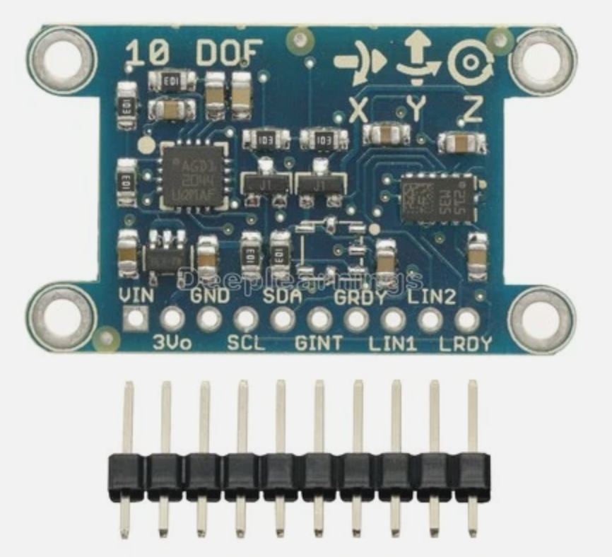
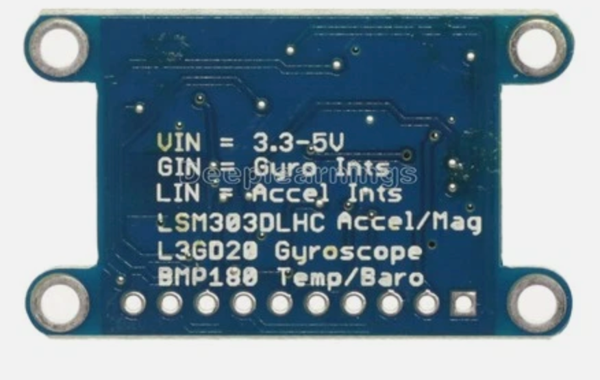

# 9-DOF IMU Kit

Can a robot feel which way it's turning, without a camera or a compass
needle? This kit wires up a real 9-axis motion sensor to a bare Raspberry Pi
Pico and proves, with live numbers on the screen, that it can.

!!! mascot-welcome "Welcome, maker!"
    { class="mascot-admonition-img" }
    In this lab, we wire up a real 9-axis motion sensor, confirm every chip
    on it answers over I2C, and stream live gyroscope, accelerometer, and
    magnetometer data to the console. Computational thinking is YOUR
    superpower — let's activate it!

## Summary

In this lab, we bring up a 9-DOF IMU module on a breadboard with a bare
Raspberry Pi Pico. We start by scanning the I2C bus to confirm all three
sensor chips are wired correctly, then check each chip's identity to prove
we're really talking to the parts we expect. Once identity is confirmed, we
stream raw gyroscope, accelerometer, and magnetometer readings to the
console and check that they look physically sane. Along the way, we hit —
and fix — a real hardware bug, because that's what bringing up new hardware
actually looks like.

## Concepts Covered

This lab covers the following concepts from the learning graph:

1. I2C Bus
2. I2C Scanner Tool
3. 9-DOF IMU Overview
4. L3GD20 Gyroscope
5. LSM303D Accelerometer Magnetometer

## Prerequisites

This lab builds on concepts from:

- [Chapter 6: Electronics, Motors, and Protocols](../../chapters/06-electronics-motors-protocols/index.md) — the I2C bus, addresses, and pull-up resistors

If you haven't tried a motion sensor before, the
[Compass Kit](../compass-hmc5883l/index.md) and
[IMU/MPU6050 Kit](../imu-mpu6050/index.md) are gentler places to start.

## Parts List

| Part | Price | Where to buy |
|---|---|---|
| Raspberry Pi Pico | *(reused from earlier kits)* | |
| Breadboard + jumper wires | *(reused from earlier kits)* | |
| "10 DOF" IMU module (L3GD20 + LSM303DLHC + BMP180) | `{{TODO: price}}` | `{{TODO: purchase link}}` |

**Total cost:** `{{TODO}}` — fill in once you have the price/link for the sensor board handy.

## Meet the 9-DOF IMU Module

**IMU** stands for **Inertial Measurement Unit** — a sensor that answers
"what am I doing right now?" instead of "what's around me?" It can tell you
whether something is spinning, tipping, or shaking, without a camera or any
outside reference point.


*The module's silkscreen prints "10 DOF" and marks the axis directions right on the board — use those arrows, not guesswork, when you decide which edge is "front."*

This board actually carries **three** separate sensor chips, not one:

| Chip | Senses | I2C address |
|------|--------|--------------|
| **L3GD20** | rotation rate (gyroscope) on 3 axes | `0x6B` |
| **LSM303DLHC** | acceleration and magnetic field (accelerometer + magnetometer) on 3 axes each | `0x19` (accel), `0x1E` (mag) |
| **BMP180** | temperature and air pressure — a bonus chip, not used in this lab | `0x77` |

Three chips, three axes each, on the gyro and accelerometer, plus three
more on the magnetometer, is where the name **9-DOF** ("nine degrees of
freedom") comes from. The board's own silkscreen calls it "10 DOF" because
it's counting the bonus BMP180 too — we only use the first nine axes in this
lab.


*The back of the board spells out exactly what's on it — the fastest way to identify a sensor board is to just read the label.*

!!! mascot-thinking "Why three chips instead of one?"
    { class="mascot-admonition-img" }
    The MPU6050 in an earlier kit packs a gyroscope and accelerometer into a
    single chip with one I2C address. This board's designer instead picked
    two separate, ready-made chips — built by a company called
    STMicroelectronics, which makes sensor chips for products all over the
    world — and wired them to the same two bus wires. That's why this module
    answers at *three* different I2C addresses instead of one — each chip
    only knows about itself, and it's our code's job to talk to all three.

The board exposes ten pins. The important detail for wiring is that `VIN`
takes power **in** (anywhere from 3.3V to 5V, printed right on the back),
while `3Vo` is a regulated 3.3V **output** from the board's own onboard
regulator — a convenience pin for powering something else, not a place to
feed power in. Leave `3Vo` unconnected.

## Wiring the Sensor

| Module pin | Pico pin | Notes |
|------------|----------|-------|
| VIN | 3.3V OUT | Power in — not `3Vo` |
| GND | GND | |
| SDA | GPIO0 | I2C data |
| SCL | GPIO1 | I2C clock |
| GINT | GPIO11 | Gyro interrupt — wired up, not read by these lessons yet |
| GRDY | GPIO12 | Gyro data-ready — wired up, not read by these lessons yet |
| LIN1 | GPIO13 | Accel/mag interrupt 1 — wired up, not read by these lessons yet |
| LIN2 | GPIO14 | Accel/mag interrupt 2 — wired up, not read by these lessons yet |
| LRDY | GPIO15 | Accel/mag data-ready — wired up, not read by these lessons yet |
| 3Vo | *(not connected)* | Regulated output, not a power input |

!!! mascot-tip "SDA is always an even pin, SCL is always the next odd one"
    { class="mascot-admonition-img" }
    On the RP2040 chip inside the Pico, every I2C data pin lands on an
    even-numbered GPIO and every I2C clock pin lands on the very next
    odd-numbered one — GPIO0/1, GPIO4/5, GPIO8/9, GPIO20/21, and so on. If
    you ever forget which GPIO is SDA and which is SCL, that pattern always
    holds.

Here's a real bug we hit while building this lab, because hardware
debugging is part of engineering — not a sign something went wrong. A plain
I2C scan found all four chips right away — but reading an actual register
from any of them threw `OSError: [Errno 5] EIO`, every time, at every clock
speed. The fix wasn't a wiring change at all:

```python
# Hardware peripheral - scans fine, but throws EIO on every real read here
i2c = machine.I2C(0, sda=machine.Pin(0), scl=machine.Pin(1), freq=100000)

# Bit-banged software I2C - same pins, same pull-ups, works perfectly
i2c = machine.SoftI2C(sda=machine.Pin(0), scl=machine.Pin(1), freq=100000)
```

!!! mascot-warning "A bus that scans but won't read isn't always a pull-up problem"
    { class="mascot-admonition-img" }
    It's tempting to add external pull-up resistors the moment reads start
    failing with `EIO`. Here's the proof that wasn't the real cause: if weak
    pull-ups were the problem, `SoftI2C` should have failed too — it uses
    the exact same physical resistors and the exact same clock speed. It
    didn't fail even once. That means the bug lived in the RP2040's hardware
    I2C0 peripheral driver on this board's firmware, not in the electrical
    bus. When a scan works but reads don't, try `machine.SoftI2C` before
    reaching for resistors.

## Step 1 — 01-probe.py: Confirm Every Chip Answers on I2C

Before trusting any sensor reading, we need proof the right chips are
actually there. `01-probe.py` scans the bus, then reads an identity value
back from each chip — because two different boards can share the same I2C
address by coincidence, and a scan alone can't tell them apart.

```python
i2c = machine.SoftI2C(sda=machine.Pin(config.I2C_SDA_PIN),
                       scl=machine.Pin(config.I2C_SCL_PIN), freq=100000)
devices = i2c.scan()
```

The gyroscope has a proper **WHO_AM_I** register that always reports a fixed
value — `0xD4` for the L3GD20, `0xD7` for the closely related L3GD20H:

```python
who = i2c.readfrom_mem(config.GYRO_I2C_ADDRESS, config.WHO_AM_I_REGISTER, 1)[0]
```

The accelerometer half of the LSM303DLHC has no identity register at all —
a real limitation of this chip, not a gap in our code. The closest thing to
a check is writing a setting and reading it back:

```python
i2c.writeto_mem(config.ACCEL_I2C_ADDRESS, 0x20, b'\x57')
readback = i2c.readfrom_mem(config.ACCEL_I2C_ADDRESS, 0x20, 1)[0]
```

The magnetometer half makes up for it with three fixed identification bytes
that spell out "H43":

```python
ida, idb, idc = i2c.readfrom_mem(config.MAG_I2C_ADDRESS, 0x0A, 3)
```

**Try it now:** run `01-probe.py` in Thonny and press **F5**. You should see
all four devices found, followed by four identity confirmations and
`TEST PASS - gyroscope, accelerometer, and magnetometer all found and
identified`. If you want a quicker scan-only check while you're wiring
things up, `i2c-scanner-test.py` does just the scan, without the identity
checks.

## Step 2 — 02-test-stream.py: Reading Raw Motion Data

With identity confirmed, we can trust the readings enough to stream them.
Two small driver classes — `L3GD20` and `LSM303DLHC` — handle the register
math, so the lesson script itself stays simple:

```python
gyro = L3GD20(i2c, config.GYRO_I2C_ADDRESS)
accel_mag = LSM303DLHC(i2c, config.ACCEL_I2C_ADDRESS, config.MAG_I2C_ADDRESS)

gx, gy, gz = gyro.read_dps()
ax, ay, az = accel_mag.read_accel_g()
mx, my, mz = accel_mag.read_mag_gauss()
```

`read_dps()` returns rotation speed in **degrees per second**. `read_accel_g()`
returns acceleration in multiples of Earth's gravity (**g**). `read_mag_gauss()`
returns magnetic field strength in **gauss** — but it has to swap two of the
three bytes it reads first, because the LSM303DLHC's magnetometer registers
come out in **X, Z, Y** order, exactly the same surprising order the
HMC5883L used back in the [Compass Kit](../compass-hmc5883l/index.md):

```python
def read_mag_gauss(self):
    data = self.i2c.readfrom_mem(self.mag_address, OUT_X_H_M, 6)
    x, z, y = ustruct.unpack('>hhh', data)  # registers are ordered X, Z, Y
    ...
```

Here's a real sample from this bench, sitting still on a table:

```
gyro dps:   92.06   19.06   13.66  accel g: -0.06  0.05  0.90  mag gauss: -0.589 -0.730 -1.860
```

The accelerometer's total pull (about 0.90g here) should sit close to 1g at
rest — ours is a little low because the board wasn't sitting perfectly
level. The gyroscope reading a steady 92 dps while the board never moved
looks alarming at first, but it isn't a bug: every cheap **MEMS** gyroscope
— MEMS means the sensor is a tiny mechanical part, built at the same
microscopic scale as the rest of the chip — has a fixed **zero-rate bias**,
an offset baked in from the factory that shows up even sitting perfectly
still. A future calibration lesson — the same
technique used for the MPU6050's gyro bias in the
[IMU/MPU6050 Kit](../imu-mpu6050/index.md) — is how you'd measure and
subtract that bias out.

**Try it now:** run
[`upload-code.sh`](https://github.com/dmccreary/stem-robots/blob/main/src/kits/9-dof-imu/upload-code.sh)
from a terminal to copy `config.py`, both numbered lessons, and the shared
`l3gd20.py`/`lsm303dlhc.py` drivers onto the Pico in one step, then run
`02-test-stream.py`. Rotate the board and watch the gyro numbers swing; tilt
it and watch the accelerometer numbers shift.

## Key Takeaways

- A "9-DOF" IMU module is often two or three separate I2C chips sharing one
  bus, not one combined chip — each with its own address and its own way of
  proving its identity.
- A scan finding a device only proves *something* answered at that address —
  reading a real identity value (WHO_AM_I, a register readback, or fixed ID
  bytes) is what proves it's the chip you think it is.
- On the RP2040, SDA is always an even-numbered GPIO and SCL is always the
  next odd one.
- A bus that scans fine but throws `EIO` on every real read isn't
  automatically a pull-up problem — swapping the hardware `machine.I2C` for
  bit-banged `machine.SoftI2C` on the exact same pins and pull-ups is a fast
  way to tell the difference.
- Every MEMS gyroscope and accelerometer has some amount of built-in error
  (zero-rate bias, a less-than-1g resting reading) that calibration, not
  perfect hardware, is what corrects.

!!! mascot-celebration "You brought up a real 9-axis sensor from scratch!"
    { class="mascot-admonition-img" }
    Look at what you just did: you confirmed three real chips over I2C,
    tracked down a genuine peripheral-driver bug instead of reaching for a
    fix that wouldn't have helped, and got nine real axes of motion data
    streaming live. That's the exact kind of hardware bring-up work that
    turns this module into the compass a future swarm of robots will use to
    agree on which way they're all facing.

## References

[L3GD20 3-axis gyroscope — Datasheet](https://www.st.com/resource/en/datasheet/l3gd20.pdf) - STMicroelectronics. Register map and electrical specifications for the gyroscope used in this lab.

[LSM303DLHC accelerometer/magnetometer — Datasheet](https://www.st.com/resource/en/datasheet/lsm303dlhc.pdf) - STMicroelectronics. Register map, the X/Z/Y magnetometer data order, and the identification bytes used in this lab.

[machine.I2C and machine.SoftI2C — MicroPython documentation](https://docs.micropython.org/en/latest/library/machine.I2C.html) - official reference for the hardware and bit-banged I2C drivers used in this lab.

[Swarm Robot Build Plan](../swarm-bot/plan.md) - the L3GD20 + LSM303DLHC module bench-tested here is the same one planned for the swarm robot's WiFi heading-synchronization project.

[Source code for this lab](https://github.com/dmccreary/stem-robots/tree/main/src/kits/9-dof-imu) - `01-probe.py`, `02-test-stream.py`, `i2c-scanner-test.py`, `config.py`, and the shared `l3gd20.py`/`lsm303dlhc.py` drivers.
