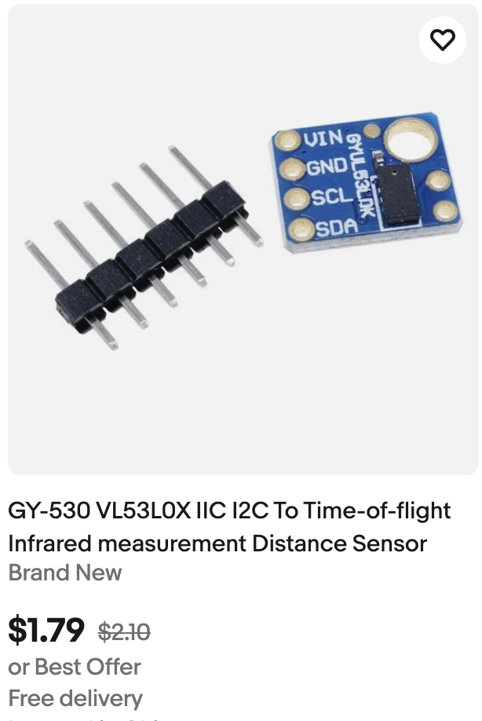

# Base STEM Robot

This is our classic low-cost collision-avoidance robot that can be purchased for around $19
 each and can be assembled without any soldering.  It is the first robot
 that we recommend that is purchased for students.  Because it
 is an open system, other more complex versions can be added to this
 robot.  For example, you can add an OLED display for an additional $13
 after the base robot has been tested.

 ## Parts
 It is built on the powerful
[Cytron Maker Pi RP2040](https://www.cytron.io/p-maker-pi-rp2040-simplifying-robotics-with-raspberry-pi-rp2040) board that is programmed by the same
software that powers the Raspberry Pi Pico.

This robot uses the [two wheel drive start robot chassis](https://www.cytron.io/p-2wd-smart-robot-car-chassis), although you can also print out your own chassis
using a 3D printer.

We also prefer the low-cost [Time-of-Flight Distance Sensor](https://www.ebay.com/sch/i.html?_nkw=VL53L0X+time+of+flight+sensor&_sop=15)

We find it is more precise and reliable than the older ultrasonic ping sensor.  It does require a small plastic holder to attached to the front of the robot.

# Introduction to the Base STEM Robot

Although there are many variations of our STEM Robot, this
robot was specifically designed for classrooms that
don't want to require any soldering and complex wiring.