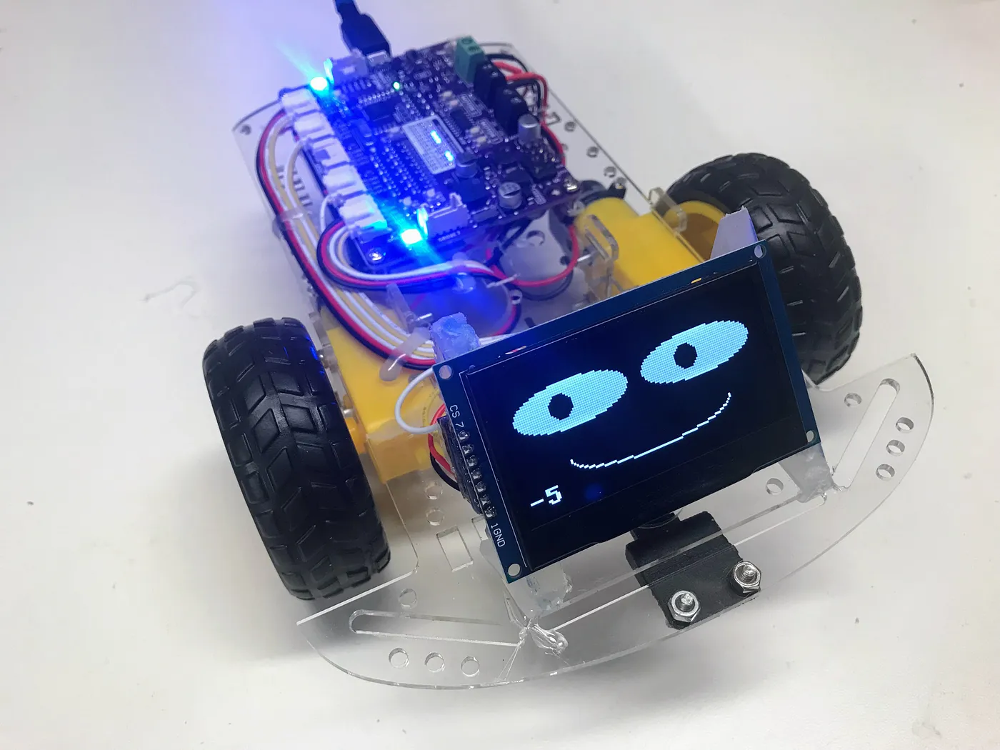

# Display Bot



One of the best ways to see what is going on in a STEM robot is to add
a small display.  One of our favorite displays is a 2.42" 128x64 OLED display.
Although it is not full color, it is large and bright enough that we can read the numbers while we are standing and the robot is on the floor.

[Display Setup](display-setup.md)

[Time of Flight Range Test](./tof-range-display-test.md)

[Displaying Distance Chart](./display-distance.md)

## Uploading the Code

The source code for every lab in this kit, plus a shared `config.py`, lives in
[`src/kits/display-bot/`](https://github.com/dmccreary/stem-robots/tree/main/src/kits/display-bot).
To copy the whole kit onto the Pico in one step, run
[`upload-code.sh`](https://github.com/dmccreary/stem-robots/blob/main/src/kits/display-bot/upload-code.sh)
from a terminal:

```bash
./upload-code.sh
```

Any single program can also be run directly from Thonny, or headlessly with:

```bash
mpremote connect /dev/cu.usbmodem101 run 05-display-test.py
```

(Your port name may differ — check what shows up when you plug in the Pico.)

