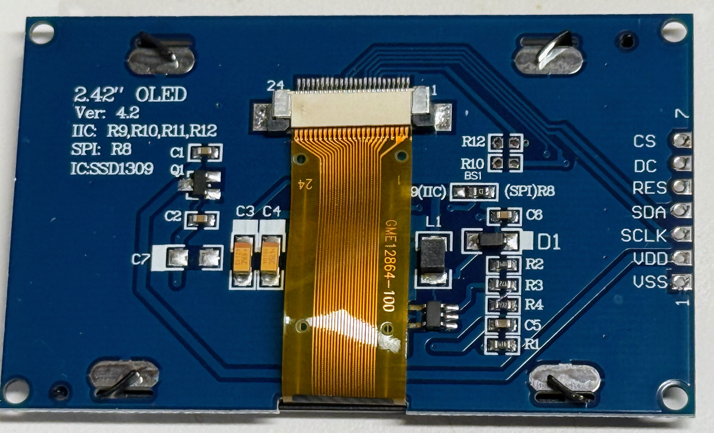
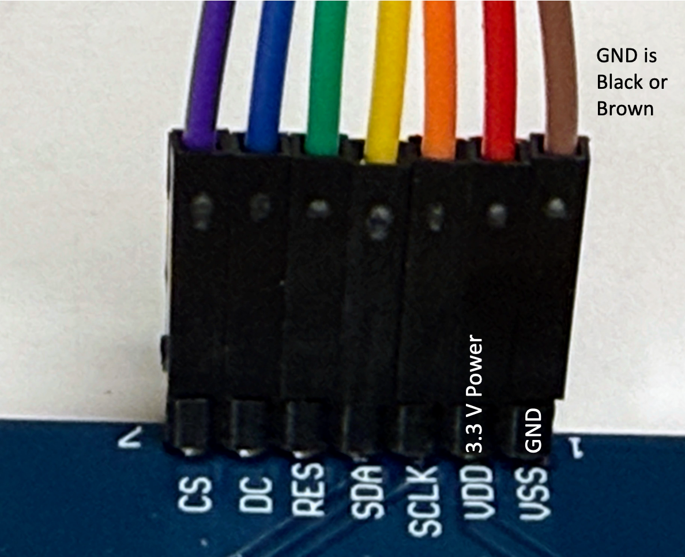
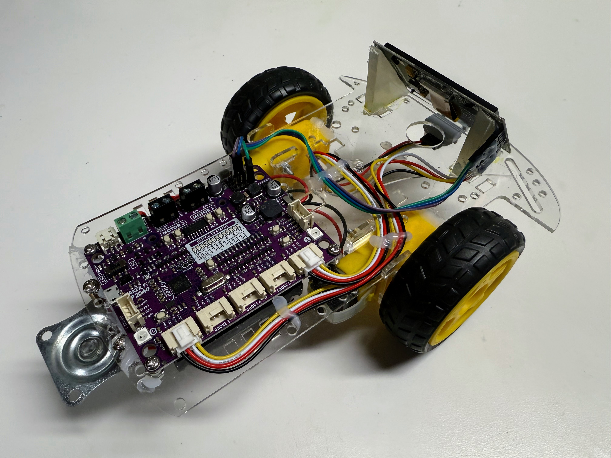
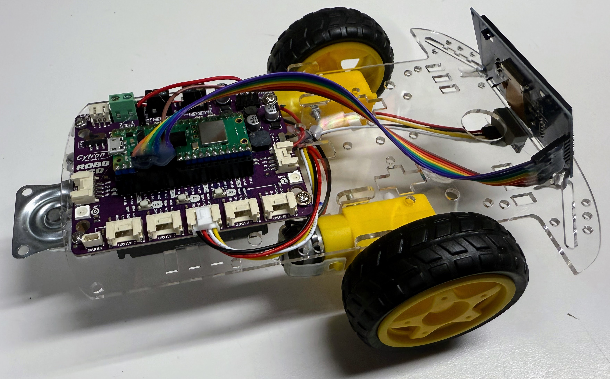

# Display Setup

There are two types of display connections.  One uses a four-wire I2C connection.  The other is a 7-wire SPI connection.  In this example we will use the 7-wire SPI interface.

## Creating a Display Cable

One of the first steps is to connect the OLED to the ports of the robot.  Here is a photo of the connections on the back of the OLED screen.



On the right you will see the following connections from top to bottom:

| Label | Description |
| --- |  --- |
| CS | Chip Select (Slave Select) - Selects this device on the SPI bus |
| --- |  --- |
| DC | Data/Command - Indicates whether data being sent is a command (LOW) or display data (HIGH) |
| RES | Reset - Active LOW reset pin to initialize the display |
| SDA | Serial Data - SPI data line (MOSI) for sending data to the display |
| SCLK | Serial Clock - SPI clock signal for data synchronization |
| VDD | 3.3 to 5 volt power |
| VSS | Ground |

These pins represent the standard SPI interface for OLED displays:

- **CS** is pulled LOW to activate communication with this specific device
- **DC** switches between command mode (LOW) and data mode (HIGH)
- **RES** should be pulled LOW briefly during initialization to reset the display
- **SDA** carries the serial data from the microcontroller to the display (also known as MOSI - Master Out Slave In)
- **SCLK** carries the clock signal that synchronizes data transmission

We will connect wires to these connections.



## Cytron Display Connection



The Cytron uses a four pin Grove connector.  This can be used
to connect the power, ground, data and clock.  We can then use
the servo pins for the other three connections.

## Cytron ROBO PICO



The Cytron PICO ROBOT has a female header that can be used to directly connect
the display cable.  You do not need to use any of the Grove connectors to 
connect the display.

## Testing the Display

After you have created your display cable you can test your display with the following code:

```python
import machine
import ssd1306

SCK=machine.Pin(2)
SDL=machine.Pin(3)
spi=machine.SPI(0,sck=SCK, mosi=SDL)
CS = machine.Pin(15)
DC = machine.Pin(14)
RES = machine.Pin(13)
oled = ssd1306.SSD1306_SPI(128, 64, spi, DC, RES, CS)

oled.fill(0)
oled.text('Hello World!', 0, 0)
oled.show()
```

Note this is an example of the `hardware` SPI interface.  There is also a software interface that includes the baudrate parameter.

Details on how the SSD1306 is used can be found on the [MicroPython Tutorial Docs Site](https://docs.micropython.org/en/latest/esp8266/tutorial/ssd1306.html) for the ESP.  The code will run the same on the RP2.

