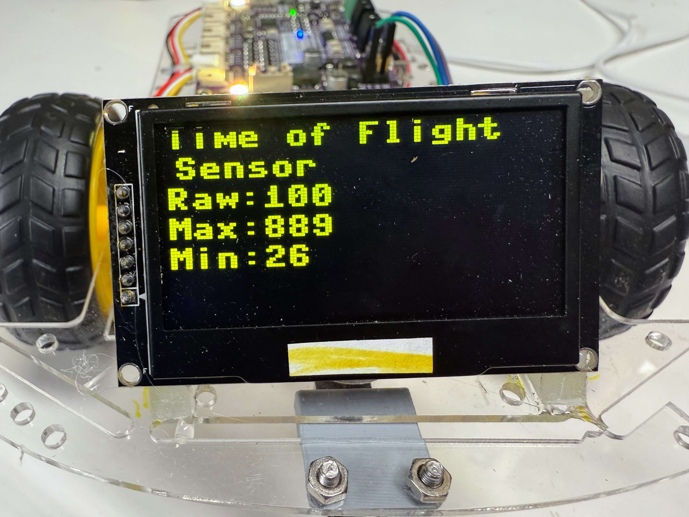

# Time of Flight Display Range Test



We can use the display to track the range of of values being measured by the time-of-flight sensor.

The following program will track the current raw value but also remember the min and max values.  Note that a value of 8190 is used to indicate there was no signal.


```python
# Test program for VL53L0X
import time
from machine import Pin, I2C
import ssd1306
import VL53L0X

sda=machine.Pin(26)
scl=machine.Pin(27)
i2c=machine.I2C(1,sda=sda, scl=scl, freq=400000)

WIDTH = 128
HEIGHT = 64
SCK=machine.Pin(2)
SDL=machine.Pin(3)
spi=machine.SPI(0,baudrate=100000,sck=SCK, mosi=SDL)
# servo pins
RES = machine.Pin(13)
DC = machine.Pin(14)
CS = machine.Pin(15)
oled = ssd1306.SSD1306_SPI(WIDTH, HEIGHT, spi, DC, RES, CS)

tof = VL53L0X.VL53L0X(i2c)

tof.start()
minimum = 1000
maximum = 0
while True:
    dist = tof.read()
    
    # store max if under 8191
    if dist > maximum: 
        if dist < 8190:
            maximum = dist
            
    # store min
    if dist < minimum: 
        minimum = dist
    print(tof.read())
    oled.fill(0)
    oled.text("Time of Flight", 0, 0)
    oled.text("Sensor", 3, 10)
    oled.text("Raw:" + str(dist), 0, 20)
    oled.text("Max:" + str(maximum), 0, 30)
    oled.text("Min:" + str(minimum), 0, 40)
    oled.show()
    time.sleep(0.05)

# tof.stop()
```