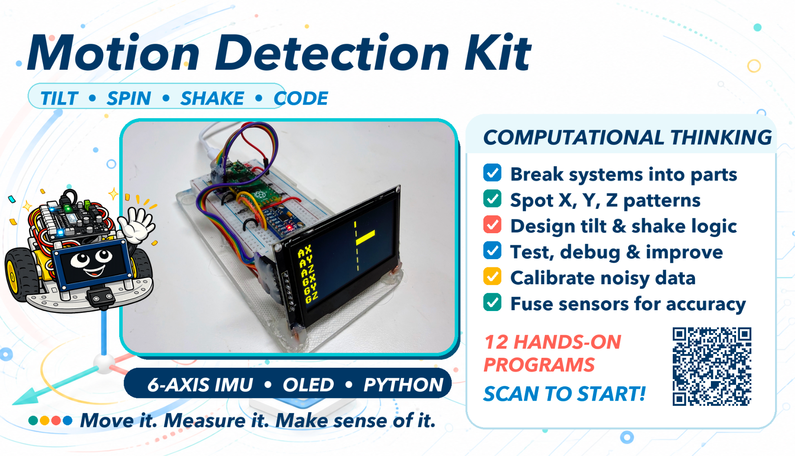
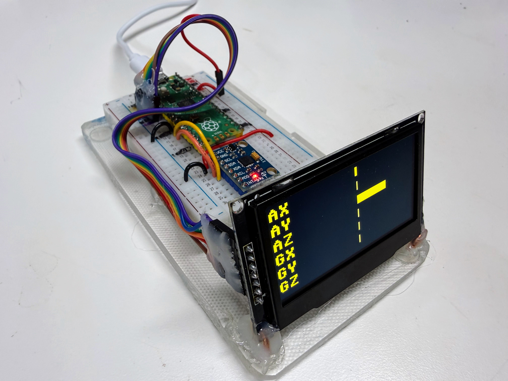
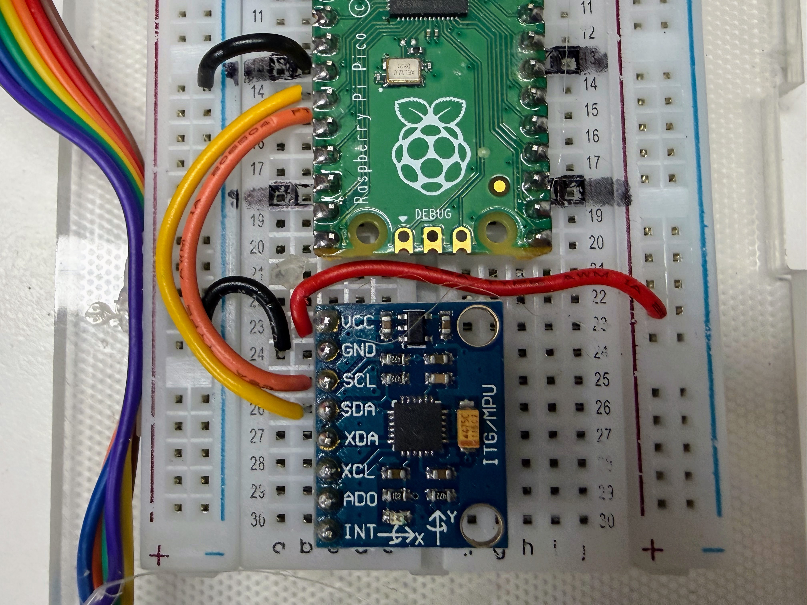
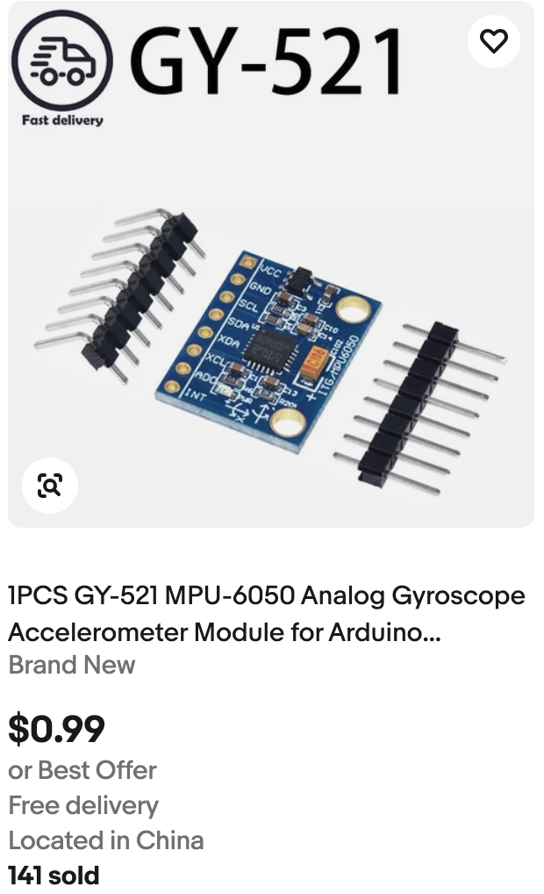
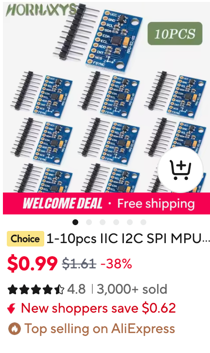

# Motion Detection Explorer Kit



Learning about how to detect motion in a robot using a sensitive MEMS sensor.

!!! mascot-welcome "Welcome, maker!"
    { class="mascot-admonition-img" }
    Today we're not building a robot that drives — we're building one that
    *feels*. Grab a Pico, a breadboard, an MPU6050 sensor, and a little OLED
    screen, and let's find out how a robot knows which way is down!

This kit is not a full robot. There are no wheels and no motors. It is a
small, standalone learning bench: a Raspberry Pi Pico, a breadboard, some
jumper wires, an MPU6050 sensor, and an OLED display. Its only job is to
teach one thing well — how an **IMU** sensor works, and how MicroPython code
reads, displays, and calibrates it. Once you understand this kit, you'll be
ready to bolt the same sensor onto a real robot chassis.

## What Is an IMU?

**IMU** stands for **Inertial Measurement Unit**. You'll also see the same
kind of chip called an **MPU**, short for **Motion Processing Unit** — that's
where the "MPU" in "MPU6050" comes from. Both names mean the same kind of
device: a chip that senses its own movement.

Every sensor you've used so far in this course answers the question "what's
around me?" A time-of-flight sensor measures distance to a wall. A line
sensor detects a dark stripe on the floor. An IMU asks a completely
different question: **"what am I doing right now?"**

- Am I tipping forward or backward?
- Am I spinning?
- Did something just hit me?
- Which way is "up"?

Think about your own inner ear. Close your eyes on a spinning office chair
and you can still feel that you're turning. You don't need to see it. That
sense — motion and balance, felt from the inside — is exactly what an IMU
gives a robot. The MPU6050 packs two sensors into one tiny chip to do this:

| Sensor | What it measures | Units |
|--------|-------------------|-------|
| **Accelerometer** | Acceleration along the X, Y, and Z axes — including gravity | g (1g = Earth's gravity) |
| **Gyroscope** | How fast the sensor is rotating around each axis | degrees per second (deg/s) |

That combination — three axes of acceleration plus three axes of rotation —
is why the MPU6050 is called a **6-DOF** sensor: six degrees of freedom.

Why does this matter in robotics? A robot with an IMU can tell if it just
got picked up, tipped over, or bumped into something — without waiting for a
distance sensor to notice. It can keep its balance. It can estimate which
way it's facing even between GPS updates or camera frames. Self-driving
cars, drones, game controllers, and phones all use the exact same idea you're
about to wire up on a breadboard.

## How MEMS Technology Makes This Possible

A chip this small and this cheap — an MPU6050 breakout costs only a few
dollars — can measure motion because of **MEMS**, or **Micro-Electro-
Mechanical Systems**. MEMS means tiny mechanical parts, built at the same
microscopic scale as computer chips, etched right onto a sliver of silicon.

Inside the MPU6050, next to the ordinary circuits, are structures smaller
than the width of a human hair — with parts that actually move:

- **The accelerometer** contains a tiny mass held in place by microscopic
  springs. When the chip accelerates — or when gravity pulls on it — that
  mass shifts a *tiny* amount. Tiny comb-shaped electrodes on either side of
  the mass detect that shift as a change in capacitance (an electrical
  property related to how close two surfaces are). More shift means more
  acceleration.
- **The gyroscope** uses a different trick: a structure vibrating at a
  constant rate. When the whole chip rotates, that vibration bends slightly
  in a new direction — a physics effect called the **Coriolis effect**
  (the same effect that curves hurricane winds on a rotating Earth). The
  chip measures that bend and turns it into a rotation rate.

!!! mascot-thinking "A mechanical machine you can't see"
    { class="mascot-admonition-img" }
    Here's the wild part: there really is a microscopic mass swinging on
    microscopic springs inside that little chip, right now. It's a real
    machine — just one you'd need a microscope to see move.

MEMS is why this sensor is reliable enough to trust: it has no motors, no
wear-prone bearings, and it's manufactured on the same automated production
lines that make ordinary computer chips by the billion. That's also why your
phone can tell when you rotate it, why game controllers know when you tilt
them, and why a five-dollar breakout board can do something that used to
require an expensive lab instrument.

## What's in This Kit



This kit has five parts, all listed with pin details in
[`config.py`](https://github.com/dmccreary/stem-robots/blob/main/src/kits/imu-mpu6050/config.py):

| Part | Role |
|------|------|
| Raspberry Pi Pico | Runs the MicroPython code |
| Breadboard | Holds everything without soldering |
| Jumper wires | Connect the Pico, sensor, and display |
| MPU6050 breakout | The IMU itself |
| SSD1306/SSD1309 OLED (128×64) | Shows live sensor readings |

### Wiring



The MPU6050 talks to the Pico over **I2C**, a two-wire protocol also used by
the compass sensor in an earlier kit. The OLED uses a different protocol
called **SPI**, which needs a few more wires but runs faster.

| MPU6050 pin | Pico pin | Purpose |
|-------------|----------|---------|
| VCC | 3.3V OUT | Power |
| GND | GND | Ground |
| SDA | GPIO10 | I2C data |
| SCL | GPIO11 | I2C clock |
| XDA / XCL | GPIO12 / GPIO13 | Not used in this kit |
| AD0 | GPIO14 | Address select (left unconnected = address `0x68`) |
| INT | GPIO15 | Not used in this kit |

| OLED pin | Pico pin |
|----------|----------|
| SCL (clock) | GPIO2 |
| SDA (data) | GPIO3 |
| RES | GPIO4 |
| DC | GPIO5 |
| CS | GPIO6 |

!!! mascot-warning "GPIO10 and GPIO11 aren't interchangeable"
    { class="mascot-admonition-img" }
    On the Pico's RP2040 chip, GPIO10 can *only* be I2C data (SDA) and
    GPIO11 can *only* be I2C clock (SCL) — swap them and MicroPython
    refuses to start with a `bad SCL pin` error. If your sensor still isn't
    found after fixing that, double check the physical wires aren't crossed
    the *other* way, landing SCL and SDA on the opposite pins from what the
    chip expects.

### Uploading the Code

Every program in this kit is a separate MicroPython file, numbered in the
order you'd naturally try them. To copy the whole kit — every program, the
shared `config.py`, the display driver, and any saved calibration — onto
the Pico in one step, run
[`upload-code.sh`](https://github.com/dmccreary/stem-robots/blob/main/src/kits/imu-mpu6050/upload-code.sh) from a
terminal:

```bash
./upload-code.sh
```

Any single program can also be run directly from Thonny, or headlessly with:

```bash
mpremote connect /dev/cu.usbmodem101 run 01-probe.py
```

(Your port name may differ — check what shows up when you plug in the Pico.)

## Step-by-Step Walkthrough of Every Program

Each program below builds on the one before it. Try them in order the first
time through.

### 1. `01-probe.py` — Is Anyone There?

Before writing any real program, we need to know the sensor is actually
there and talking. `01-probe.py` scans the I2C bus and lists every address
that answers — like a roll call for chips:

```python
i2c = machine.I2C(I2C_BUS, sda=sda, scl=scl, freq=400000)
devices = i2c.scan()
```

If the MPU6050 answers, it always shows up at address `0x68` (or `0x69` if
the AD0 pin is wired high). The probe then reads a register called
**`WHO_AM_I`** — every MPU6050 always reports back `0x68` here, no matter
what its I2C address is — as a second confirmation that the chip really is
an MPU6050 and not some other I2C device wired to the same pins.

### 2. `02-test-stream.py` — Numbers Without a Screen

You don't need a display to know the sensor works. This program prints
accelerometer and gyroscope readings straight to the console, six numbers
per line:

```python
data = i2c.readfrom_mem(MPU6050_ADDRESS_LOW, ACCEL_XOUT_H, 14)
ax, ay, az, _temp, gx, gy, gz = struct.unpack(">hhhhhhh", data)
```

That one `readfrom_mem` call grabs all 14 bytes the sensor needs in a single
trip across the wire — accelerometer X/Y/Z, a temperature reading we don't
use yet, and gyroscope X/Y/Z. `struct.unpack` turns those raw bytes into six
signed numbers. Run this program and gently rotate the sensor — the numbers
should change smoothly and immediately.

### 3. `03-test-oled-hello.py` — Hello, Screen

The classic first program for any display: put "Hello World!" on the
screen. If you can read it, the SPI wiring and the OLED driver both work —
completely separate from whether the MPU6050 works:

```python
oled = config.init_display()
oled.fill(config.BLACK)
oled.text("Hello World!", 15, 28, config.WHITE)
oled.show()
```

### 4. `04-display-accel-bars.py` — Feeling Gravity

Now we combine the sensor and the screen. This program draws three
horizontal bars — X, Y, and Z acceleration — each growing left or right from
a center line as you tilt or move the sensor. Hold it still and one bar
should already be pushed out: that's gravity, always pulling at 1g on
whichever axis points straight down.

### 5. `05-display-gyro-bars.py` — Feeling Spin

Same three-bar layout, but this time driven by the gyroscope instead of the
accelerometer. Spin the sensor and the bars swing out; let it rest and they
snap back to center. This is a good way to *feel* the difference between the
two sensors: the accelerometer reacts to **tilt and gravity**, the
gyroscope reacts to **how fast you're turning it**.

### 6. `06-display-tilt-level.py` — Bubble Level

This program turns the accelerometer into a digital version of the bubble
level a carpenter uses. A dot drifts away from the center of a circle as you
tilt the board, and the screen prints "LEVEL" once you get it flat:

```python
if abs(ax) < LEVEL_TOLERANCE_G and abs(ay) < LEVEL_TOLERANCE_G:
    label = "LEVEL"
```

Under the hood, it turns the X and Y acceleration into **roll** and **pitch**
angles (in degrees) using `atan2` — the same trigonometry a robot uses to
know it's about to tip over.

### 7. `07-display-six-bars.py` — All Six at Once

This puts everything from programs 4 and 5 on one screen: six compact bars,
`AX`/`AY`/`AZ`/`GX`/`GY`/`GZ`, all updating live. It's the best "just pick it
up and play" demo in the kit — every possible motion moves at least one bar
— which is why it's the default screen in `main.py` (more on that below).

### 8. `08-calibrate-gyro.py` — Teaching the Sensor to Sit Still

Set a resting gyroscope on a table and it should read exactly `0` deg/s on
every axis. In real hardware, it never quite does — manufacturing isn't
perfect, so every MPU6050 has a small constant **bias**, often a few deg/s,
even sitting perfectly still.

```python
gx_offset = sum_x / samples / GYRO_SCALE
```

This program averages five seconds of readings — **you must hold the sensor
completely still and flat** — to measure that bias for each axis, then
saves it to a file called `calibration.json` on the Pico. Other programs can
load that file later and subtract the bias out.

!!! mascot-warning "Calibration only works if you hold still"
    { class="mascot-admonition-img" }
    If the sensor moves — even a little — during those five seconds, real
    motion gets averaged in as if it were bias. That produces a *worse*
    correction than no correction at all. Set it down flat, let go, and
    don't touch the table either.

### 9. `09-demo-gyro-drift.py` — Why Calibration Matters

This program proves calibration is worth doing. It integrates the
gyroscope's Z-axis reading over time into a running heading estimate — two
ways at once. **RAW** uses the sensor's raw output; **CAL** subtracts the
bias saved by program 8:

```python
raw_heading = (raw_heading + gz * dt) % 360.0
cal_heading = (cal_heading + (gz - gz_offset) * dt) % 360.0
```

Set the sensor down and don't touch it. Watch RAW slowly count upward (or
downward) even though nothing is moving — that's the uncorrected bias adding
up, one tiny slice of time (`dt`) at a time. CAL should drift far more
slowly. Neither one drifts to exactly zero forever, though — which is
exactly the problem the last section of this page explains how to solve.

### 10. `10-demo-complementary-filter.py` — Two Sensors Are Better Than One

This program shows three different estimates of tilt (roll) side by side:

- **GYRO** — integrated from the gyroscope. Fast and smooth, but drifts.
- **ACC** — computed directly from gravity, using the accelerometer. Never
  drifts, but jumps around with every bump and vibration.
- **FILT** — a blend of both, called a **complementary filter**.

```python
filtered_roll = FILTER_ALPHA * (filtered_roll + (gx - gx_offset) * dt) + (1 - FILTER_ALPHA) * accel_roll
```

That one line is the whole trick: trust the gyroscope almost completely
(`FILTER_ALPHA = 0.98`, or 98%) moment to moment, but constantly nudge the
result a small amount (2%) back toward whatever the accelerometer says. The
gyroscope smooths out the accelerometer's noise; the accelerometer keeps the
gyroscope from drifting forever. Tilt the sensor slowly, then jerk it
quickly, and watch how differently each row reacts.

### 11. `11-demo-shake-detector.py` — Catching a Bump

At rest, no matter which way the sensor is pointed, its *total*
acceleration (all three axes combined) always measures close to 1g — that's
just gravity. A tap, drop, or shake briefly pushes that total number well
above or below 1g:

```python
magnitude = math.sqrt(ax * ax + ay * ay + az * az)
if abs(magnitude - 1.0) > SHAKE_THRESHOLD_G:
```

When that happens, the screen flashes **SHAKE!** in big inverted (white
background, black text) letters. A real robot could use this exact same
check to notice a collision — even one its distance sensor never saw
coming.

### 12. `12-demo-swarm-compare.py` — Two Robots, Two Opinions

This program draws a compass-style needle from a *calibrated* gyroscope
heading — the same math as program 9's CAL line, just drawn as a dial
instead of a number. It's meant to be copied onto **two or more** Picos and
started at the same instant, pointing the same way.

Watch what happens: both needles agree at first, then slowly drift apart.
Each board is only trusting its own slightly-imperfect gyroscope, with no
way to check itself against the other. That's not a bug — it's a preview of
a real problem every swarm of robots has to solve, which the last section of
this page explains.

## The Default Demo: `main.py`

!!! mascot-encourage "One big program, five small ones"
    { class="mascot-admonition-img" }
    This next program is the longest one in the kit. Don't let that worry
    you — it's really just programs 4, 5, 6, 7, and 10 taking turns on the
    same screen, plus one clever trick to switch between them.

Once you've tried the numbered programs, the kit's `main.py` — copied from
[`main-template.py`](https://github.com/dmccreary/stem-robots/blob/main/src/kits/imu-mpu6050/main-template.py) — is
what runs automatically every time the Pico powers on. It's built to hand
someone the kit with zero instructions and still make sense.

### Five Modes, No Calibration Required

`main.py` cycles through five display modes, each one a simplified version
of a program you've already met:

| Mode | Name | Same idea as |
|------|------|--------------|
| 0 (default) | Six Bars | `07-display-six-bars.py` |
| 1 | Tilt Level | `06-display-tilt-level.py` |
| 2 | Accel Bars | `04-display-accel-bars.py` (X/Y/Z only) |
| 3 | Gyro Bars | `05-display-gyro-bars.py` (X/Y/Z only) |
| 4 | Sensor Fusion | `10-demo-complementary-filter.py` |

Mode 0 — Six Bars — is the very first thing you see, on purpose. It's the
demo where *any* motion moves *something* on the screen, so a total stranger
picking up the kit immediately understands "oh, this reacts to how I move
it" within a couple of seconds, no reading required.

Notice `main.py` never loads `calibration.json`. That's deliberate: this is
the program a new user meets first, before they've ever run program 8. Mode
4's Sensor Fusion display still works fine without calibration — it just
carries a small, harmless bias in its GYRO row, which is invisible at a
glance and doesn't stop the demo from making its point.

### How Shaking Changes the Mode

`main.py` reuses the exact shake-detection math from program 11 — total
acceleration more than `0.5`g away from the resting 1g counts as a shake —
but instead of just flashing a message, a shake **advances to the next
mode**:

```python
if shook and not cooling_down:
    next_index = (mode_index + 1) % len(MODES)
    next_name, _draw, _on_enter = MODES[next_index]

    oled.fill(WHITE)
    center_text("Shake Detected", 8, BLACK)
    center_text("Changing Mode", 24, BLACK)
    center_text(next_name, 40, BLACK)
    oled.show()
    time.sleep_ms(SHAKE_MESSAGE_MS)
```

That screen — white background, bold black text, the upcoming mode's name
spelled out — is impossible to miss. After the last mode (Sensor Fusion), a
shake wraps back around to Six Bars, so the demo never gets "stuck" at the
end.

One detail makes this feel smooth instead of glitchy: `MODE_COOLDOWN_MS`.
For a second and a half after every mode change, new shakes are ignored.
Without it, a single real-world shake — which rarely lasts just one instant
— could trigger two or three mode changes in a row before you even let go of
the sensor.

Try it yourself: run `main.py`, watch the Six Bars mode react to every
movement, then give the board one firm shake and read the message before
the next mode appears.

## From One Sensor to a Swarm: Adding a Magnetometer

Program 12 showed two boards' headings quietly drifting apart, each trusting
only its own gyroscope. That's not just a demo quirk — it's a fundamental
limit of this exact 6-DOF sensor, and understanding *why* points straight at
how real robot swarms solve it.

Here's the core problem: the accelerometer can tell you which way is
**down** (that's how program 6's Tilt Level works), but it cannot tell you
which way is **north**. Spin the sensor flat on a table, staying perfectly
level the whole time, and gravity still pulls straight down on the same
axis — the accelerometer sees no change at all. The only sensor tracking
that spin is the gyroscope, and the gyroscope only measures a *rate of
change* that has to be added up over time — which means, as program 9
showed, it drifts.

A **magnetometer** solves this by sensing something the accelerometer can't:
Earth's magnetic field. Just like a compass needle, it points toward
magnetic north no matter how the sensor is spinning. Add a magnetometer to
this kit's accelerometer and gyroscope, and you get a full **9-DOF** sensor
— nine degrees of freedom, three sensors, three axes each. That's exactly
the [L3GD20 gyroscope + LSM303D accelerometer/magnetometer combo](../../chapters/13-swarm-robotics-advanced-patterns/index.md)
used later in this course to build a real swarm.

The magnetometer isn't a free lunch, though. Motors, batteries, and nearby
metal all distort magnetic fields, so every magnetometer needs its own
**hard-iron calibration** — you can see this exact idea already at work in
the [compass kit](https://github.com/dmccreary/stem-robots/blob/main/src/kits/compass-hmc5883l/README.md), where
rotating the sensor through a full circle measures and cancels out that
local distortion. And a magnetometer reading alone is noisy and slow, in
the same way this kit's accelerometer alone was noisy in program 10 — so a
9-DOF sensor gets fused together with the same **complementary filter** idea
from program 10, just extended to blend three sensors into one stable
heading instead of two.

Here's where it becomes a *swarm* technique rather than a single-robot one.
Program 12 already showed that two boards, left alone, disagree more and
more over time. A magnetometer fixes that for *one* robot by giving it its
own absolute compass reference. But a whole swarm needs every robot to agree
with **each other**, not just with a compass — and cheap magnetometers still
have small errors that differ from one to the next. The fix used later in
this course is for one robot to broadcast its own fused heading over WiFi,
using a networking pattern called **UDP broadcast**, so every other robot in
the swarm can steer to match it — the same way you might follow a friend's
pointed finger instead of trying to work out north yourself. No robot has to
be perfectly accurate on its own. They just all have to agree.

That's the real destination this kit has been building toward: everything
you practiced here — reading raw sensor values, calibrating out bias, and
blending two disagreeing sensors into one trustworthy answer — is precisely
what it takes to keep an entire swarm of robots pointed the same direction.

!!! mascot-celebration "You just learned how robots feel motion!"
    { class="mascot-admonition-img" }
    Look at what you built: you probed a sensor over I2C, streamed live
    motion data, drew five different OLED visualizations, measured a real
    gyroscope bias, and fused two sensors into one steady answer. That's the
    same toolkit real robotics engineers use — you just used it on a
    breadboard instead of a spacecraft!

## References

[MPU-6000/MPU-6050 Product Specification](https://invensense.tdk.com/wp-content/uploads/2015/02/MPU-6000-Datasheet1.pdf) - InvenSense/TDK. The official datasheet: register map, electrical characteristics, and pin configuration for the 6-DOF sensor used in this kit.


## Purchasing Your Own Sensors

There are two reasons we selected the MPU6050 in the GY-521 package. The first is
that is is low cost (about $1 if you are a clever shopper) and the second reason is
that because it is popular and therefore also well documented.  The initial release of the MPU6050 was back in November of 2010.  Since then it has been use in many low-cost robotics projects.
When the MPU6050 is combined with a magnetic sensor such as the [HMC5883L magnetosensor](../compass-hmc5883l/index.md) then robots can know and communicate their orientation.

### eBay

[MPU6050 search on eBay](https://www.ebay.com/sch/i.html?_nkw=MPU6050+GY-521&_sop=15) - typical breakout boards (often labeled GY-521) sorted by price, low to high.
For example, this part on eBay was listed for .99 cents with free shipping.

{ width="200px"}

### AliExpress

[MPU6050 search on AliExpress](https://www.aliexpress.com/wholesale?SearchText=MPU6050+GY-521) - the same breakout boards, usually cheaper in small bulk quantities but with longer shipping times.

{ width="200px"}
