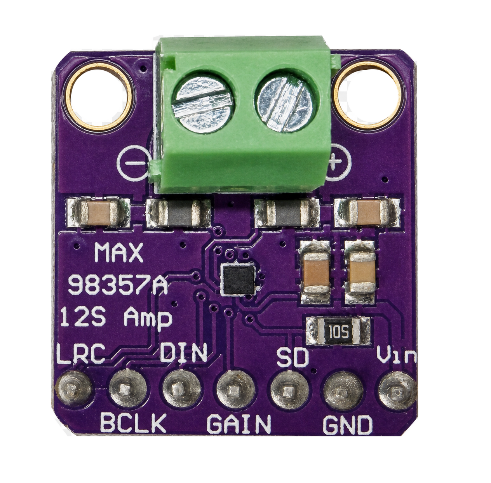
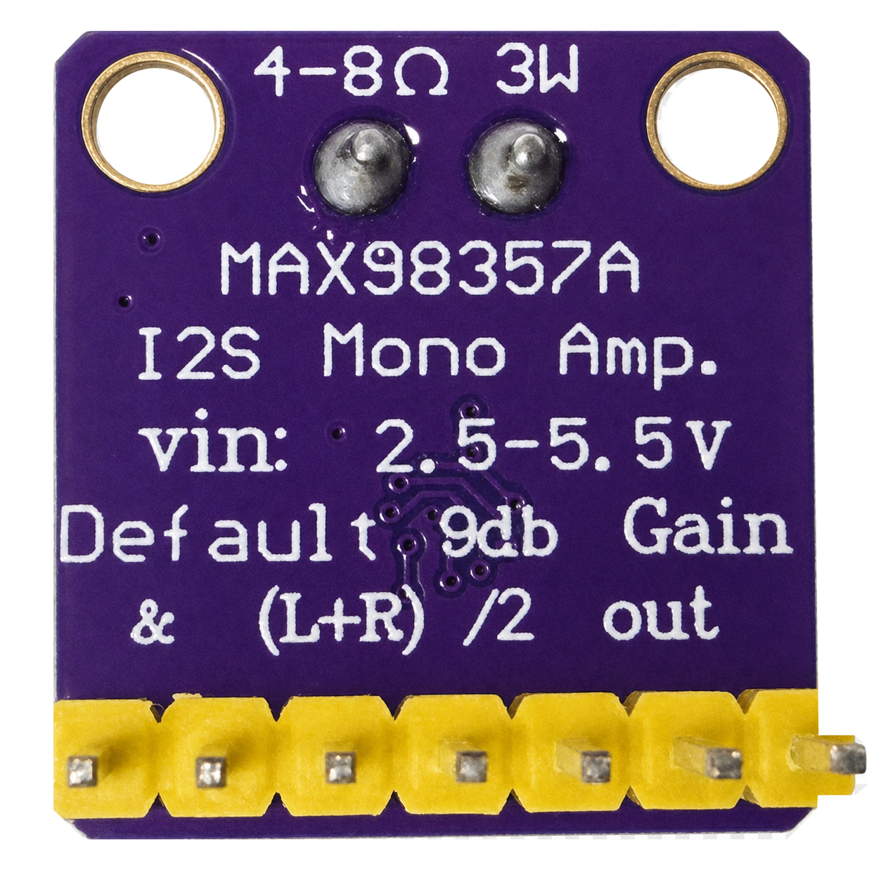

# The MAX98357A I2S Amplifier Project Kit

## Why the MAX98357A Amplifier Rocks

Most beginner robots make sound with a tiny piezo speaker wired straight
to a GPIO pin. The Pico turns that pin on and off very fast, using a
trick called **PWM**, or Pulse Width Modulation. The piezo speaker turns
that switching into a single, thin beep. It works, but a beep is the
only sound it can ever make.

The MAX98357A is a completely different kind of chip. Audio engineers
call this design a **Class D amplifier** — a chip that switches power on
and off very efficiently instead of wasting it as heat. This small chip
costs about $10, yet it can drive a real speaker loud enough to fill a
room, powered by nothing more than three AA batteries.

The MAX98357A can also play real recorded sounds, not just a single
tone. It reads digital audio files, so it can play full sentences, sound
effects, even music — like the R2D2 sounds in this kit. A simple piezo
beeper can never do that. It only knows one note at a time.

The MAX98357A also keeps the sound clean. It receives audio as a purely
digital signal, called **I2S**, all the way until the very last step
inside the chip. That means electrical noise and hum from motors,
batteries, and the Pico's own power supply never gets a chance to sneak
into your sound. A piezo wired straight to a GPIO pin has no such
protection — every bit of electrical noise on that pin comes out as
noise in the beep.

!!! mascot-thinking "Ever hear a buzzer hum along with the motors?"
    { class="mascot-admonition-img" }
    That hum is electrical noise leaking straight into the sound. Keeping
    audio digital until the very last moment, the way the MAX98357A does,
    is how real audio engineers keep motors and buzzers from fighting
    over the same wires.

This kit also lets you control volume with a real knob, called a
**potentiometer**. Turning it smoothly changes how loud the speaker
plays, just like a volume knob on a stereo. A simple piezo buzzer has no
volume control at all — it is either on or off, at one fixed loudness.






[Explore an interactive pinout diagram of the MAX98357A board](../../sims/max98357a-amp-pinout/index.md) - hover over the speaker terminal, the amplifier chip, and each of the seven pins to see what it does.

The MAX98357A I2S Amplifier is a mono amplifier with an input
voltage of 2.5 to 5.5 volts and a default gain of 9dB.

!!! mascot-welcome "Welcome, maker!"
    { class="mascot-admonition-img" }
    This little box can talk, glow, and groove — a speaker, a round color
    screen, a button, and a knob, all wired to one tiny Pico. Let's crack
    it open and make it come alive, one lab at a time!

## Project Box Components

1. Raspberry Pi Pico
2. 1 MAX98357A breakout board
3. 1/2 size breadboard
3. Ribbon cable from MAX98357A breakout board to breadboard - note BCLK and LRC pins are reversed
4. Smartwatch display
6. Ribbon cable from breadboard to display
7. Momentary push button
8. 3 AA batteries
9. Power toggle switch
10. Clear plastic case (Container Store)
11. LED for power indicator with 330 ohm resistor

It is designed to be used with 4-8 ohm speakers and it is rated at 3W.

## Pico Connections

- BCLK connect to GPIO 11
- LRC connect to GPIO 12
- DIN connect to GPIO 13
- GND connect to GND
- GAIN connect to GPIO 14
- SD connect to GPIO 15 (lower left corner)

- VIN connected to the VBUS at 5v - **not** the Pico's 3V3 OUT pin. The
  onboard 3.3V regulator only supplies a few hundred mA shared with the
  rest of the board; on 3V3 this amp browned out and audio cut off after
  about 1.2 seconds of playback.
- Momentary push button GPIO 16 (lower right corner of the Pico)

!!! mascot-warning "Don't power me from 3V3 OUT"
    { class="mascot-admonition-img" }
    I learned this one the hard way — wiring VIN to the Pico's 3V3 OUT pin
    starved the amp of power and cut my audio off after about a second.
    Always connect VIN to VBUS (5V) instead.

This pin choice satisfies one hard constraint and one board-specific
caution:

1. MicroPython's `machine.I2S` driver on the RP2040 requires the `ws`
   (LRC) pin to be exactly one GPIO number higher than the `sck` (BCLK)
   pin.
2. If this kit is later run on a **Cytron Maker Pi RP2040** instead of a
   plain Pico, GPIO 8-11 are hardwired to that board's onboard DC motor
   driver and GPIO 12-15 to its onboard servo headers (see the
   [MAKER-PI-RP2040 datasheet](https://www.mouser.com/pdfDocs/MAKER-PI-RP2040Datasheet.pdf)),
   so those pins aren't safe to reuse for I2S there. GPIO 2-6 are free
   Grove-port pins on that board too, so this wiring works on either.

Note. Our early testing had problems initially looked broken (clean I2S execution, but no sound on two
separate Pico boards), which led to real doubt about whether those pins
were somehow bad. That turned out to be a testing artifact, not a pin
problem: a very short audio clip (~0.44s) played with almost no delay
after enabling the amp, likely swallowed by the amp's own brief power-on
mute. Adding a ~200ms delay after enabling the amp (before sending real
audio) resolved it - see `SETTLE_MS` in the kit's scripts. The lesson:
always test a new pin group with a clip of at least a second or two and a
short settle delay, not the shortest file available, or you can easily
mistake a playback-timing artifact for a wiring/pin fault.

!!! mascot-tip "A short clip can trick you"
    { class="mascot-admonition-img" }
    If a new sound seems to vanish right after I power on, it's probably
    not a wiring problem — it's my own power-on mute swallowing a clip
    that's too short. Test new pins with a clip a second or two long.

## Labs

1. [Lab 1: Meet Your Kit](01-meet-your-kit.md) - turn it on and try
   every part, no computer needed
2. [Lab 2: Your First Sound](02-your-first-sound.md) - connect to
   Thonny and play a musical tone
3. [Lab 3: Press the Button](03-press-the-button.md) - the R2D2 sound
   board and how it cycles through sounds
4. [Lab 4: Light Up the Display](04-light-up-the-display.md) - draw
   your own text and colors on the round screen
5. [Lab 5: Turn the Dial](05-turn-the-dial.md) - the potentiometer,
   analog input, and the gauge ring
6. [Lab 6: Volume Control Lab](06-volume-control-lab.md) - the full
   program that combines the button, knob, display, and speaker

## Uploading the Code

The source code for this kit, plus a shared `config.py`, lives in
[`src/kits/max98357a-amp/`](https://github.com/dmccreary/stem-robots/tree/main/src/kits/max98357a-amp).
The sound files it plays live in
[`sounds/`](https://github.com/dmccreary/stem-robots/tree/main/sounds)
at the root of the repository. To copy the whole kit (code, display
driver, and sounds) onto the Pico in one step, run
[`upload-code.sh`](https://github.com/dmccreary/stem-robots/blob/main/src/kits/max98357a-amp/upload-code.sh)
from a terminal:

```bash
./upload-code.sh
```

Any single lab script can also be opened and run directly from Thonny,
which is how each lab above is written to be used.
