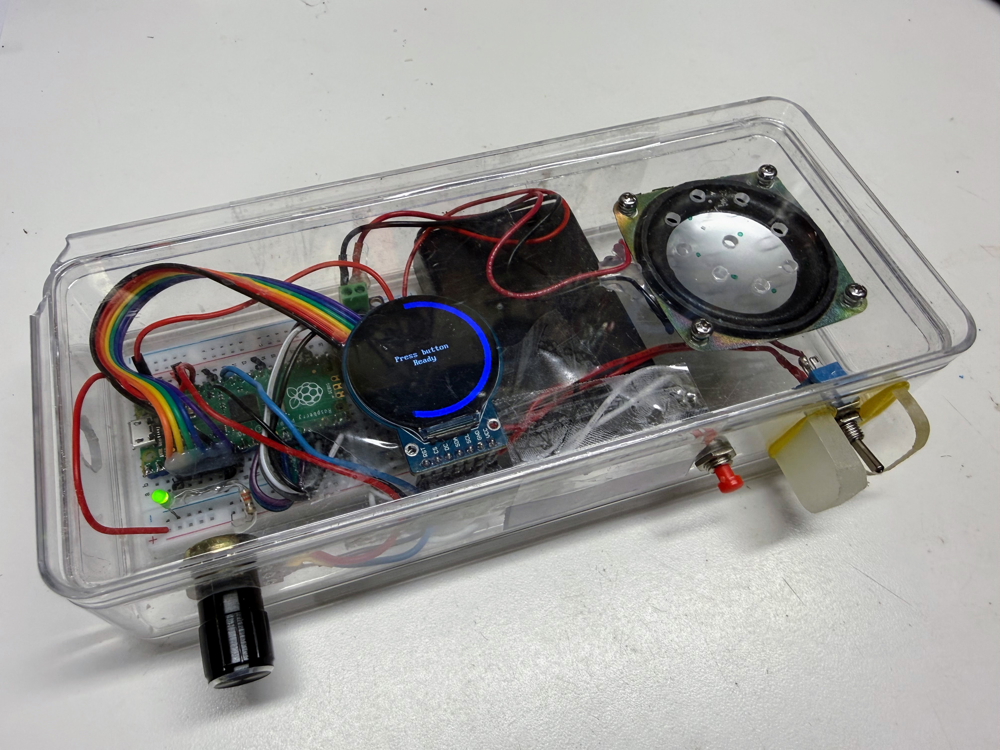

# The MAX98357A I2S Amplifier



The MAX98357A I2S Amplifier is a mono amplifier with an input
voltage of 2.5 to 5.5 volts and a default gain of 9dB.

## Project Box Components

1. Raspberry Pi Pico
2. 1 MAX98357A breakout board
3. 1/2 size breadboard
3. Ribbon cable from MAX98357A breakout board to breadboard - note BCLK and LRC pins are reversed
4. Smartwatch display
6. Ribbon cable from breadboard to display
7. Momentary push button
8. 3 AA batteries
9. Power toggle switch
10. Clear plastic case (Container Store)
11. LED for power indicator with 330 ohm resistor

It is designed to be used with 4-8 ohm speakers and it is rated at 3W.

## Pico Connections

- BCLK connect to GPIO 11
- LRC connect to GPIO 12
- DIN connect to GPIO 13
- GND connect to GND
- GAIN connect to GPIO 14
- SD connect to GPIO 15 (lower left corner)

- VIN connected to the VBUS at 5v - **not** the Pico's 3V3 OUT pin. The
  onboard 3.3V regulator only supplies a few hundred mA shared with the
  rest of the board; on 3V3 this amp browned out and audio cut off after
  about 1.2 seconds of playback.
- Momentary push button GPIO 16 (lower right corner of the Pico)

This pin choice satisfies one hard constraint and one board-specific
caution:

1. MicroPython's `machine.I2S` driver on the RP2040 requires the `ws`
   (LRC) pin to be exactly one GPIO number higher than the `sck` (BCLK)
   pin.
2. If this kit is later run on a **Cytron Maker Pi RP2040** instead of a
   plain Pico, GPIO 8-11 are hardwired to that board's onboard DC motor
   driver and GPIO 12-15 to its onboard servo headers (see the
   [MAKER-PI-RP2040 datasheet](https://www.mouser.com/pdfDocs/MAKER-PI-RP2040Datasheet.pdf)),
   so those pins aren't safe to reuse for I2S there. GPIO 2-6 are free
   Grove-port pins on that board too, so this wiring works on either.

Note. Our early testing had problems initially looked broken (clean I2S execution, but no sound on two
separate Pico boards), which led to real doubt about whether those pins
were somehow bad. That turned out to be a testing artifact, not a pin
problem: a very short audio clip (~0.44s) played with almost no delay
after enabling the amp, likely swallowed by the amp's own brief power-on
mute. Adding a ~200ms delay after enabling the amp (before sending real
audio) resolved it - see `SETTLE_MS` in the kit's scripts. The lesson:
always test a new pin group with a clip of at least a second or two and a
short settle delay, not the shortest file available, or you can easily
mistake a playback-timing artifact for a wiring/pin fault.

## Labs

1. [Lab 0: Meet Your Kit](00-meet-your-kit.md) - turn it on and try
   every part, no computer needed
2. [Lab 1: Your First Sound](01-your-first-sound.md) - connect to
   Thonny and play a musical tone
3. [Lab 2: Press the Button](02-press-the-button.md) - the R2D2 sound
   board and how it cycles through sounds
4. [Lab 3: Light Up the Display](03-light-up-the-display.md) - draw
   your own text and colors on the round screen
5. [Lab 4: Turn the Dial](04-turn-the-dial.md) - the potentiometer,
   analog input, and the gauge ring
6. [Lab 5: Volume Control Lab](05-volume-control-lab.md) - the full
   program that combines the button, knob, display, and speaker

## Uploading the Code

The source code for this kit, plus a shared `config.py`, lives in
[`src/kits/max98357a-amp/`](https://github.com/dmccreary/stem-robots/tree/main/src/kits/max98357a-amp).
The sound files it plays live in
[`sounds/`](https://github.com/dmccreary/stem-robots/tree/main/sounds)
at the root of the repository. To copy the whole kit (code, display
driver, and sounds) onto the Pico in one step, run
[`upload-code.sh`](https://github.com/dmccreary/stem-robots/blob/main/src/kits/max98357a-amp/upload-code.sh)
from a terminal:

```bash
./upload-code.sh
```

Any single lab script can also be opened and run directly from Thonny,
which is how each lab above is written to be used.