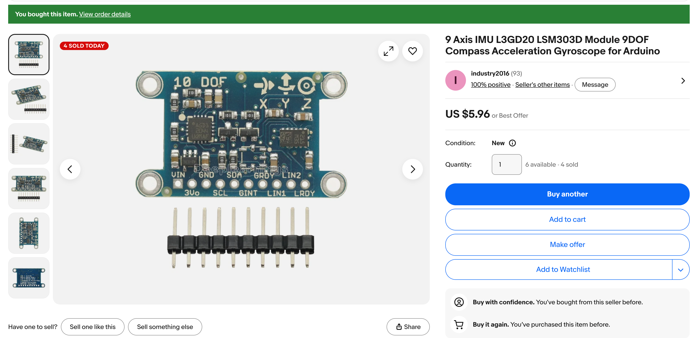

# Swarm Robot Build Plan — L3GD20 + LSM303D IMU on Cytron ROBO-PICO

This is the concrete build plan for the heading-follower swarm concept described in
[Swarm Robotics Cluster — Design Report](../../appendices/swarm-robots/index.md). That
report compared IMU options in the abstract; this plan is scoped to the parts already
on hand: the **Cytron ROBO-PICO** board running a **Raspberry Pi Pico W**, and the
**L3GD20 + LSM303D 9-DOF module** shown below.


*The purchased module. Two separate ST chips on one board — a gyroscope (L3GD20) and a combined accelerometer/magnetometer (LSM303D) — each with its own I2C address.*

## 1. What Changes From the Design Report

The design report's generic bill of materials assumed a separate motor driver
(TB6612FNG). The ROBO-PICO already has an onboard dual motor driver, LiPo charge
circuit, buzzer, NeoPixel, and five Grove ports — all visible on its pinout diagram
and already used by other kits in this repo (`src/kits/wi-fi-bot/config.py`,
`src/kits/base-bot/config.py`). That simplifies the per-robot BOM to just:

| Item | Status |
|---|---|
| [Cytron ROBO-PICO](https://www.cytron.io/p-robo-pico-simplifying-robotics-with-raspberry-pi-pico) board | On hand (existing kits use it) |
| Raspberry Pi Pico W | On hand |
| L3GD20 + LSM303D 9-DOF module | **Purchased** ($5.96) |
| Two DC gear motors + wheels + caster + chassis | On hand (existing kit chassis) |
| LiPo battery | On hand |
| 10-pin male header (to solder onto the IMU) | Included loose with the module — must be soldered before wiring |

Reference: [Cytron ROBO-PICO datasheet](https://docs.google.com/document/d/1X67yKga7m5pugBcogww6pyR2YHXwRJL79_nNDLTYcKU/edit?tab=t.0) — pin functions, onboard peripherals, and electrical specs for the board.

The class already solders sensor boards regularly, so the unsoldered header is a
normal first step, not a blocker.

## 2. IMU Identification and Pinout

The module's silkscreen pin labels (top row, left to right): `VIN, GND, SDA, GRDY, LIN2`.
Bottom row: `3Vo, SCL, GINT, LIN1, LRDY`. That layout — a regulated 3.3V output broken
out separately from `VIN`, plus gyro/accel-mag data-ready and interrupt pins — matches
the well-documented **Pololu MinIMU-9 v3** pin arrangement (L3GD20H gyro + LSM303D
accel/mag), so its public register maps and wiring notes are a reliable reference if
you get stuck. The board silkscreen also prints X/Y/Z axis arrows — use those, not
guesswork, to decide which physical edge is "front" when you mount it.

We only need four of the ten pins for the first build. The `GRDY`, `LIN2`, `GINT`,
`LIN1`, and `LRDY` interrupt/data-ready pins are a stretch goal (Section 5, Phase 12) —
leave them unconnected for now and poll the sensors instead.

## 3. Wiring

Wire the IMU to the same I2C bus already used by the ToF sensor and OLED display in
other ROBO-PICO kits (`I2C_SDA_PIN = 16`, `I2C_SCL_PIN = 17` in every existing
`config.py`). I2C allows multiple devices on one bus as long as addresses differ, and
this module presents two.

| IMU pin | ROBO-PICO pin | Notes |
|---|---|---|
| `VIN` | `3V3` (GPIO breakout header) | Start with 3.3V. Before connecting `SDA`/`SCL` to the Pico, check with a multimeter that `SCL` reads ~3.3V idle-high — some clone boards' onboard regulators need more headroom and only work cleanly off 5V (`VBUS`). If the scan in Phase 1 below finds nothing, try `VBUS` instead. |
| `GND` | `GND` | |
| `SDA` | `GPIO16` | Shared with existing `I2C_SDA_PIN` |
| `SCL` | `GPIO17` | Shared with existing `I2C_SCL_PIN` |
| `GRDY`, `LIN2`, `GINT`, `LIN1`, `LRDY` | unconnected | Reserved for interrupt-driven reads (stretch goal) |

Mount the module **away from the DC motors** — motor magnets distort the
magnetometer, and this is the single most common cause of a heading that drifts or
jumps only while driving. A small standoff on the rear deck, away from both motors,
is enough.

## 4. Software Layout

Follow the numbering convention already used in `src/kits/base-bot/` and `src/kits/wi-fi-bot/`.
Proposed new files:

```
src/lib/l3gd20.py           # gyroscope driver
src/lib/lsm303d.py          # accelerometer + magnetometer driver
src/lib/heading_filter.py   # complementary filter: gyro + mag -> heading
src/kits/swarm/config.py    # extends the standard config.py with IMU + AP settings
src/kits/swarm/secrets.py   # AP_SSID / AP_PASSWORD, gitignored like wi-fi/secrets.py
src/kits/swarm/
    01-i2c-scan-imu.py
    02-read-gyro-raw.py
    03-read-accel-mag-raw.py
    04-mag-calibration.py
    05-heading-fusion-test.py
    06-master-ap-broadcast.py
    07-follower-udp-receive.py
    08-follower-pid-steering.py
    09-swarm-integration-test.py
```

Add to `config.py`:

```py
# IMU I2C addresses (confirm in Phase 1 — clone boards vary)
GYRO_I2C_ADDRESS = 0x6B   # L3GD20, SDO/SA0 pulled high
ACCEL_MAG_I2C_ADDRESS = 0x1D  # LSM303D, SDO/SA0 pulled high

# Swarm networking
UDP_PORT = 8000
BROADCAST_ADDR = "192.168.4.255"  # Pico W AP default subnet
LOOP_HZ = 50
```

## 5. Step-by-Step Build Order

### Phase 0 — Bench setup (once, per robot)

1. Flash MicroPython onto the Pico W (same image already used for the wifi-bot kit).
2. Confirm the base robot still works: motor test buttons on the ROBO-PICO, and the
   existing `01-wi-fi-test.py` connects to your classroom WiFi.
3. Solder the 10-pin header onto the IMU module.

### Phase 1 — Confirm both IMU chips answer on I2C

1. Wire the IMU per Section 3.
2. Run the existing I2C scanner pattern (`src/kits/base-bot/09-i2c-scanner-test.py`) but
   print **all** devices found, not just the first:

   ```py
   import machine
   i2c = machine.I2C(0, sda=machine.Pin(16), scl=machine.Pin(17), freq=400000)
   found = i2c.scan()
   print("Devices found:", [hex(d) for d in found])
   ```

   Expect two addresses: the gyro at `0x6B` (or `0x6A` if its `SDO` pin is grounded
   on this particular clone) and the accel/mag at `0x1D` (or `0x1E`). Record whatever
   you actually see and update `config.py` — don't assume the datasheet default.
3. Confirm chip identity by reading the `WHO_AM_I` register (`0x0F`) from each address:
   gyro should read `0xD4` (L3GD20) or `0xD7` (L3GD20H); accel/mag should read `0x49`.
   A mismatch means the wrong address or a wiring fault, not a bad filter later on.

### Phase 2 — Minimal drivers

Write `l3gd20.py` and `lsm303d.py` following the register-constant style already used
in `src/lib/VL53L0X.py` (`const()` addresses, `readfrom_mem`/`writeto_mem`). Skeleton:

```py
# l3gd20.py
from micropython import const
import ustruct

_WHO_AM_I = const(0x0F)
_CTRL_REG1 = const(0x20)
_CTRL_REG4 = const(0x23)
_OUT_X_L = const(0x28 | 0x80)  # 0x80 bit auto-increments across X/Y/Z

class L3GD20:
    def __init__(self, i2c, address=0x6B):
        self.i2c = i2c
        self.address = address
        self.i2c.writeto_mem(self.address, _CTRL_REG1, b'\x0F')  # normal mode, XYZ on, 95 Hz
        self.i2c.writeto_mem(self.address, _CTRL_REG4, b'\x00')  # 250 dps full scale

    def read_dps(self):
        data = self.i2c.readfrom_mem(self.address, _OUT_X_L, 6)
        x, y, z = ustruct.unpack('<hhh', data)
        sensitivity = 0.00875  # dps per LSB at 250 dps full scale
        return (x * sensitivity, y * sensitivity, z * sensitivity)
```

```py
# lsm303d.py
from micropython import const
import ustruct

_CTRL1 = const(0x20)
_CTRL5 = const(0x24)
_CTRL6 = const(0x25)
_CTRL7 = const(0x26)
_OUT_X_L_A = const(0x28 | 0x80)
_OUT_X_L_M = const(0x08 | 0x80)

class LSM303D:
    def __init__(self, i2c, address=0x1D):
        self.i2c = i2c
        self.address = address
        self.i2c.writeto_mem(self.address, _CTRL1, b'\x57')  # 100 Hz, XYZ accel on
        self.i2c.writeto_mem(self.address, _CTRL5, b'\x64')  # high-res mag, 50 Hz
        self.i2c.writeto_mem(self.address, _CTRL6, b'\x20')  # +/-4 gauss
        self.i2c.writeto_mem(self.address, _CTRL7, b'\x00')  # continuous-conversion mode

    def read_accel_g(self):
        data = self.i2c.readfrom_mem(self.address, _OUT_X_L_A, 6)
        x, y, z = ustruct.unpack('<hhh', data)
        sensitivity = 0.061 / 1000  # g per LSB at +/-2g
        return (x * sensitivity, y * sensitivity, z * sensitivity)

    def read_mag_gauss(self):
        data = self.i2c.readfrom_mem(self.address, _OUT_X_L_M, 6)
        x, y, z = ustruct.unpack('<hhh', data)
        sensitivity = 0.16 / 1000  # gauss per LSB at +/-4 gauss
        return (x * sensitivity, y * sensitivity, z * sensitivity)
```

Treat the sensitivity constants as starting points — verify them against the
`WHO_AM_I` result from Phase 1 (L3GD20 vs L3GD20H have slightly different specs), and
be ready to adjust after Phase 3's raw-value sanity check.

### Phase 3 — Raw sensor read test (`03-read-accel-mag-raw.py`)

Print gyro deg/s, accel g's, and mag gauss in a loop. Sanity checks before moving on:

- Accelerometer magnitude ≈ 1.0 g while the robot sits still.
- Gyro readings ≈ 0 dps while still, and change sign when you rotate the robot the
  other way.
- Magnetometer magnitude stays roughly constant as you rotate the robot in place
  (only the X/Y split should change, not the overall size).

### Phase 4 — Magnetometer calibration (`04-mag-calibration.py`)

This is the step the design report flags as the most common reason heading-following
demos fail — don't skip it.

1. Place the assembled robot on a table, away from motors of *other* robots and away
   from laptops/metal.
2. Run a script that logs `mag_x, mag_y` for ~20 seconds while you slowly spin the
   robot by hand through at least one full rotation.
3. Compute the hard-iron offset: `offset_x = (max_x + min_x) / 2`,
   `offset_y = (max_y + min_y) / 2`.
4. Apply the offset before every heading calculation:
   `corrected_x = mag_x - offset_x`, `corrected_y = mag_y - offset_y`.
5. Save the two offsets per robot — in `config.py` or a small `calibration.json` —
   since each robot's soldering and mounting is slightly different. Start with
   hard-iron correction only; add soft-iron (per-axis scale) correction only if
   heading error is still too large after this.
6. **Re-run this whole step any time the IMU is unmounted, remounted, or moved.**

### Phase 5 — Heading fusion (`05-heading-fusion-test.py`, `heading_filter.py`)

A complementary filter is enough — no need for a full Kalman filter for this project:

```py
import math

class HeadingFilter:
    def __init__(self, alpha=0.98):
        self.alpha = alpha
        self.heading = 0.0

    def mag_heading(self, mag_x, mag_y):
        heading = math.degrees(math.atan2(mag_y, mag_x))
        return heading % 360

    def update(self, gyro_z_dps, mag_x, mag_y, dt):
        gyro_estimate = self.heading + gyro_z_dps * dt
        compass_estimate = self.mag_heading(mag_x, mag_y)
        self.heading = (self.alpha * gyro_estimate
                         + (1 - self.alpha) * compass_estimate) % 360
        return self.heading
```

Run the fusion loop at `LOOP_HZ` (50 Hz → `dt = 0.02`). `alpha = 0.98` is a reasonable
starting point: mostly trust the gyro moment-to-moment, and let the (calibrated)
compass slowly correct drift.

### Phase 6 — Validate a stable heading

Rotate the robot by hand to known headings — use a phone compass app or a printed
compass rose as ground truth — and confirm the reading is within about 10–15° after
calibration. Leave the robot still for 60 seconds and confirm the heading doesn't
drift. Then power the drive motors and confirm the heading doesn't jump — if it does,
the IMU is too close to the motors; add a standoff and recalibrate.

### Phase 7 — Master: WiFi AP + UDP broadcast (`06-master-ap-broadcast.py`)

Reuse the `network` / `socket` patterns already in `src/kits/wi-fi-bot/`, but in
Access-Point mode broadcasting UDP instead of Station mode serving a TCP web page:

```py
import network
import socket
import json
import time
import secrets
import config

def start_ap():
    ap = network.WLAN(network.AP_IF)
    ap.config(ssid=secrets.AP_SSID, password=secrets.AP_PASSWORD)
    ap.active(True)
    while not ap.active():
        time.sleep(0.5)
    print("AP up:", ap.ifconfig())
    return ap

def broadcast_loop(get_heading):
    sock = socket.socket(socket.AF_INET, socket.SOCK_DGRAM)
    sock.setsockopt(socket.SOL_SOCKET, socket.SO_BROADCAST, 1)
    while True:
        payload = json.dumps({"heading": get_heading(), "speed": 0.6})
        sock.sendto(payload.encode(), (config.BROADCAST_ADDR, config.UDP_PORT))
        time.sleep(1 / config.LOOP_HZ)
```

### Phase 8 — Follower: join AP + UDP receive (`07-follower-udp-receive.py`)

```py
import network
import socket
import json
import time
import secrets
import config

def join_ap():
    sta = network.WLAN(network.STA_IF)
    sta.active(True)
    sta.connect(secrets.AP_SSID, secrets.AP_PASSWORD)
    while not sta.isconnected():
        time.sleep(0.5)
    print("Joined AP:", sta.ifconfig())
    return sta

def open_listener():
    sock = socket.socket(socket.AF_INET, socket.SOCK_DGRAM)
    sock.bind(('0.0.0.0', config.UDP_PORT))
    sock.settimeout(0.1)  # don't block the control loop waiting on a dropped packet
    return sock

def receive_target(sock, last_target):
    try:
        data, addr = sock.recvfrom(128)
        return json.loads(data)
    except OSError:
        return last_target  # no packet this cycle — reuse the last known target
```

### Phase 9 — Follower steering (`08-follower-pid-steering.py`)

Normalize the heading error to the shortest turn direction, then apply a proportional
(start simple, add I/D only if needed) controller:

```py
def heading_error(target, current):
    error = (target - current + 180) % 360 - 180
    return error  # -180..+180, positive = turn right

def steer(error, base_speed, Kp=0.02):
    turn = Kp * error
    left = max(0, min(1, base_speed + turn))
    right = max(0, min(1, base_speed - turn))
    return left, right
```

Feed `left`/`right` into the existing motor pins from `config.py`
(`RIGHT_FORWARD_PIN`, `LEFT_FORWARD_PIN`, etc.) — same PWM pattern already used in
`src/kits/base-bot/04-motor-test.py`.

### Phase 10 — Two-robot integration test (`09-swarm-integration-test.py`)

One robot running the master script, one running the follower script, both on the
bench. Manually rotate the master and confirm the follower turns to match within a
second or two.

### Phase 11 — Scale to 3+ followers

Flashing the same follower code to more robots is "free" in principle, since UDP
broadcast needs no per-follower registration. In practice, test this early: the Pico
W's onboard soft-AP has a real limit on simultaneous associated stations (commonly
cited around 4 in community testing, not officially documented by Raspberry Pi). If
the class's follower count exceeds what the Pico-hosted AP handles reliably, the
fallback is a dedicated WiFi router or access point as the network — the UDP
broadcast payload and follower code don't need to change, only which device hosts
the AP.

### Phase 12 — Extension ideas

- **Tilt-compensated heading**: use the accelerometer (already on this same chip as
  the magnetometer) to correct the compass heading when the robot isn't level —
  useful if the swarm ever operates on a ramp or uneven floor.
- **Bump/collision detection**: the accelerometer is already being read every loop;
  a spike above ~1.5g is a free collision signal with no extra hardware.
- Forward speed matching, obstacle avoidance, and loose formation offsets, as listed
  in the design report.
- Interrupt-driven reads using `GRDY`/`LRDY` instead of polling, if loop timing
  becomes tight with more sensors added later.

## 6. Troubleshooting Checklist

| Symptom | Likely cause |
|---|---|
| I2C scan finds nothing | Check `VIN`/`GND` wiring first; try `VBUS` (5V) instead of `3V3` if the onboard regulator needs more headroom |
| I2C scan finds only one address | One chip's `WHO_AM_I` read failed — re-check solder joints on that chip's side of the board |
| `WHO_AM_I` doesn't match expected value | Wrong address assumed, or a cold solder joint — don't proceed to calibration until this passes |
| Heading drifts slowly while stationary | Re-run magnetometer calibration (Phase 4) |
| Heading jumps only while driving | IMU mounted too close to a motor — add a standoff, recalibrate |
| Two robots report different headings for the same physical orientation | Expected — per-robot calibration and solder variance. This is the sensor-variance teaching point from the design report, not a bug |
| Follower never turns | Confirm follower joined the master's AP subnet (`ifconfig()`), and that `UDP_PORT` matches on both sides |
| Follower steering oscillates / hunts | `Kp` too high — reduce it, or add a small deadband around zero error |

## 7. Suggested Session Schedule

Assuming roughly 45–60 minute class blocks:

1. Solder headers, wire IMU, confirm I2C scan + `WHO_AM_I` (Phase 0–1) — one session.
2. Raw sensor read + sanity checks (Phase 2–3) — one session.
3. Magnetometer calibration (Phase 4) — one session; this one tends to need re-runs.
4. Heading fusion + validation (Phase 5–6) — one session, a good milestone to
   celebrate on its own, matching the design report's suggested build order.
5. Master AP broadcast + follower receive, single pair (Phase 7–10) — one to two
   sessions.
6. Scale to the full swarm + extensions (Phase 11–12) — remaining sessions.
