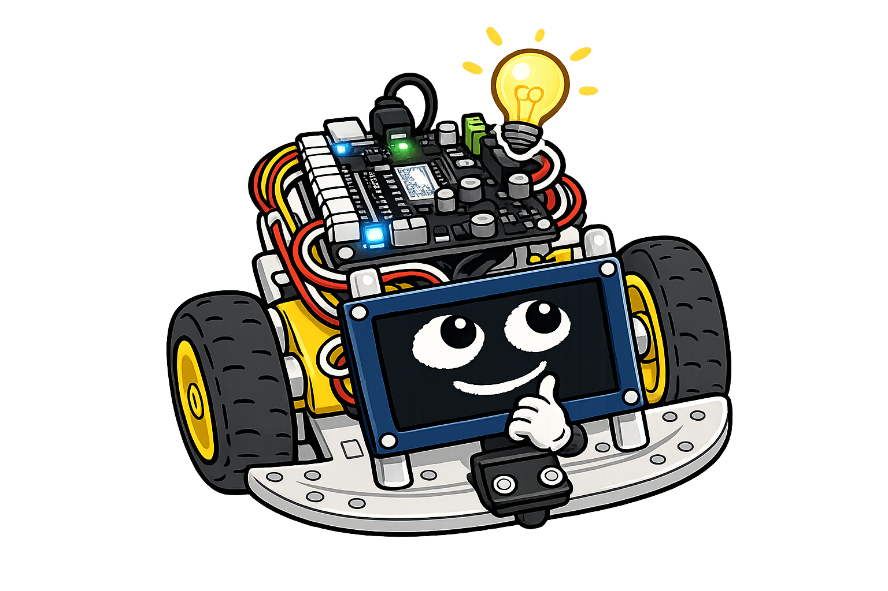

# Lab 3: Shaping the Volume

A pin has two states: on and off. There is no "half on". So how can this
kit play quiet sounds and loud ones? In this lab you will find out, and
you will learn why the *shape* of a sound's volume matters as much as its
pitch.

!!! mascot-welcome "Welcome back, makers!"
    { class="mascot-admonition-img" }
    Today we solve a puzzle: how do you get soft and loud out of a pin
    that only knows on and off? The answer is a clever cheat, and once you
    see it you'll spot it everywhere.

## What You Need

- Your finished circuit from Lab 1
- The Pico connected to your computer with a USB cable
- Thonny, connected to the Pico

## What You'll Learn

- What **duty cycle** means
- How switching speed and switching *width* do two different jobs
- What an **envelope** is
- Why the same pitch can sound like a knock, a chirp, or a warning

## Step-by-Step

### Step 1: Run the Volume Program

Open **`03-volume-and-envelope.py`** in Thonny and press **Run**. You
will hear six beeps at the same pitch, getting quieter each time. Then
you will hear three sounds that are all the same pitch but feel
completely different.

### Step 2: Look at the Six Beeps

```python
for volume in (100, 80, 60, 40, 20, 10):
    r2d2.tone(800, 180, volume)   # same pitch, quieter each time
```

Every beep is 800 Hz. Only the third number changes. That number is a
volume from 0 to 100.

### Step 3: Understand the Cheat

Here is the trick. The pin really is only ever fully on or fully off. But
we can change **how much of each cycle it spends switched on**. That
fraction is called the **duty cycle**.

Think of a light switch you flip on and off very fast. Leave it on for
half of each cycle and the room is as bright as this trick can make it.
Leave it on for only a sliver of each cycle and the room is dim. The
flipping *speed* never changed — only the *width* of each "on" moment.

That is why pitch and volume do not fight each other here. Switching
speed sets the pitch. Switching width sets the volume.

!!! mascot-thinking "Two jobs for one pin"
    { class="mascot-admonition-img" }
    How *fast* I flip the pin decides the note. How *long* I leave it on
    each flip decides the loudness. One pin, two completely separate jobs
    — that's why a single wire can carry a whole sound.

### Step 4: Meet the Envelope

The second half of the program plays 800 Hz three times, but shapes the
volume differently each time. That shape is called the **envelope**.

```python
r2d2.glide(800, 800, 400, 100, 0)   # loud immediately, then fade away
```

Volume starts at 100 and ends at 0, so the sound begins sharply and dies
out. That is what a plucked string does, and your ear hears it as a knock
or a pluck.

### Step 5: Reverse the Envelope

```python
r2d2.glide(800, 800, 400, 0, 100)   # swell up from silence
```

Now volume starts at 0 and climbs to 100. The very same 800 Hz note now
sounds like something approaching, or a warning building up.

### Step 6: Build a Two-Part Envelope

The last example fades in and back out by putting two glides together:

```python
r2d2.glide(800, 800, 200, 0, 100)   # swell up
r2d2.glide(800, 800, 200, 100, 0)   # and back down
```

That is a passing hum. Three sounds, one pitch, three different feelings
— all from volume shape alone.

!!! mascot-tip "Sharp starts sound like hits"
    { class="mascot-admonition-img" }
    Here's a trick sound designers rely on: a sound that starts *instantly*
    reads as something being struck. A sound that fades *in* reads as
    something moving toward you. Same note either way!

## Try It Yourself

- Make a very short, sharp pluck: `r2d2.glide(1200, 1200, 60, 100, 0)`.
- Make a slow, creepy swell: `r2d2.glide(300, 300, 2000, 0, 60)`.
- Combine a glide with an envelope:
  `r2d2.glide(400, 1600, 300, 20, 100)` rises in both pitch and volume.
- Try volume `5`. Can you still hear it? Then try `1`.

## What's Happening Under the Hood

There is one wrinkle. Loudness does not follow duty cycle in a straight
line. A square wave that is on for a fraction `d` of each cycle carries a
signal strength of `d × (1 − d)`, all under a square root. That peaks at a
half-and-half duty and falls away on both sides.

If the code simply used "duty equals volume", then volume 50 would not
sound half as loud as volume 100. So `r2d2.py` works that formula
backwards. It calculates the duty cycle that produces the loudness you
actually asked for, and stores all 101 answers in a list when the program
starts. Looking up an answer is much faster than calculating one, and the
engine needs a fresh one every 4 milliseconds.

## Check Your Understanding

1. What is a duty cycle?
2. Which one sets the pitch: switching speed or switching width?
3. What is an envelope?
4. Why does the code use a lookup list instead of doing the math each time?

## Full Code

You can find the complete program at
[`src/kits/synth-sounds/03-volume-and-envelope.py`](https://github.com/dmccreary/stem-robots/blob/main/src/kits/synth-sounds/03-volume-and-envelope.py).

!!! mascot-celebration "You got volume out of an on/off pin!"
    { class="mascot-admonition-img" }
    You just made one pitch sound like three different objects using
    nothing but volume shape. Engineers call that envelope design, and you
    can now hear it in every sound around you!
