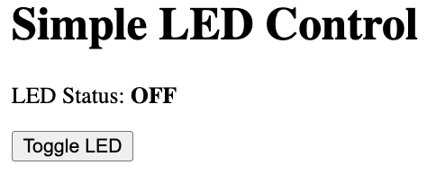

# Simple Web Server




# Simple LED Web Server - Code Walkthrough

## Introduction

This tutorial explains how to create a web server on a Raspberry Pi Pico W that can control an LED through a web page. Think of it like creating your own mini-website that can control real hardware!

## What You'll Learn

- How to connect your Pico W to WiFi
- How to create a simple web server
- How to control hardware (LED) from a webpage
- Basic Python programming concepts

## Prerequisites

- You need a `secrets.py` file with your WiFi credentials:

```python
SSID = "YourWiFiName"
PASSWORD = "YourWiFiPassword"
```

## Section 1: Importing Libraries

```python
import network
import socket
import secrets
import time
from machine import Pin
```

**What's happening here?**

**`import`** statements tell Python to load special tools (called libraries) that we need:

- **`network`** - Tools for connecting to WiFi
- **`socket`** - Tools for creating web servers (like a mailbox for internet messages)
- **`secrets`** - Your WiFi password file (keeps it separate and safe)
- **`time`** - Tools for waiting and timing
- **`Pin`** - From the `machine` library, this controls the physical pins on your Pico W

Think of imports like getting tools from a toolbox - you only take out what you need for the job.

## Section 2: Setting Up the LED

```python
# Setup the onboard LED
led = Pin("LED", Pin.OUT)
led_state = False  # Track LED state
```

**What's happening here?**

**`led = Pin("LED", Pin.OUT)`** - This creates a connection to the built-in LED on your Pico W
- **"LED"** tells it which pin to use (the built-in one)
- **Pin.OUT** means we want to control it (send signals OUT to it)

**`led_state = False`** - This creates a variable to remember if the LED is on or off
- **`False`** means "off" 
- **`True`** would mean "on"
- This is like a sticky note that says "remember: LED is currently off"

## Section 3: Connecting to WiFi

```python
def connect_wifi():
    """Connect to WiFi network using credentials from secrets.py"""
    print(f'Connecting to WiFi: {secrets.SSID}')
    
    wlan = network.WLAN(network.STA_IF)
    wlan.active(True)
    wlan.connect(secrets.SSID, secrets.PASSWORD)
    
    # Wait for connection
    while not wlan.isconnected():
        print('.', end='')
        time.sleep(1)
    
    print(f'\nConnected! IP: {wlan.ifconfig()[0]}')
    return wlan
```

**What's happening here?**

**`def connect_wifi():`** - This creates a function (a reusable block of code) called `connect_wifi`
- Functions are like recipes - you write them once, then use them whenever needed

**`print(f'Connecting to WiFi: {secrets.SSID}')`** - Shows which network we're connecting to
- **`f'...'`** is called an f-string - it lets you put variables inside text
- **`secrets.SSID`** gets your network name from the secrets file

**`wlan = network.WLAN(network.STA_IF)`** - Creates a WiFi object
- Think of this like turning on your phone's WiFi

**`wlan.active(True)`** - Turns on the WiFi radio
**`wlan.connect(secrets.SSID, secrets.PASSWORD)`** - Attempts to connect using your credentials

**The while loop:**

```python
while not wlan.isconnected():
    print('.', end='')
    time.sleep(1)
```
- **`while`** means "keep doing this as long as..."
- **`not wlan.isconnected()`** means "as long as we're NOT connected"
- **`print('.', end='')`** prints a dot without going to a new line
- **`time.sleep(1)`** waits 1 second
- This creates the "Connecting..." dots you see

**`return wlan`** - Gives back the WiFi object so other parts of the code can use it

## Section 4: Controlling the LED

```python
def toggle_led():
    """Toggle the LED on/off and return current state"""
    global led_state
    led_state = not led_state
    
    if led_state:
        led.on()
        print("LED turned ON")
    else:
        led.off()
        print("LED turned OFF")
    
    return "ON" if led_state else "OFF"
```

**What's happening here?**

**`global led_state`** - This tells Python we want to change the `led_state` variable we created earlier
- Without `global`, Python would create a new, separate variable

**`led_state = not led_state`** - This flips the state
- If `led_state` was `False`, **`not False`** becomes `True`
- If `led_state` was `True`, **`not True`** becomes `False`
- It's like a light switch - if it's off, turn it on; if it's on, turn it off

**The if/else statement:**
```python
if led_state:
    led.on()
    print("LED turned ON")
else:
    led.off()
    print("LED turned OFF")
```
- **`if led_state:`** means "if led_state is True"
- **`led.on()`** physically turns the LED on
- **`else:`** means "otherwise" (if led_state is False)
- **`led.off()`** physically turns the LED off

**`return "ON" if led_state else "OFF"`** - This is a shortcut way to return text
- If `led_state` is `True`, return `"ON"`
- If `led_state` is `False`, return `"OFF"`


## Section 5: Creating the Web Page

```python
def generate_html():
    """Create simple HTML page with LED toggle button"""
    html = f"""<!DOCTYPE html>
<html>
<head>
    <title>LED Control</title>
</head>
<body>
    <h1>Simple LED Control</h1>
    <p>LED Status: <strong>{toggle_led.__globals__['led_state'] and "ON" or "OFF"}</strong></p>
    <button onclick="toggleLED()">Toggle LED</button>
    
    <script>
        function toggleLED() {{
            fetch('/toggle', {{method: 'POST'}})
            .then(() => location.reload());
        }}
    </script>
</body>
</html>"""
    return html
```

**What's happening here?**

**`html = f"""..."""`** - Creates a multi-line string containing HTML code
- **`f"""..."""`** lets us put Python variables inside the HTML
- HTML is the language used to create web pages

**Key HTML parts:**
- **`<title>LED Control</title>`** - Sets the browser tab title
- **`<h1>Simple LED Control</h1>`** - Creates a big heading
- **`<p>LED Status: <strong>...</strong></p>`** - Shows the current LED status
- **`<button onclick="toggleLED()">Toggle LED</button>`** - Creates a clickable button

**The JavaScript part:**
```javascript
function toggleLED() {
    fetch('/toggle', {method: 'POST'})
    .then(() => location.reload());
}
```
- This runs when someone clicks the button
- **`fetch('/toggle', {method: 'POST'})`** sends a message to our server
- **`.then(() => location.reload())`** refreshes the page after the LED toggles


## Section 6: The Web Server

```python
def start_server(wlan):
    """Start web server and handle requests"""
    # Create socket and bind to port 80
    s = socket.socket()
    s.bind(('0.0.0.0', 80))
    s.listen(1)
    
    print(f'Web server running at: http://{wlan.ifconfig()[0]}')
    
    while True:
        # Accept incoming connection
        client, addr = s.accept()
        print(f'Client connected: {addr}')
        
        # Read the request
        request = client.recv(1024).decode('utf-8')
        
        if 'GET / ' in request:
            # Serve main page
            html = generate_html()
            client.send('HTTP/1.1 200 OK\r\n\r\n')
            client.send(html)
            
        elif 'POST /toggle' in request:
            # Toggle LED and send response
            state = toggle_led()
            client.send('HTTP/1.1 200 OK\r\n\r\n')
            client.send(f'LED is {state}')
        
        client.close()
```

**What's happening here?**

**Setting up the server:**
```python
s = socket.socket()
s.bind(('0.0.0.0', 80))
s.listen(1)
```
- **`socket.socket()`** creates a "mailbox" for internet messages
- **`s.bind(('0.0.0.0', 80))`** says "listen on all network connections, port 80"
- Port 80 is the standard port for websites
- **`s.listen(1)`** says "allow 1 person to connect at a time"

**The main server loop:**
```python
while True:
    # This runs forever, handling one visitor at a time
```

**Handling visitors:**
```python
client, addr = s.accept()
print(f'Client connected: {addr}')
request = client.recv(1024).decode('utf-8')
```
- **`s.accept()`** waits for someone to visit our website
- **`client.recv(1024)`** reads their request (what page they want)
- **`.decode('utf-8')`** converts the message to readable text

**Understanding the request:**
```python
if 'GET / ' in request:
    # Someone wants to see the main page
    html = generate_html()
    client.send('HTTP/1.1 200 OK\r\n\r\n')
    client.send(html)
    
elif 'POST /toggle' in request:
    # Someone clicked the toggle button
    state = toggle_led()
    client.send('HTTP/1.1 200 OK\r\n\r\n')
    client.send(f'LED is {state}')
```

- **`GET /`** means "show me the main page"
- **`POST /toggle`** means "toggle the LED"
- **`HTTP/1.1 200 OK`** is like saying "Everything's fine, here's what you asked for"

**`client.close()`** - Ends the conversation with that visitor


## Section 7: The Main Program

```python
def main():
    """Main program - connect to WiFi and start server"""
    print('Simple LED Web Server')
    print('====================')
    
    # Turn off LED initially
    led.off()
    
    # Connect to WiFi
    wlan = connect_wifi()
    
    # Start web server
    start_server(wlan)

# Run the program
if __name__ == '__main__':
    main()
```

**What's happening here?**

**`def main():`** - Creates the main function that runs our program

**`led.off()`** - Makes sure the LED starts in the "off" position

**`wlan = connect_wifi()`** - Calls our WiFi function and saves the result

**`start_server(wlan)`** - Starts the web server (this runs forever)

**`if __name__ == '__main__':`** - This is Python's way of saying "if this file is being run directly (not imported), then run the main() function"


## How Everything Works Together

1. **Startup:** Program turns off LED and connects to WiFi
2. **Server starts:** Creates a "mailbox" at your Pico's IP address
3. **Waiting:** Server waits for someone to visit the website
4. **Visitor arrives:** Someone types the IP address in their browser
5. **Send webpage:** Server sends the HTML page with the button
6. **Button clicked:** Visitor clicks "Toggle LED"
7. **Message sent:** Browser sends a "toggle" message to the server
8. **LED changes:** Server runs the toggle function, changing the LED
9. **Response sent:** Server tells the browser "LED is now ON/OFF"
10. **Page refreshes:** Browser reloads to show the new status
11. **Repeat:** Back to step 5, ready for the next click

## Key Programming Concepts You Learned

**Variables:** Storing information (like `led_state`)

**Functions:** Reusable blocks of code (like `toggle_led()`)

**Loops:** Repeating actions (`while` loops)

**Conditionals:** Making decisions (`if/else` statements)

**Libraries:** Using pre-written code (`import` statements)

**Global variables:** Sharing data between functions

**Return values:** Functions giving back results

**String formatting:** Putting variables in text (`f"..."`)

## Real-World Applications

This same pattern is used in:

- Smart home devices (controlling lights, thermostats)
- IoT (Internet of Things) sensors
- Industrial control systems
- Home automation projects
- Remote monitoring systems

You've just built the foundation for controlling any device over the internet!

## Full Source Code

Here is the full source code.  It is about 70 lines.

```python
import network
import socket
import secrets
import time
from machine import Pin

# Setup the onboard LED
led = Pin("LED", Pin.OUT)
led_state = False  # Track LED state

def connect_wifi():
    """Connect to WiFi network using credentials from secrets.py"""
    print(f'Connecting to WiFi: {secrets.SSID}')
    
    wlan = network.WLAN(network.STA_IF)
    wlan.active(True)
    wlan.connect(secrets.SSID, secrets.PASSWORD)
    
    # Wait for connection
    while not wlan.isconnected():
        print('.', end='')
        time.sleep(1)
    
    print(f'\nConnected! IP: {wlan.ifconfig()[0]}')
    return wlan

def toggle_led():
    """Toggle the LED on/off and return current state"""
    global led_state
    led_state = not led_state
    
    if led_state:
        led.on()
        print("LED turned ON")
    else:
        led.off()
        print("LED turned OFF")
    
    return "ON" if led_state else "OFF"

def generate_html():
    """Create simple HTML page with LED toggle button"""
    html = f"""<!DOCTYPE html>
<html>
<head>
    <title>LED Control</title>
</head>
<body>
    <h1>Simple LED Control</h1>
    <p>LED Status: <strong>{toggle_led.__globals__['led_state'] and "ON" or "OFF"}</strong></p>
    <button onclick="toggleLED()">Toggle LED</button>
    
    <script>
        function toggleLED() {{
            fetch('/toggle', {{method: 'POST'}})
            .then(() => location.reload());
        }}
    </script>
</body>
</html>"""
    return html

def start_server(wlan):
    """Start web server and handle requests"""
    # Create socket and bind to port 80
    s = socket.socket()
    s.bind(('0.0.0.0', 80))
    s.listen(1)
    
    print(f'Web server running at: http://{wlan.ifconfig()[0]}')
    
    while True:
        # Accept incoming connection
        client, addr = s.accept()
        print(f'Client connected: {addr}')
        
        # Read the request
        request = client.recv(1024).decode('utf-8')
        
        if 'GET / ' in request:
            # Serve main page
            html = generate_html()
            client.send('HTTP/1.1 200 OK\r\n\r\n')
            client.send(html)
            
        elif 'POST /toggle' in request:
            # Toggle LED and send response
            state = toggle_led()
            client.send('HTTP/1.1 200 OK\r\n\r\n')
            client.send(f'LED is {state}')
        
        client.close()

def main():
    """Main program - connect to WiFi and start server"""
    print('Simple LED Web Server')
    print('====================')
    
    # Turn off LED initially
    led.off()
    
    # Connect to WiFi
    wlan = connect_wifi()
    
    # Start web server
    start_server(wlan)

# Run the program
if __name__ == '__main__':
    main()
```