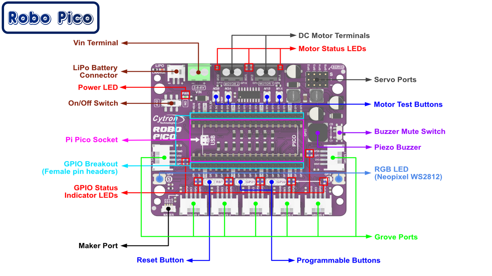

# Wireless Robot

This robot uses the [Cytron Robo Pico](https://www.cytron.io/p-robo-pico-simplifying-robotics-with-raspberry-pi-pico) board that allows us to use a Raspberry Pi Pico W board as our microcontroller.  The "W" has builtin WiFi and Bluetooth hardware
so we can control our robot wirelessly.

## Cytron Robo Pico Pinout



Note that the GPIO breakout female header allows us to connect our display cable directly to the board without using Grove connectors!

## Source Code

We can use the [base robot source code](https://github.com/dmccreary/stem-robots/tree/main/src/kits/base) as
a starting point for our wireless robot.

## MicroPython Wireless Functions

When you stop/restart Thonny you MUST make sure you have loaded the Pico "W" version of software.

```
MicroPython v1.25.0 on 2025-04-15; Raspberry Pi Pico W with RP2040
```

[Raspbeery Pi Pico MicroPython Wireless Functions](https://dmccreary.github.io/learning-micropython/basics/06-wireless/)

## Secrets File

## Testing Your Secrets File

```
Connecting to WiFi Network Name: anndan
Waiting for wifi chip to power up...
Waiting for access point to log us in.
Success! We have connected to your access point!
Try to ping the device at 10.0.0.57
```

## Ping Test Slow

[Ping Test Slow](./02-ping-test-slow.md)

## Ping Test Slow

[Ping Test Fast](./03-ping-test-fast.md)