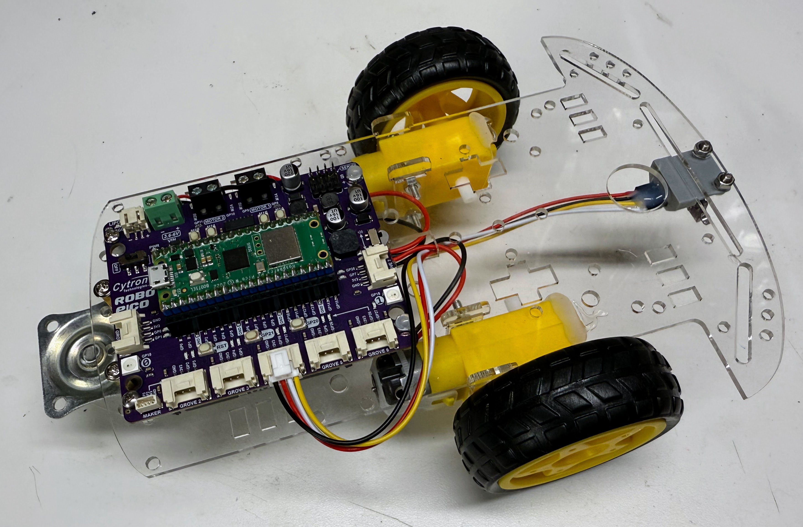

# Wireless STEM Robot



This robot uses the [Cytron Robo Pico](https://www.cytron.io/p-robo-pico-simplifying-robotics-with-raspberry-pi-pico) board that allows us to use a Raspberry Pi Pico W board as our microcontroller.  The "W" has builtin WiFi and Bluetooth hardware
so we can control our robot wirelessly.

## Cytron Robo Pico Pinout


Note that the GPIO breakout female header allows us to connect our display cable directly to the board without using Grove connectors!

## Source Code

We can use the [base robot source code](https://github.com/dmccreary/stem-robots/tree/main/src/kits/base) as
a starting point for our wireless robot.

## MicroPython Wireless Functions

When you stop/restart Thonny you MUST make sure you have loaded the Pico "W" version of software.

```
MicroPython v1.25.0 on 2025-04-15; Raspberry Pi Pico W with RP2040
```

[Raspbeery Pi Pico MicroPython Wireless Functions](https://dmccreary.github.io/learning-micropython/basics/06-wireless/)

## Secrets File

Our WiFi connection stores the local wireless network name and password in a file called `secrets.py`.  It has the following format:

```python
SSID = "MY_WIFI_NETWORK_NAME"
PASSWORD = "MY_WIFI_PASSWORD"
```

Note that you should take steps to make sure the `secrets.py` file is not checked into public GitHub repositories.
The best way to do this is to add the following line to your .gitignore file:

```
secrets.py
```

This will work even though the file is at any level of the GitHub repository.

## Testing Your Secrets File

Once you have your `secrets.py` file configured you can test it with a simple "ping test" program

```python
import network
import secrets
from utime import sleep

print('Connecting to WiFi Network Name:', secrets.SSID)
wlan = network.WLAN(network.STA_IF)
wlan.active(True) # power up the WiFi chip
print('Waiting for wifi chip to power up...')
sleep(3) # wait three seconds for the chip to power up and initialize

wlan.connect(secrets.SSID, secrets.PASSWORD)
print('Waiting for access point to log us in.')
sleep(2)

if wlan.isconnected():
  print('Success! We have connected to your access point!')
  print('Try to ping the device at', wlan.ifconfig()[0])
else:
  print('Failure! We have not connected to your access point!  Check your secrets.py file for errors.')
```

Here is the Thonny console log when that prgram is running.

```
Connecting to WiFi Network Name: anndan
Waiting for wifi chip to power up...
Waiting for access point to log us in.
Success! We have connected to your access point!
Try to ping the device at 10.0.0.57
```

To test this you must open your Terminal application (or PowerSheel on Windows) and run the ping commend:

```sh
ping 10.0.0.57
```

Sample result:

```
PING 10.0.0.57 (10.0.0.57): 56 data bytes
Request timeout for icmp_seq 0
Request timeout for icmp_seq 1
Request timeout for icmp_seq 2
64 bytes from 10.0.0.57: icmp_seq=1 ttl=255 time=2741.073 ms
64 bytes from 10.0.0.57: icmp_seq=2 ttl=255 time=1740.994 ms
64 bytes from 10.0.0.57: icmp_seq=3 ttl=255 time=740.691 ms
```

Note that your IP address might be different.  In this mode, ping will usually have three timeouts and then repond in about three seconds.  The is slow because the Raspberry Pi Pico is in a power saving mode by default.  It takes time to load the networking code into the WiFi chip.  We will fix this in the next labs.

## Ping Test Slow

In this lab we 

[Ping Test Slow Lab](./02-ping-test-slow.md)

## Ping Test Slow

[Ping Test Fast Lab](./03-ping-test-fast.md)

## Simple Web Server

[Simple Web Server Lab](./05-simple-web-server.md)

## References

[MicroPython Docs for the RP2 WiFi](https://docs.micropython.org/en/latest/rp2/quickref.html#networking)