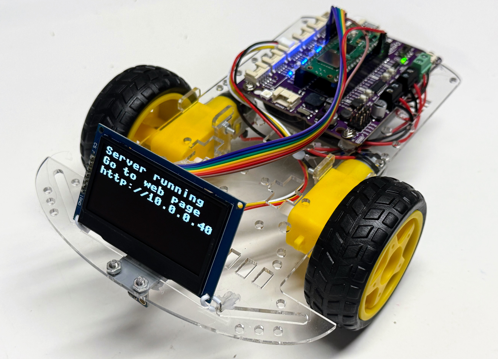

# WiFi Display Bot

This robot starts with the [WiFi Bot](../wifi-bot/index.md) but then adds an OLD display to
view the status of the bot as it starts up, connects to a WiFi access
point and then display a driver form on a web server.

## Display Status Screens

[Display Status Screens](./display-status.md)

