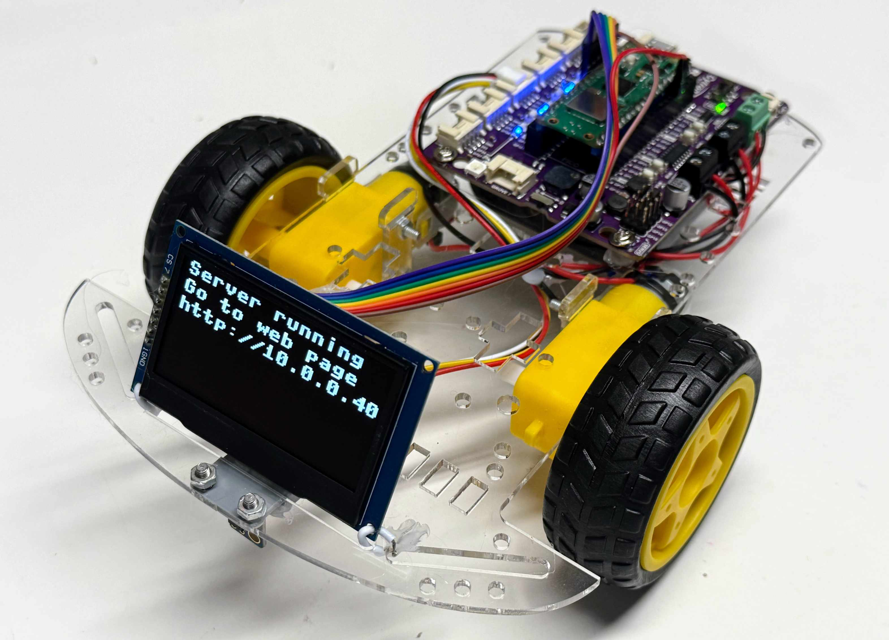

# WiFi Display Bot



This robot starts with the [WiFi Bot](../wifi-bot/index.md) but then adds an OLED display to
view the status of the bot as it starts up, connects to a WiFi access
point and then display a driver form on a web server.

## Display Status Screens

[Display Status Screens](./display-status.md)

## Uploading the Code

The source code for this kit, plus a shared `config.py`, lives in
[`src/kits/wifi-display-bot/`](https://github.com/dmccreary/stem-robots/tree/main/src/kits/wifi-display-bot).
To copy the whole kit — `config.py`, `secrets.py`, the shared display driver,
and every script — onto the Pico W in one step, run
[`upload-code.sh`](https://github.com/dmccreary/stem-robots/blob/main/src/kits/wifi-display-bot/upload-code.sh)
from a terminal:

```bash
./upload-code.sh
```

This also uploads `secrets.py` as-is, so edit it with your own WiFi SSID and
password first. Any single script can also be run directly from Thonny, or
headlessly with:

```bash
mpremote connect /dev/cu.usbmodem101 run 20-display-wifi.py
```

(Your port name may differ — check what shows up when you plug in the Pico.)

