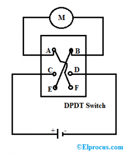

# H-Bridge Lab

The H-bridge circuit allows us to make a motor turn in opposite directions
if we close opposite switches.  To make the motor move one direction we close the upper left (Switch 1) and the lower right (Switch 4) switches.  To make the motor move in the opposite direction we close the lower left (Switch 2) and upper right (Switch 3) switches.

It is called an "H" bridge because the circuit forms the shape of the letter "H".

In the figure above:

1. To move forward, close switches 1 and 4
2. To move in reverse, close switches 2 and 3

This circuit can also be demonstrated by using a single double-pole, double throw switch.

<iframe width="560" height="315" src="https://www.youtube.com/embed/rtaaIjR2qmY?si=UHTfZRQHnEzNux3i" title="YouTube video player" frameborder="0" allow="accelerometer; autoplay; clipboard-write; encrypted-media; gyroscope; picture-in-picture; web-share" allowfullscreen></iframe>

