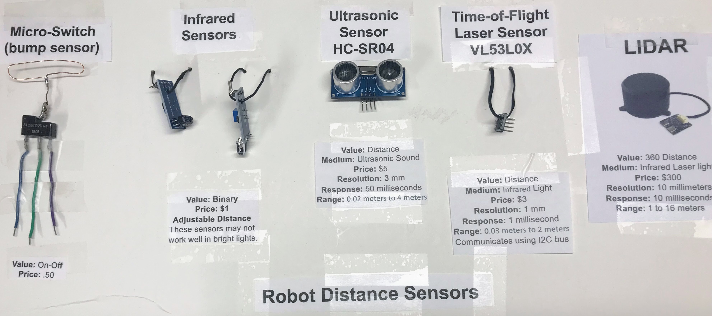

# Sensors

1. **Bump sensors** - microswitches
2. **IR Sensors** - Infrared distance sensors
3. **Ultrasonic Sensors** - using sound to measure distance
4. **Time of Flight Sensors** - our favorite sensor
5. **LIDAR** - high end sensors for moving robots

