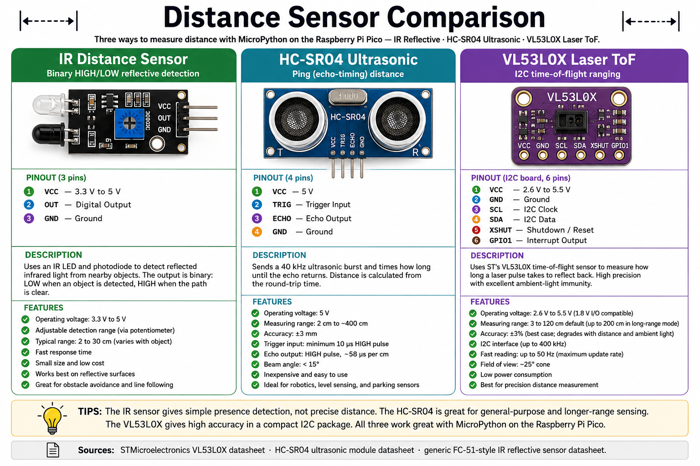
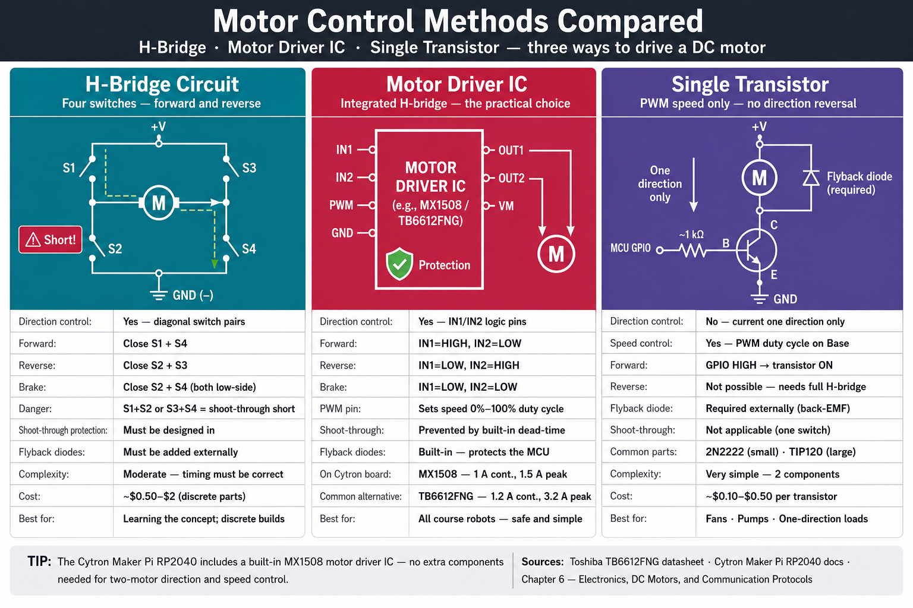
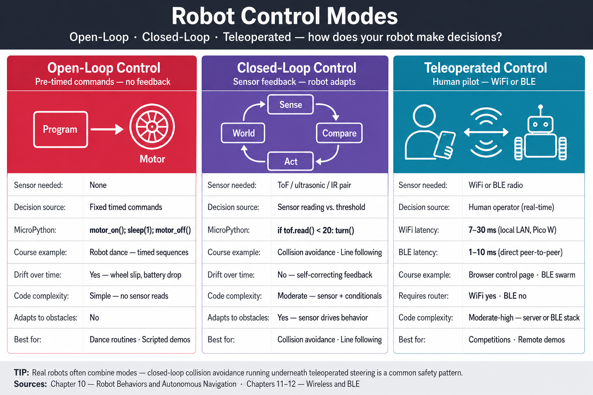
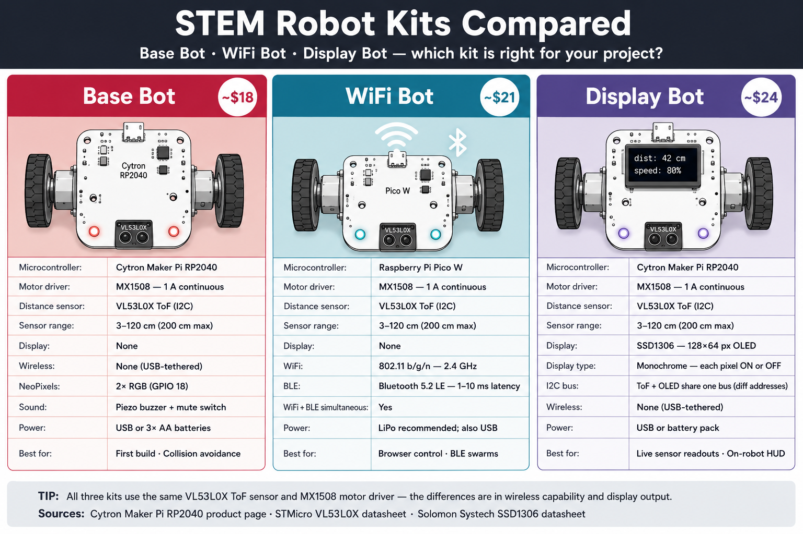
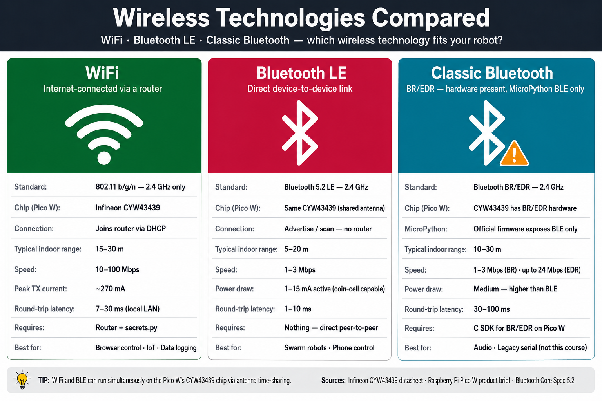

# Infographic Posters for STEM Robots

These comparison infographic posters are designed for classroom display, hallway bulletin boards, and textbook reference. Each poster lets students click a column to explore facts and then switch to **Quiz Me** mode to test their understanding.

-   **[I2C vs SPI Communication Protocols](./communication-protocols/index.md)**

    

    An interactive side-by-side comparison of the I2C and SPI serial communication protocols covering wires, topology, speed, addressing, and best uses with a built-in quiz.

-   **[Distance Sensors Compared](./distance-sensors/index.md)**

    

    An interactive comparison of IR reflective, HC-SR04 ultrasonic, and VL53L0X laser time-of-flight distance sensors — range, accuracy, and interface — with a built-in quiz.

-   **[Motor Control Methods Compared](./motor-control-methods/index.md)**

    

    An interactive comparison of H-bridge circuits, motor driver ICs, and single transistors for controlling DC motors — direction, speed, complexity, and cost — with a built-in quiz.

-   **[Robot Control Modes Compared](./robot-control-modes/index.md)**

    

    An interactive comparison of open-loop, closed-loop, and teleoperated robot control — sensor use, reliability, code complexity, and when to choose each — with a built-in quiz.

-   **[STEM Robot Kits Compared](./robot-kits/index.md)**

    

    An interactive comparison of the Base Bot, WiFi Bot, and Display Bot kits — cost, components, capabilities, and which chapters each supports — with a built-in quiz.

-   **[Wireless Technologies Compared](./wireless-technologies/index.md)**

    

    An interactive comparison of WiFi, Bluetooth LE, and Classic Bluetooth — range, power, connection model, and robot use cases — with a built-in quiz.

---

## Generating the Infographic Images

Each poster directory contains an **Image Prompt** section in its `index.md`. Copy that prompt into a text-to-image tool (ChatGPT, DALL·E 3, Midjourney, or similar) to generate the background illustration. Save the output as the PNG filename listed in `data.json` inside the same folder, then reload `main.html` to activate the interactive overlays.
