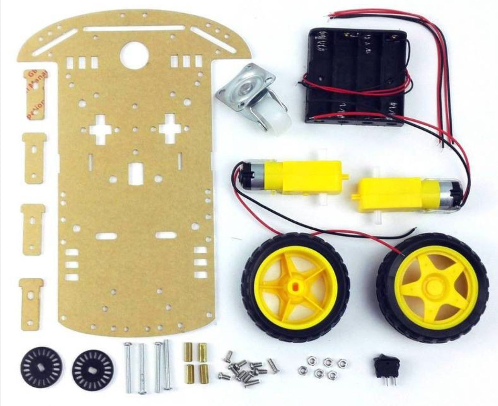
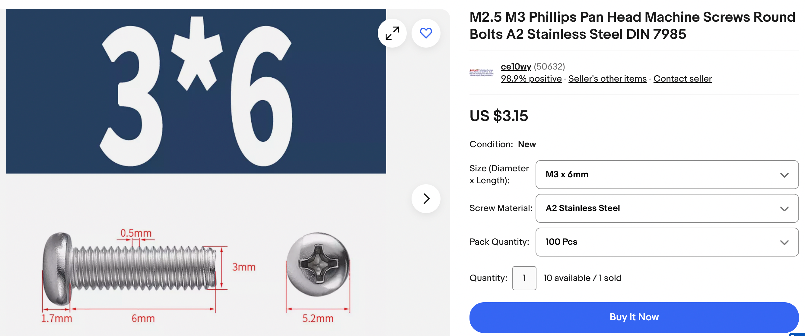

# Purchasing Your Own Parts

Many schools have received sample kits from our programs.
But you can buy your own parts and assemble your own kits.

## 2WD "Smart Car" Kit

There are many "Smart Car" kits available online retailers such as [eBay](https://www.ebay.com/sch/i.html?_from=R40&_nkw=2WD+robot+smart+car+chasis), [Amazon](https://www.amazon.com/s?k=2WD+Smart+car+robot+chassis) and [Walmart](https://www.walmart.com/search?q=2WD+Smart+Car+Robot+Chassis).
Purchasing these kits in quantity 10 or more can help you save on shipping costs.

Note that these kits often come with two black circular wheel encoders.  We
do not use these parts and they can be discarded.  We also do not
use the power switch since the Cytron board has its own power switch.

Our preferred vendor is the [Cytron 2WD Smart Robot Car Chassis](https://www.cytron.io/p-2wd-smart-robot-car-chassis) at $4.80.

We like the Cytron kit because the motors come with the wires soldered in place.  We also use a small cable tie to keep the wires from breaking off.  These kits frequently come with a small
screwdriver for tightening the screws.

Note that the prices for these kits vary widely, so be careful what you purchase.

## Cytron Motor Control Board

There are many robotics controllers available that can be programmed with MicroPython.
But the one from Cytron stands out as having all the features we need for our
STEM Robot, and at $12.00 it is a great value.

[Our Review of the Cytron Maker Pi RP2040 Board on Medium](https://dmccreary.medium.com/the-cytron-maker-pi-rp2040-robotics-board-b1dc7f0eab34)

Cytron Maker Pi RP2040 Board

1. Powered by Raspberry Pi RP2040 MicroController
    1. Dual-core Arm Cortex-M0+ processor
    1. 264KB internal RAM
    1. 2MB of Flash memory
2. 4x Servo motors
3. 2x DC motors with quick test buttons
4. Versatile power circuit
5. Automatic power selection: USB 5V, LiPo (1-cell) or Vin (3.6-6V)
6. Built-in 1-cell LiPo/Li-Ion charger (over-charged & over-discharged protection)
7. Power on/off switch
8. 13x Status indicator LEDs for GPIO pins
9. 1x Piezo buzzer with mute switch
10. 2x Push button
11. 2x RGB LED (Neopixel Compatible)
12. 7x Grove ports (flexible I/O options: digital, analog, I2C, SPI, UART...)
13. 6x M3 screw hole

The Cytron board comes with a screwdriver and four rubber mounting tabs.

### Cytron
[Cytron Maker Pi RP2040](https://www.cytron.io/p-maker-pi-rp2040-simplifying-robotics-with-raspberry-pi-rp2040)

### Digikey

[Maker Pi RP2040 Board](https://www.digikey.com/en/products/detail/cytron-technologies-sdn-bhd/MAKER-PI-RP2040/14557836) - listed for $11

### Adafruit

[Adafruit $14.90](https://www.adafruit.com/product/5129)

### Time of Flight Distance Sensor

VL53L0X Time-of-Flight Laser Ranging Module IR Distance Sensor

The VL53L0X is a low-cost ($5) time-of-flight light-based distance sensor that is easy to use. It comes packaged in an I2C board and gives precise distance measurements up to 1.5 meters away. It measures the time that light pulses take to travel to an object and back to estimate distance. Light travels about 1 foot every nanosecond, so the timing inside this little chip must be very accurate.

The VL53L0X integrates a group of Single Photon Avalanche Diodes (SPAD) and embeds ST Electronic's second generation FlightSense™ patented technology. The VL53L0X’s 940 nm emitter Vertical Cavity Surface-Emitting Laser (VCSEL), is safe for kids and totally invisible to the human eye. Coupled with internal physical infrared filters, the sensor enables longer-ranging distances, higher immunity to ambient light, and better robustness to cover glass optical crosstalk.

[Review and 3D Printed Mount](https://dmccreary.medium.com/a-3d-printed-mount-for-time-of-flight-distance-sensor-8acea5480709)

## M3 Bolts and Nuts

We use M3 metric screws for mounting the Cytron board to the back of the chassis and
mounting the time-of-flight sensor to the front of the robot.  We use 4x 10 mm screws
on the Cytron board and 2x 6mm screws for the time-fight sensor.

[eBay M3 pan head bolts](https://www.ebay.com/sch/i.html?_from=R40&_nkw=M3+Phillips+Pan+%2F+Round+Head+Machine+Screw+Bolts&Head%2520Style=Pan%2520Head&Screw%2520Size=%25233&rt=nc&Material=Stainless%2520Steel&_dcat=26217)

[M3 STAINLESS HEX FULL NUTS QTY 100 PACK $6 US](https://www.ebay.com/itm/220532417069)