# List of MicroSims for STEM Robots

Interactive Micro Simulations to help students learn STEM robotics and computational thinking fundamentals.

-   **[9-DOF IMU Chip Layout](./imu-chip-layout-diagram/index.md)**

    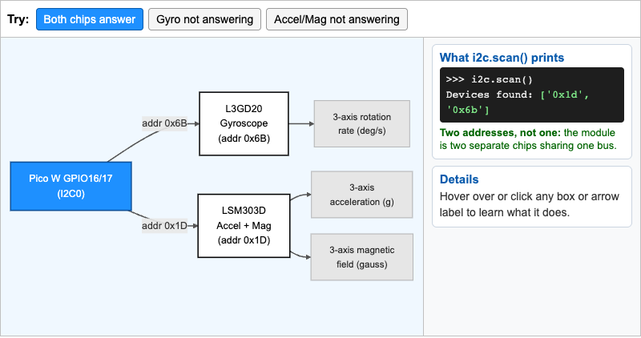

    Interactive diagram showing that the 9-DOF IMU module is really two sensor chips, the L3GD20 gyroscope at 0x6B and the LSM303DLHC accelerometer (0x19) and magnetometer (0x1E), sharing one bus on Pico W GPIO16/17.

-   **[Analog vs Digital Signal Comparison](./analog-digital-signals/index.md)**

    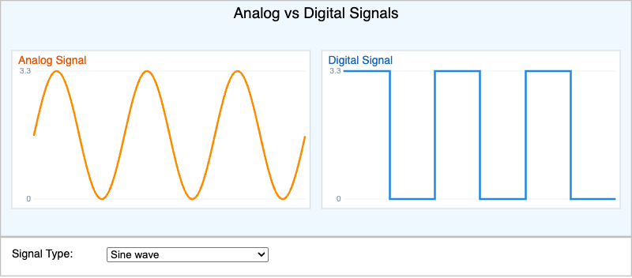

    Move your mouse across a smooth analog wave and a sharp digital square wave to see how a signal that can be any voltage differs from one that is only HIGH or LOW.

-   **[Arithmetic Operator Playground](./arithmetic-operator-playground/index.md)**

    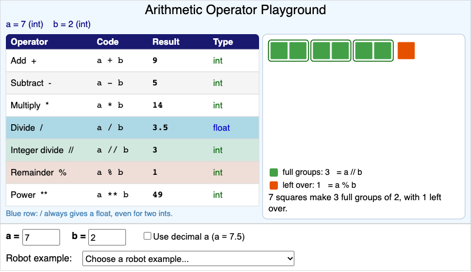

    Enter two numbers and see all seven MicroPython arithmetic operators side by side, with a block picture that shows what integer division and remainder really mean.

-   **[Battery Pack Health Explorer](./battery-pack-health-explorer/index.md)**

    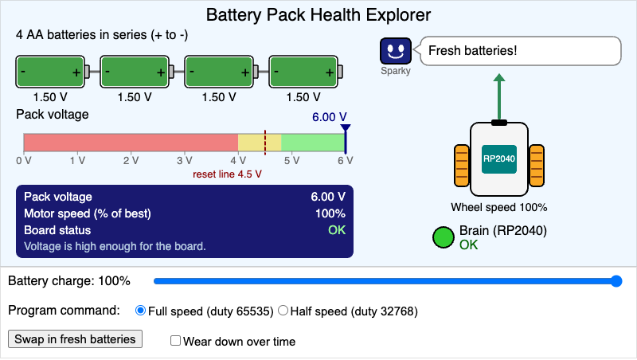

    Wear down four AA batteries in series and see how the falling pack voltage slows the robot's motors and puts the RP2040 board at risk of resetting.

-   **[Battery Runtime Estimator](./battery-runtime-estimator/index.md)**

    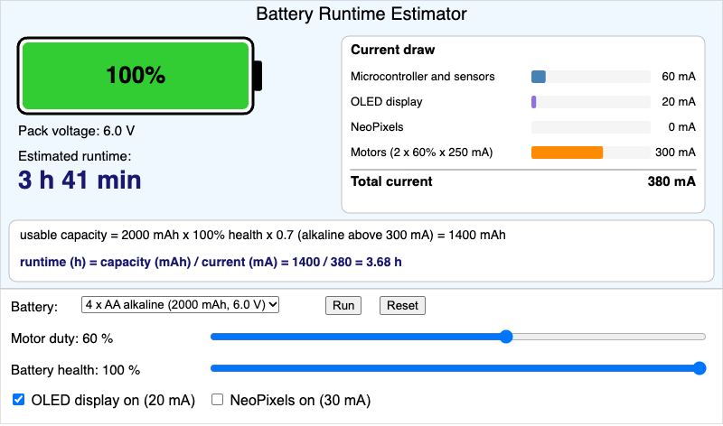

    Estimate how long your robot runs on one battery pack by dividing usable capacity by total current, and see how motor duty, the display, NeoPixels, and battery health change the answer.

-   **[BLE Advertising and Scanning](./ble-advertising-scanner/index.md)**

    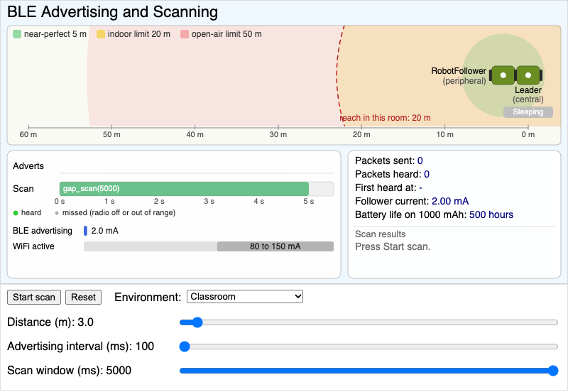

    A follower robot advertises over Bluetooth Low Energy while a leader robot scans, so students can see how distance, advertising interval, and scan window decide which packets are heard and how much power advertising uses.

-   **[BLE Connection Lifecycle](./ble-connection-lifecycle/index.md)**

    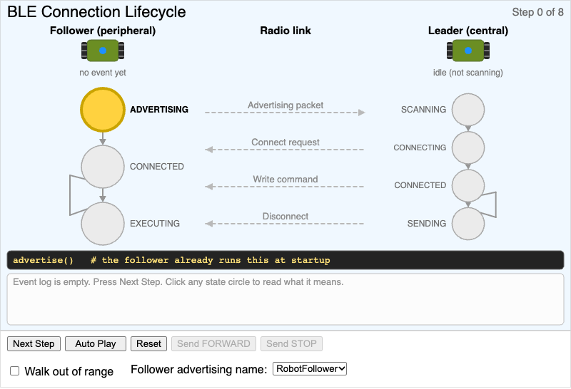

    Step through how a leader and follower robot find each other, connect, send a command, and disconnect over Bluetooth Low Energy, with the IRQ event code and MicroPython call for every step.

-   **[Breadboard Layout Explorer](./breadboard-layout-explorer/index.md)**

    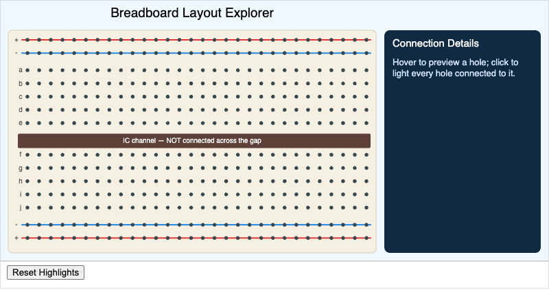

    Students will explain which holes on a breadboard are electrically connected to each other, and correctly trace a circuit path from the power rail through a component to ground.

-   **[Button Bounce Timeline](./button-bounce-timeline/index.md)**

    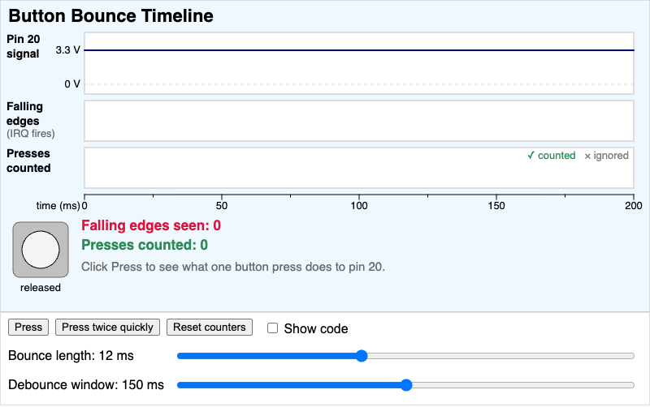

    A slow-motion timeline that shows how one button press on pin 20 makes many falling edges, and how a debounce window decides which edges count as presses.

-   **[Clean Shutdown Flow](./clean-shutdown-flow/index.md)**

    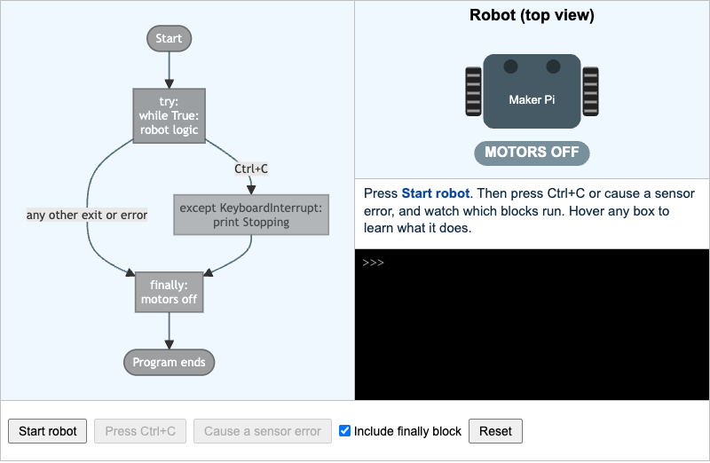

    Trace a robot program through try, except, and finally as you press Ctrl+C or cause a sensor error, and see why the motor stop code belongs in finally.

-   **[Collision Avoidance Arena](./collision-avoidance-arena/index.md)**

    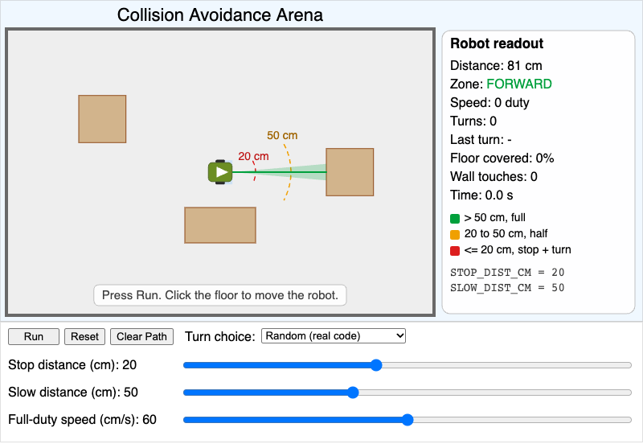

    A top-down robot arena where students tune STOP_DIST_CM and SLOW_DIST_CM and watch how the robot's path, speed, turns, and wall touches change.

-   **[Collision Avoidance Decision Flow](./collision-decision-flow/index.md)**

    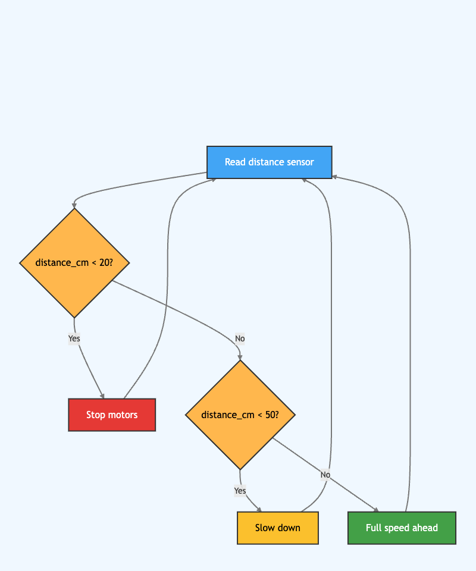

    Follow the robot's decision steps as it reads its distance sensor and chooses to stop, slow down, or drive full speed. Hover over any step to see what it does.

-   **[Collision Avoidance Robot](./collision-avoidance/index.md)**

    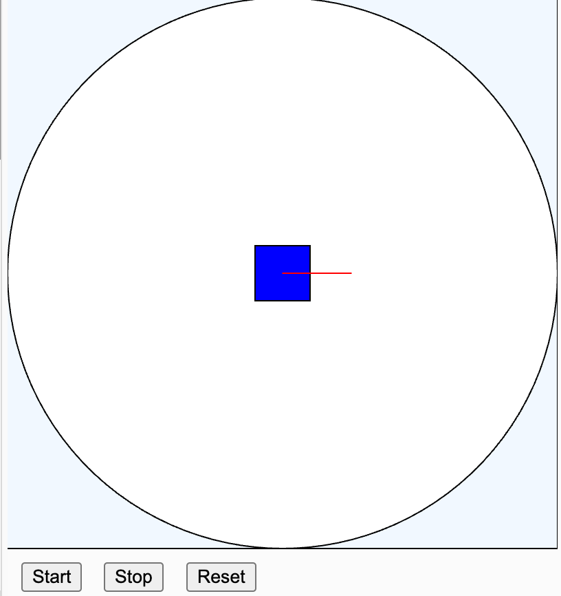

    Press Start to watch a simulated robot drive forward, back up, and turn whenever it gets close to the wall of a circular arena.

-   **[Commit or Ignore Sorter](./git-secrets-sorter/index.md)**

    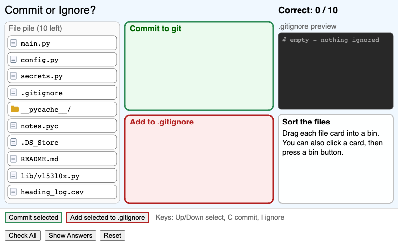

    A drag-and-drop sorting activity where students decide which robot project files to commit to git and which to add to .gitignore, with a reason for every choice.

-   **[Complementary Filter Heading Tuner](./complementary-filter-heading-tuner/index.md)**

    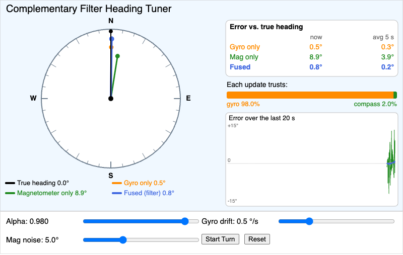

    Compare gyro-only, magnetometer-only, and complementary-filter heading estimates against the true heading on one compass dial, and use the alpha slider to see which sensor the fused estimate trusts.

-   **[Concept Graph Viewer](./learning-graph/index.md)**

    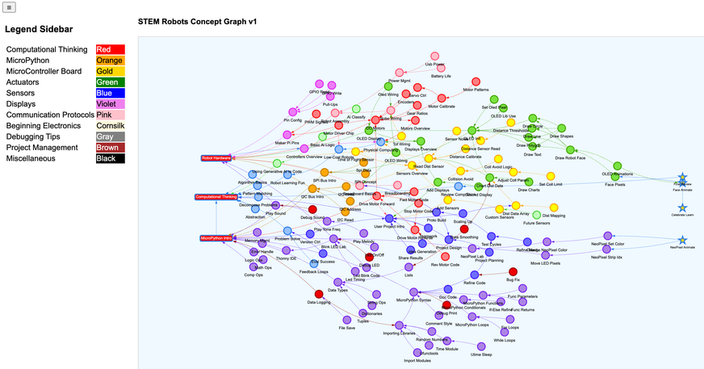

    Pan, zoom, and drag the nodes of the STEM Robots learning graph to see how each concept depends on the ones before it.

-   **[Cooperative Multitasking Timeline](./cooperative-multitasking-timeline/index.md)**

    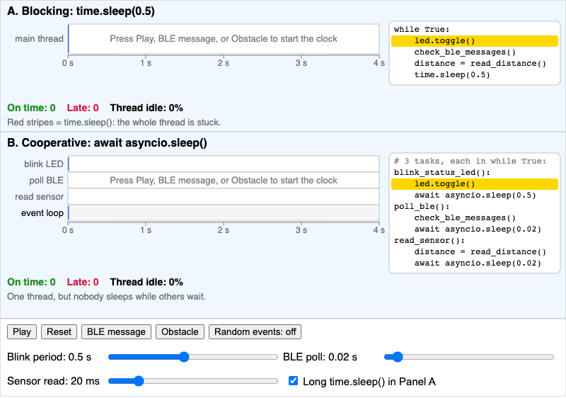

    Compare a blocking robot loop that calls time.sleep() with uasyncio tasks that pause at await, and see which BLE messages and obstacles each program handles late.

-   **[Cytron Maker Pi RP2040 Board Explorer](./cytron-board-explorer/index.md)**

    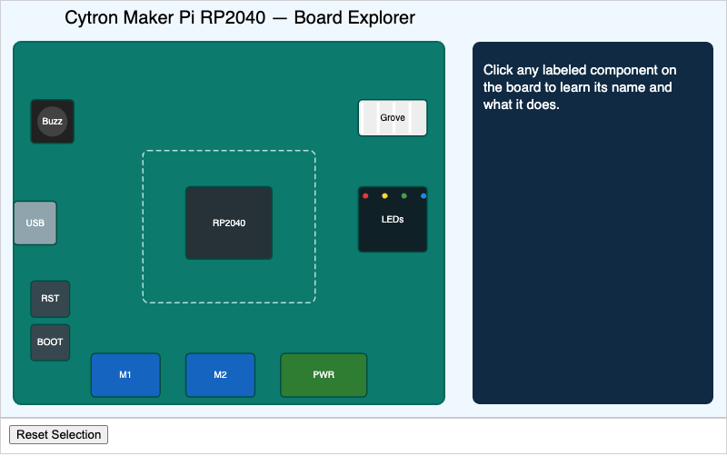

    Students will identify each major component on the Cytron Maker Pi RP2040 board and state its function in the robot system.

-   **[Cytron Maker Pi RP2040 Board Explorer](./cytron-maker-pi-rp2040-overlay/index.md)**

    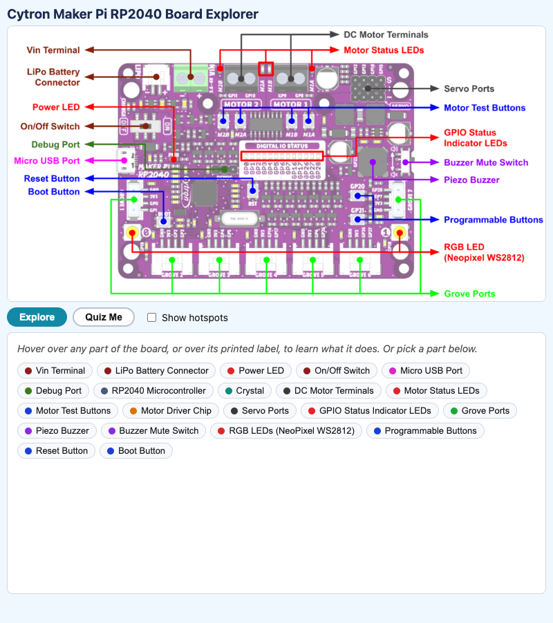

    Hover over any part of the Cytron Maker Pi RP2040 robotics board to learn what it does, then take a quiz that asks you to find each part by its job.

-   **[Cytron Robo Pico Board Explorer](./cytron-robo-pico-overlay/index.md)**

    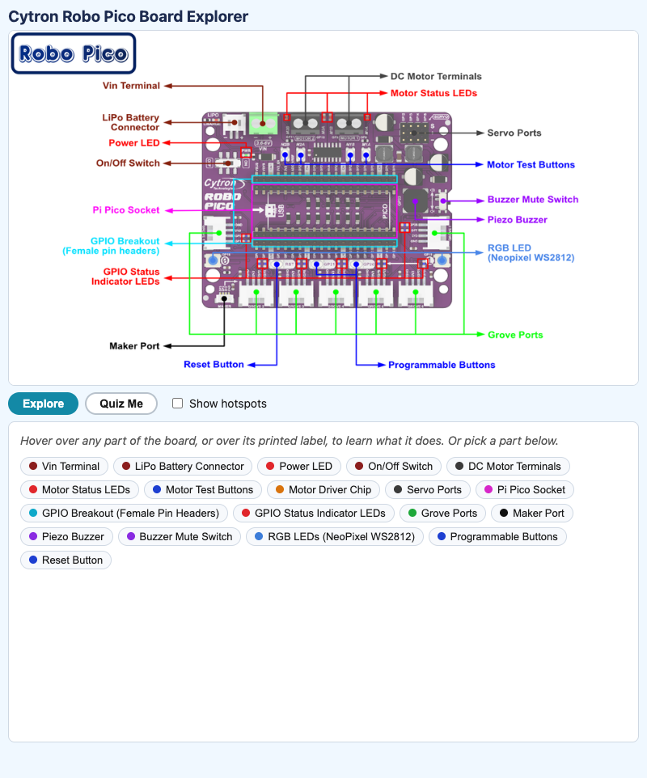

    Hover over any part of the Cytron Robo Pico robotics board to learn what it does, then take a quiz that asks you to find each part by its job.

-   **[Dance Beat Sequencer](./dance-beat-sequencer/index.md)**

    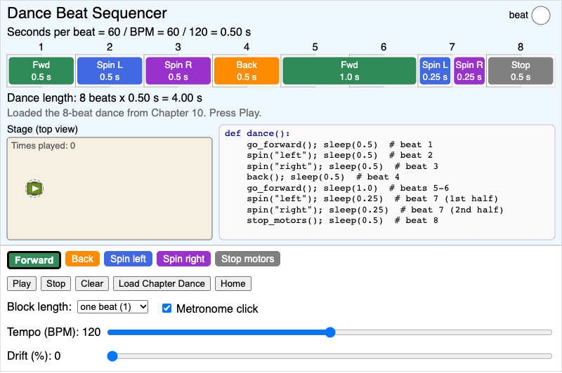

    An 8-beat timeline where students convert BPM into seconds per beat, arrange timed robot moves, preview the dance, and see the matching dance() code.

-   **[Data Type Explorer](./python-data-type-explorer/index.md)**

    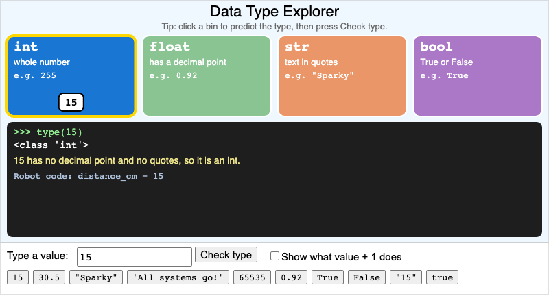

    Type a value or pick a robot value and watch it slide into the int, float, str, or bool bin, with a REPL-style type() check and a plain-English reason.

-   **[Differential Drive Turn Simulator](./differential-drive-simulator/index.md)**

    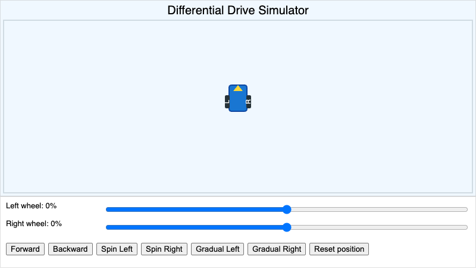

    Set the left and right wheel speeds and watch a top-down robot drive, spin, and curve. See how the difference between two wheels steers the robot.

-   **[Distance to Display Mapper](./distance-display-mapper/index.md)**

    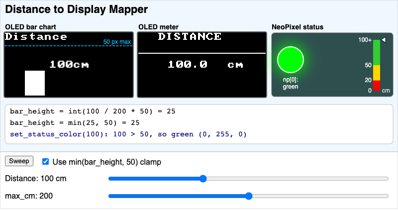

    Turn one distance reading into an OLED bar chart, an OLED meter, and a NeoPixel status color, and see how int(), min(bar_height, 50), and the 50 cm and 20 cm thresholds shape each output.

-   **[Fetch vs. Form Page Reload](./fetch-async-control/index.md)**

    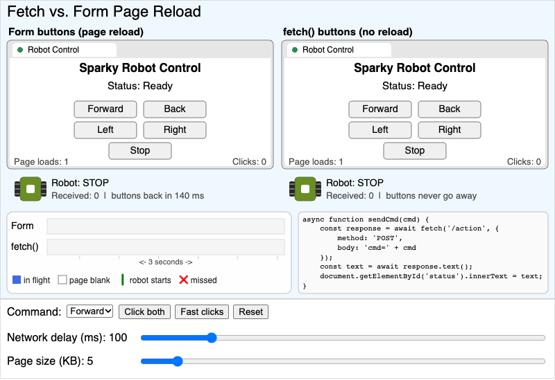

    Two robot controller pages side by side, one with form buttons that reload the page and one with fetch(), so students can compare missed clicks, blank-page time, and robot response.

-   **[Flash Memory vs RAM Power Cycle](./flash-vs-ram-power-cycle/index.md)**

    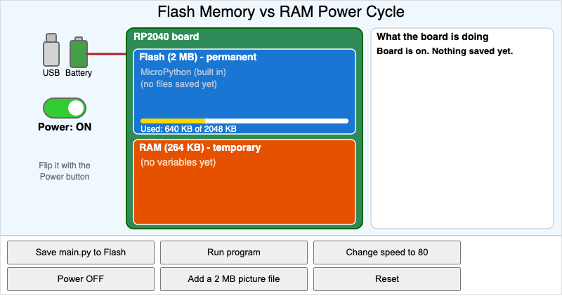

    Save main.py, run it, change a variable, and cut the power to see that Flash memory keeps your files while RAM forgets everything.

-   **[GATT Hierarchy Explorer](./gatt-hierarchy-explorer/index.md)**

    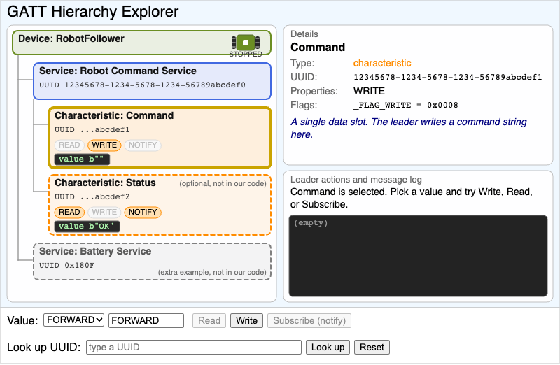

    Explore the follower robot's GATT tree of device, services, and characteristics, then act as the leader robot to read, write, or subscribe and see which operations each characteristic allows.

-   **[Git Commit Workflow](./git-commit-workflow/index.md)**

    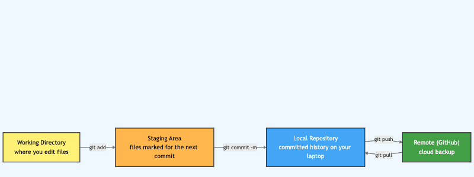

    See how your code moves from the working directory to the staging area, your local repository, and GitHub. Hover over each box and arrow to learn what git add, commit, and push do.

-   **[GPIO Pin Explorer](./gpio-pin-explorer/index.md)**

    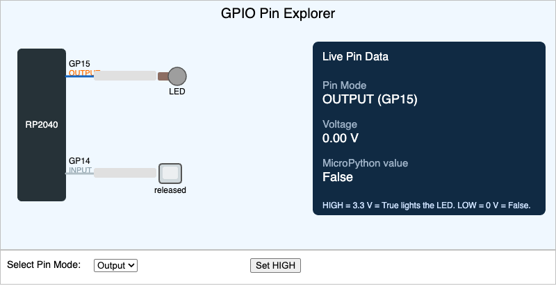

    Students will explain the difference between a digital input pin and a digital output pin, and correctly map HIGH/LOW states to voltage levels and MicroPython boolean values.

-   **[H-Bridge Circuit](./h-bridge/index.md)**

    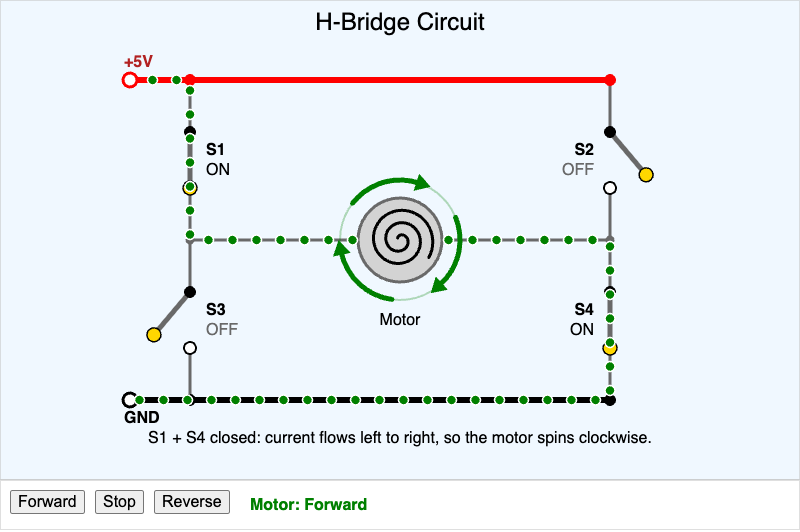

    Click the four knife switches of an H-bridge, or press Forward, Stop, or Reverse, and watch green or purple current flow spin the motor. A short circuit flashes the wires red.

-   **[H-Bridge Switch States](./h-bridge-simulator/index.md)**

    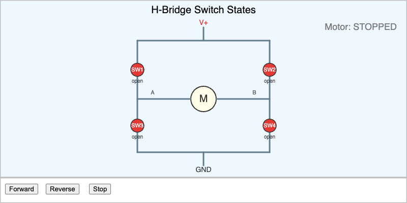

    Press Forward, Reverse, or Stop to flip the four switches of an H-bridge and watch the current flow change which way the motor spins.

-   **[Hardware Troubleshooting Detective](./hardware-troubleshooting-detective/index.md)**

    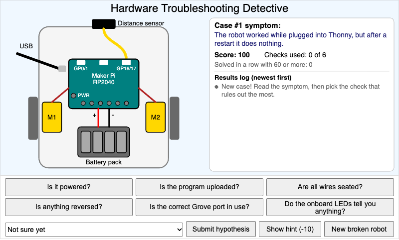

    Solve broken-robot cases by choosing which of the six hardware checks to run, reading the clues, and naming the hidden fault with as few checks as possible.

-   **[Heading Broadcast Network Topology](./heading-broadcast-topology/index.md)**

    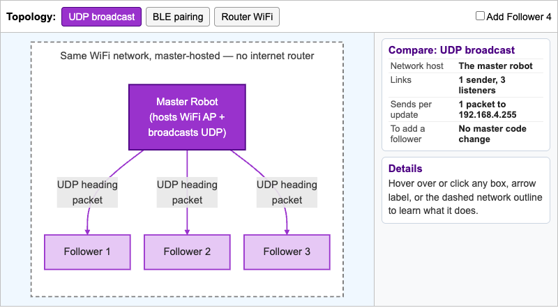

    Interactive network diagram that compares the heading swarm's one-to-many UDP broadcast with one-to-one BLE pairing and router-hosted WiFi, and shows what the sender must change to add a follower.

-   **[Heading Error and Steering Explorer](./heading-error-steering-explorer/index.md)**

    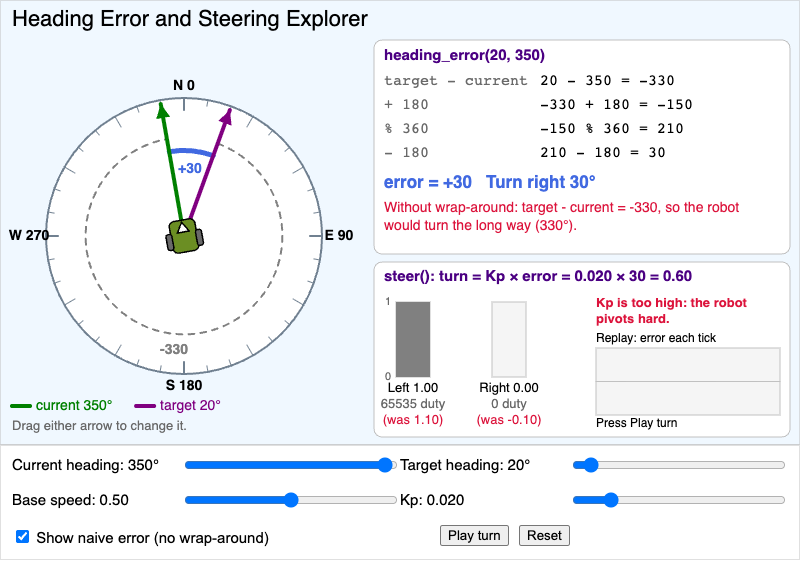

    Set a follower robot's current and target headings, watch heading_error() pick the shorter turn step by step, and see the left and right motor speeds that steer() returns for a given Kp.

-   **[I2C Bus Explorer](./i2c-bus-explorer/index.md)**

    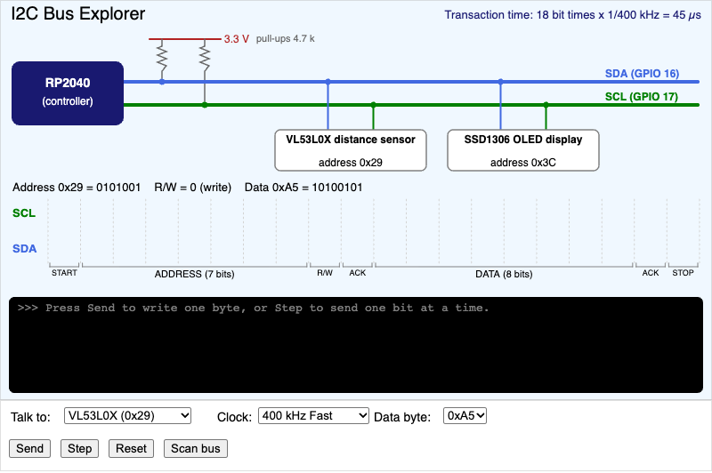

    Send a byte on a shared two-wire I2C bus and trace START, the 7-bit address, the ACK, the data bits, and STOP, then scan the bus to find which addresses answer.

-   **[I2C vs SPI Wiring Comparison](./i2c-vs-spi-wiring/index.md)**

    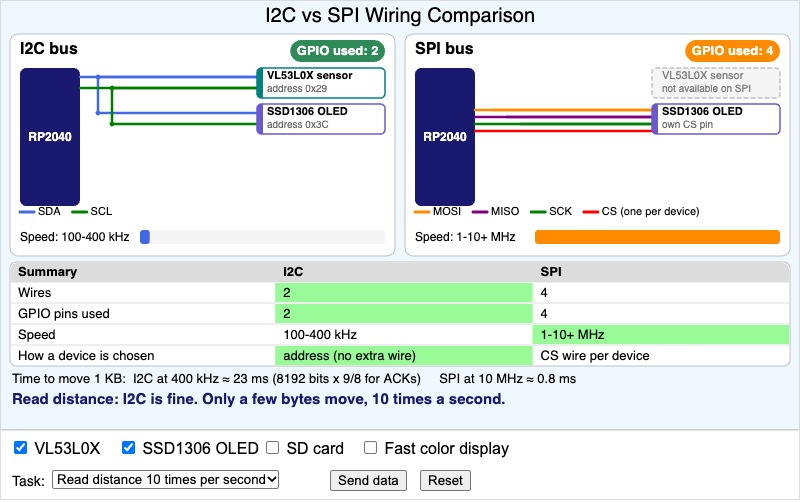

    Wire the robot's devices to an I2C bus and to an SPI bus side by side, count the wires and GPIO pins each one uses, and decide which bus fits each task.

-   **[IR Reflectance Threshold Explorer](./ir-reflectance-threshold-explorer/index.md)**

    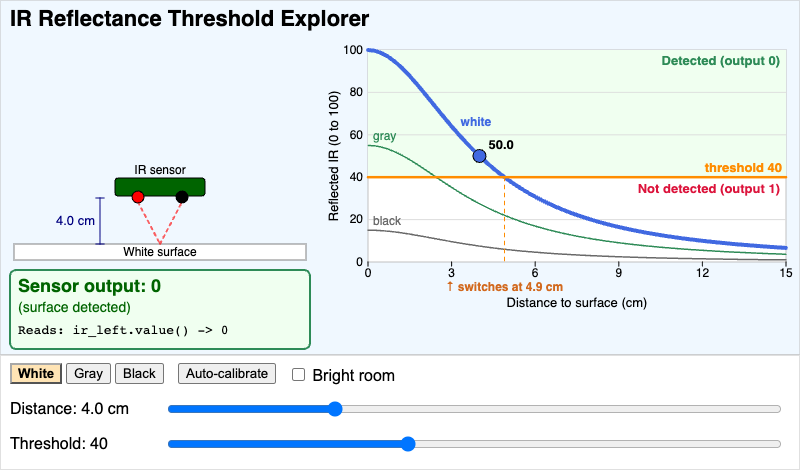

    See how surface color, distance, and the trimmer threshold decide whether an active-LOW IR sensor reads 0 (surface detected) or 1 (nothing detected).

-   **[Learning Graph Viewer](./graph-viewer/index.md)**

    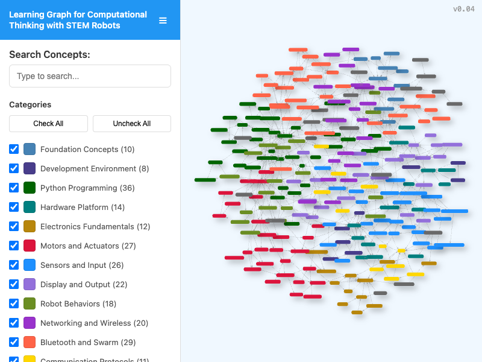

    Search, filter, and zoom through the concept map for this course to see which ideas you need to learn before others.

-   **[Line Follower Simulator](./line-follower-simulator/index.md)**

    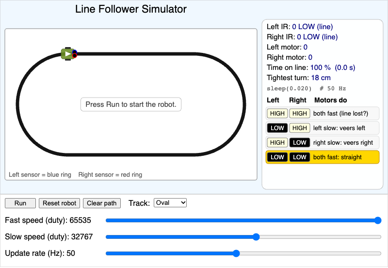

    A two-sensor line-following robot that runs the Chapter 10 adjust_motors() rules on oval, figure-8, and zigzag tracks, with sliders for fast speed, slow speed, and update rate.

-   **[List Index Explorer](./list-index-explorer/index.md)**

    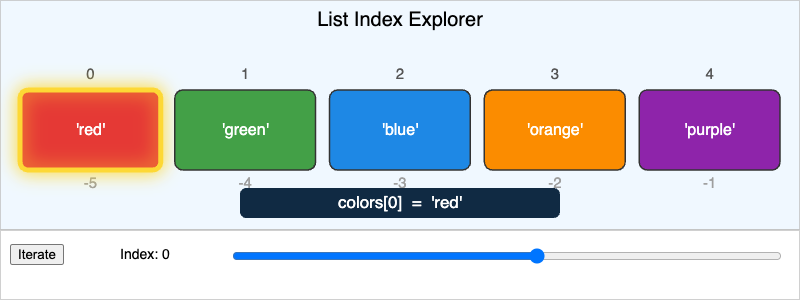

    Pick an index with the slider or press Iterate to see how positive and negative indexes find items in a MicroPython list.

-   **[Local vs Global Scope Explorer](./scope-local-global-explorer/index.md)**

    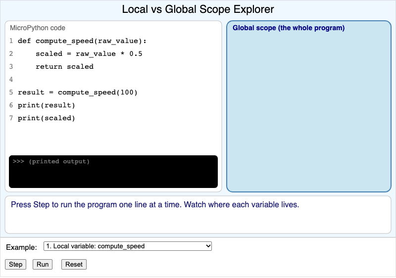

    Step through three short robot programs one line at a time and watch local variables appear and vanish inside a function, and see what the global keyword changes.

-   **[Magnetometer Calibration Explorer](./magnetometer-calibration-explorer/index.md)**

    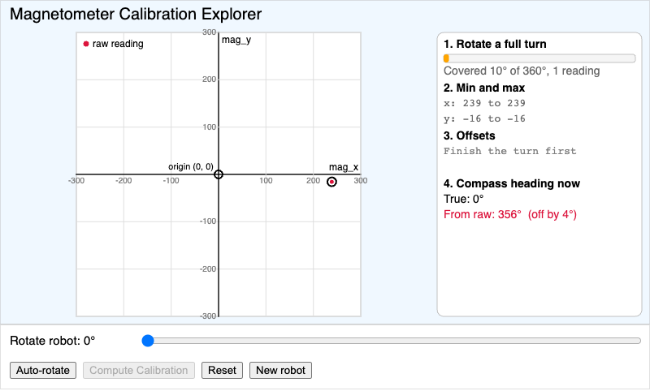

    Rotate a simulated magnetometer through a full turn, watch the raw X/Y readings trace an off-center circle, then compute the hard-iron offset from min and max values and see the corrected circle and heading snap back into place.

-   **[MAX98357A Amplifier Pinout](./max98357a-amp-pinout/index.md)**

    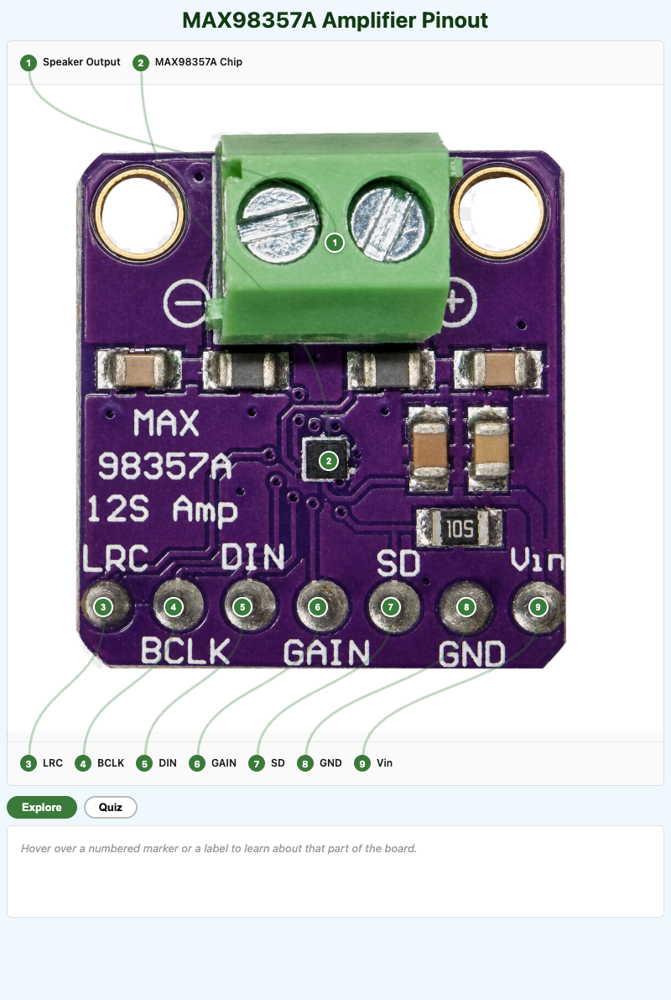

    Students will identify each pin and component on the MAX98357A I2S amplifier breakout board and explain what it does in the audio circuit.

-   **[MicroPython in the Stack](./micropython-stack-diagram/index.md)**

    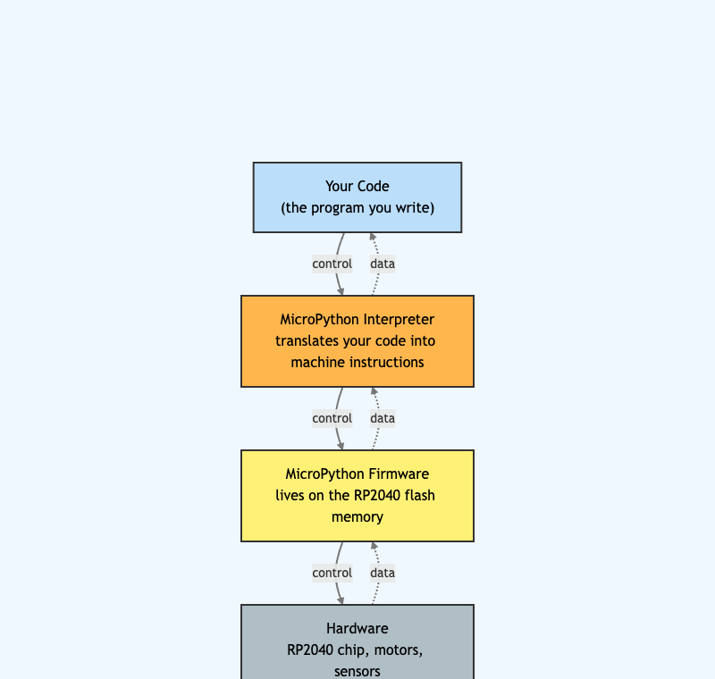

    See how your code, the MicroPython interpreter, the firmware, and the RP2040 hardware stack up to run your robot. Hover over each layer to learn its job.

-   **[Module Import Flow](./module-import-flow/index.md)**

    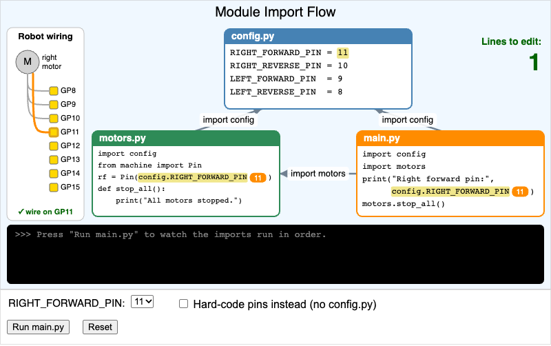

    Change one pin number in config.py and watch it flow into motors.py and main.py through import, then compare how many lines you would edit with hard-coded pins.

-   **[NeoPixel RGB Color Mixer](./neopixel-rgb-color-mixer/index.md)**

    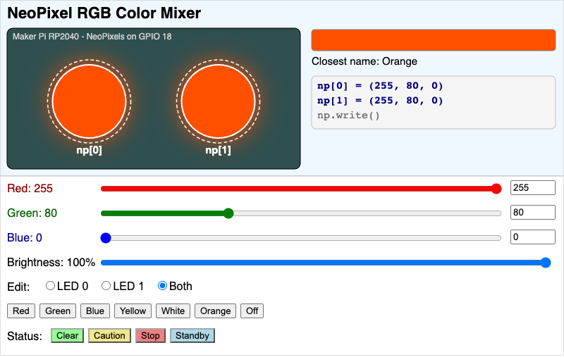

    Mix red, green, and blue values from 0 to 255 on the robot's two NeoPixels, see the glow, and copy the matching np[0] = (r, g, b) line of MicroPython.

-   **[OLED Coordinate System Explorer](./oled-coordinate-explorer/index.md)**

    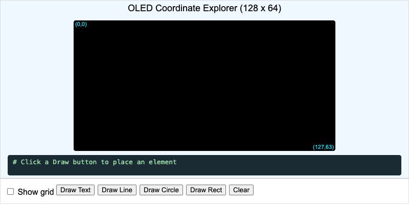

    Hover over a magnified 128 by 64 OLED screen to read pixel coordinates, then draw text, lines, circles, and boxes and see the matching ssd1306 code.

-   **[OLED Framebuffer and show()](./oled-framebuffer-show-demo/index.md)**

    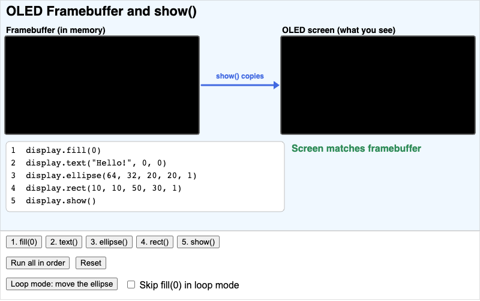

    Run display.fill(0), text(), ellipse(), rect(), and show() one step at a time to see that drawing changes only the framebuffer in memory and show() copies it to the OLED screen.

-   **[Open-Loop vs. Closed-Loop Control](./open-closed-loop-comparison/index.md)**

    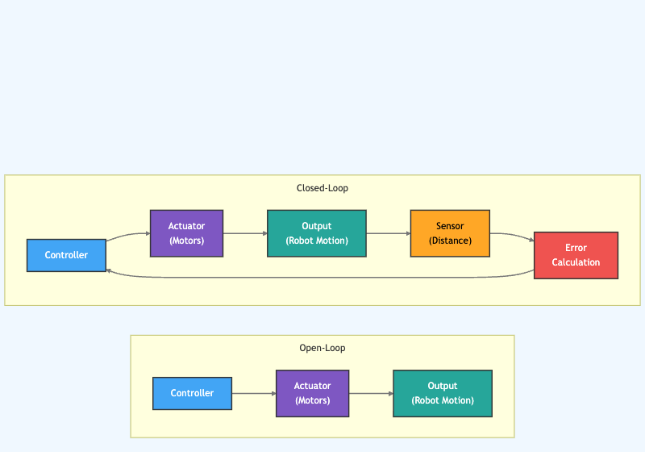

    Compare open-loop and closed-loop control side by side. Hover over each part to see how a sensor and an error value let the robot correct itself.

-   **[Physical Computing Explorer](./physical-computing-explorer/index.md)**

    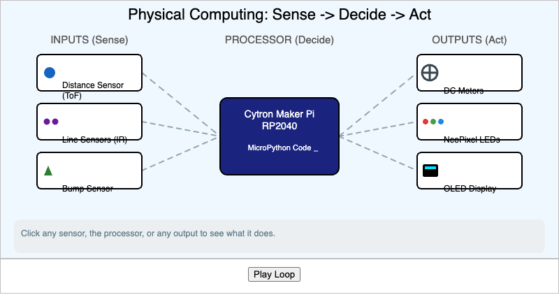

    Press Play Loop to watch information flow from a robot's sensors, through its processor, and out to its motors in the sense, decide, act loop.

-   **[PID Feedback Loop Tuner](./pid-feedback-loop-tuner/index.md)**

    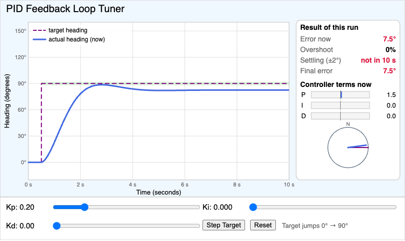

    Adjust Kp, Ki, and Kd one at a time and watch a simulated robot turn to a new heading, with live overshoot, settling time, final error, and P, I, and D term readouts.

-   **[Piezo Tone Frequency Explorer](./piezo-tone-frequency-explorer/index.md)**

    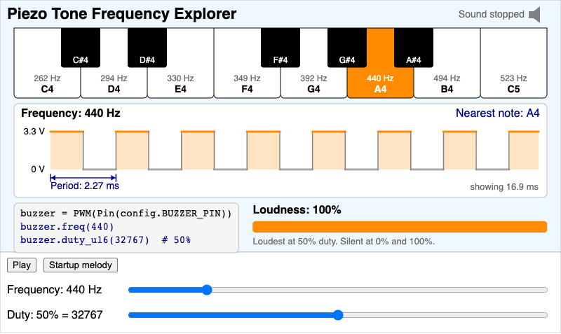

    Play a PWM tone and see how the frequency passed to buzzer.freq() sets the pitch, the period of the wave, and the piano note, and why 50% duty is the loudest.

-   **[Pulse-Width Modulation](./pwm/index.md)**

    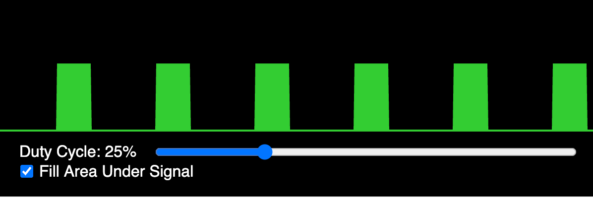

    Drag the slider to change the duty cycle of a PWM waveform drawn like a green oscilloscope trace.

-   **[PWM Duty Cycle Explorer](./pwm-duty-cycle-explorer/index.md)**

    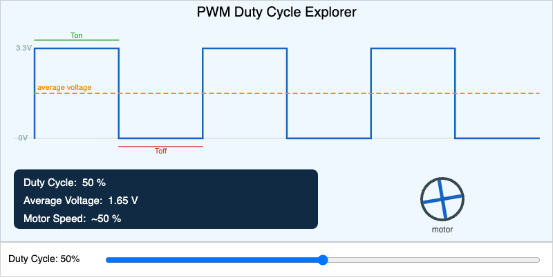

    Drag the duty cycle slider to reshape a PWM square wave and see how it changes the average voltage and the speed of a spinning motor.

-   **[Range Mapping Explorer](./range-mapping-explorer/index.md)**

    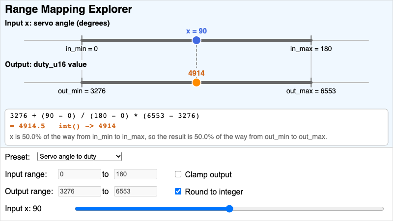

    Pick an input range and an output range, move the input, and see the linear mapping formula fill in with real numbers, including clamping and int() rounding.

-   **[REPL and Save Workflow](./repl-workflow/index.md)**

    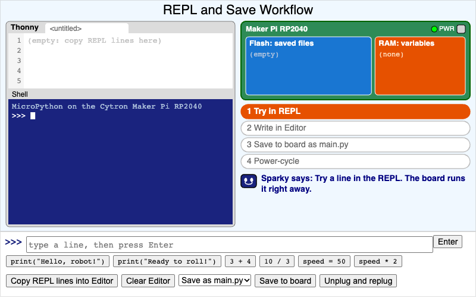

    Test lines in a mock Thonny REPL, copy the ones that work into the Editor, save them to the board as main.py or test.py, and power-cycle to see what runs by itself.

-   **[Resistor Color Code Calculator](./resistor-color-code-calculator/index.md)**

    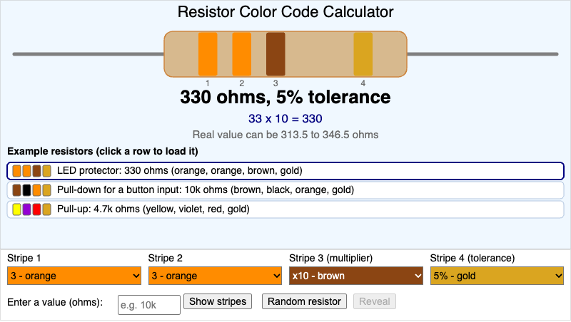

    Pick four stripe colors to read a resistor's value in ohms, type a value to see its stripes, load common robot-lab resistors, and quiz yourself on random resistors.

-   **[Robot Assembly Workflow](./robot-assembly-workflow/index.md)**

    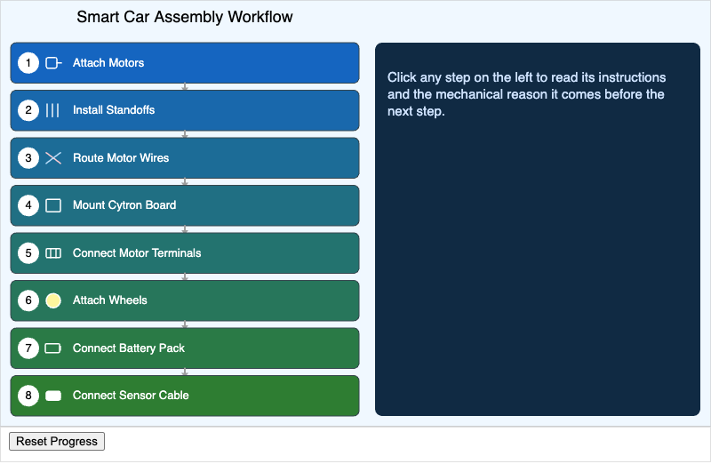

    Students will sequence the eight assembly steps in the correct order and explain the mechanical reason each step precedes the next (e.g., why standoffs must be installed before the board is mounted).

-   **[Robot Debugging Flowchart](./robot-debugging-flowchart/index.md)**

    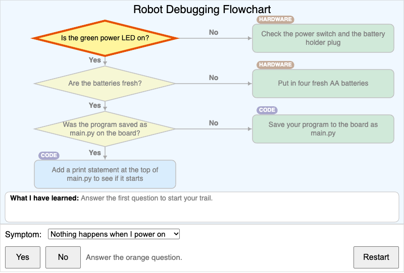

    Pick a robot symptom and answer yes-or-no questions one step at a time to decide whether the problem is hardware or code and find one thing to change.

-   **[Robot Decomposition Tree](./robot-decomposition-tree/index.md)**

    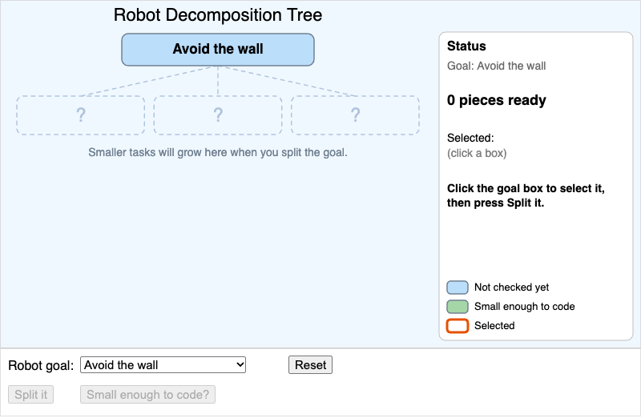

    Split a big robot goal such as "Avoid the wall" into smaller tasks, and keep splitting until every piece is small enough to write as a line or two of MicroPython.

-   **[Robot Logic Truth Table](./robot-logic-truth-table/index.md)**

    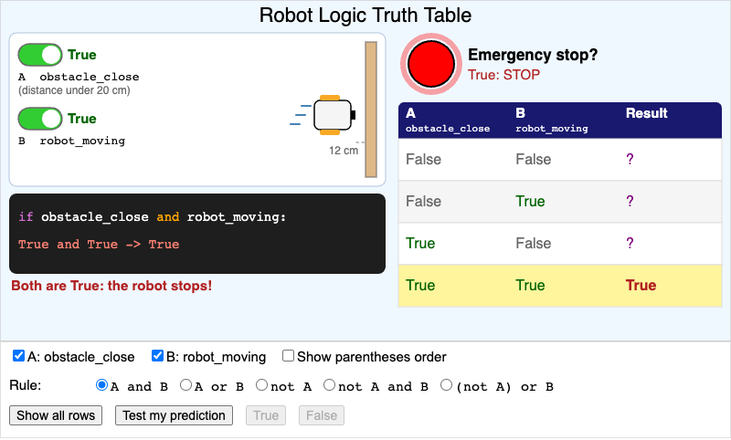

    Flip two robot conditions, pick an and, or, or not rule, and watch the Emergency stop lamp and a live truth table show exactly when the robot stops.

-   **[Robot Loop Pattern Explorer](./robot-loop-pattern-explorer/index.md)**

    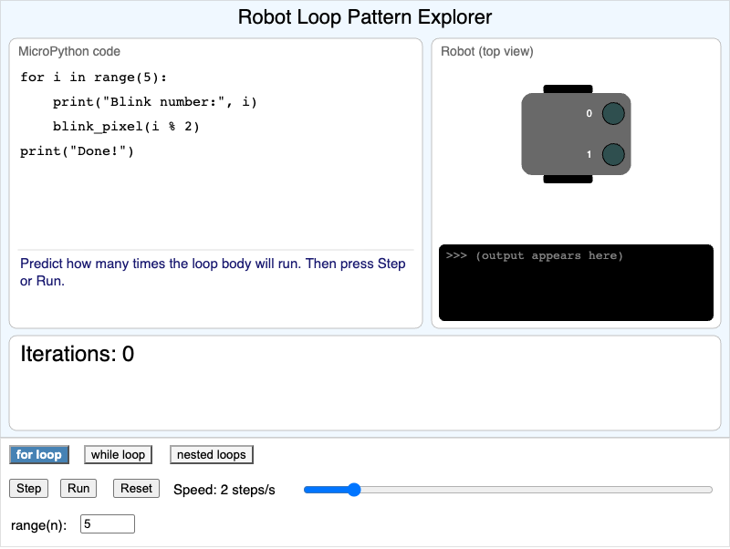

    Step through a for loop, a while loop, and a nested loop that blink a robot's NeoPixels or drive it toward a wall, and predict how many times each loop body runs.

-   **[Robot Main Loop with Timing](./robot-main-loop-timing/index.md)**

    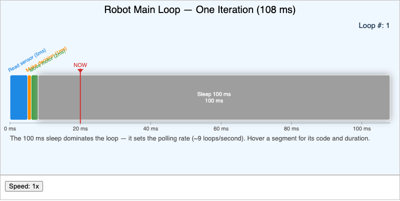

    Watch a timeline of the robot's main loop as it reads the sensor, decides, moves the motors, and sleeps. See where each pass through the loop spends its time.

-   **[Sensor Calibration Two-Point Process](./sensor-calibration-explorer/index.md)**

    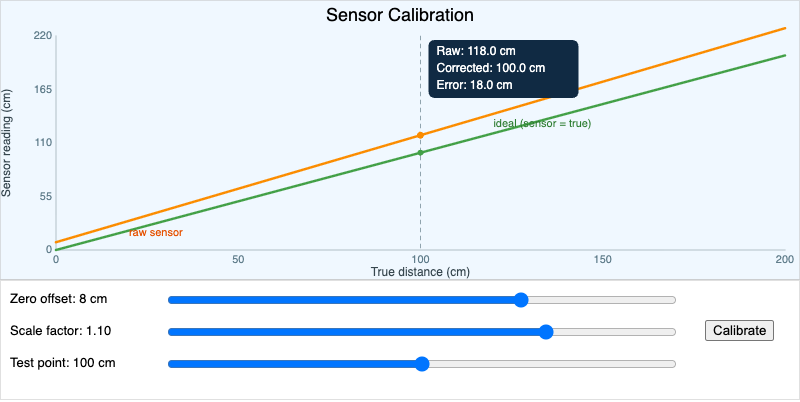

    Adjust the offset and scale of a sensor that reads wrong, then press Calibrate to line its readings up with the true distance.

-   **[Sensor Coverage Comparison](./sensor-coverage-comparison/index.md)**

    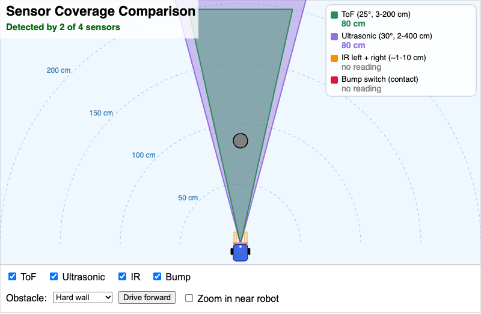

    A top-down view of the robot that compares the range, beam width, and blind spots of the ToF, ultrasonic, IR, and bump sensors as you drag an obstacle around.

-   **[Sensor Dictionary Explorer](./sensor-dictionary-explorer/index.md)**

    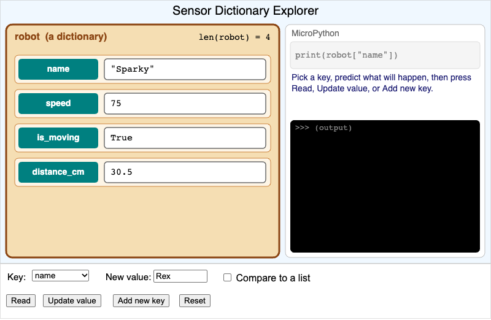

    Read, update, and add entries in the robot dictionary by key, see each action as a line of MicroPython, and predict the KeyError for a key that does not exist yet.

-   **[Sensor Filter Lab](./sensor-filter-lab/index.md)**

    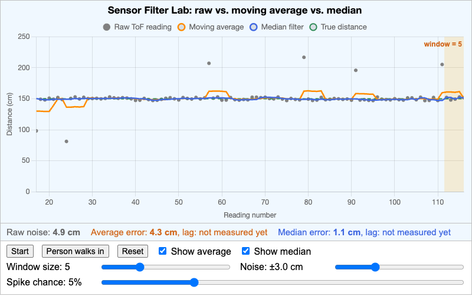

    Compare a moving average and a median filter on the same noisy ToF readings, with spikes and a sudden change, and judge which filter is better and how window size trades smoothness against lag.

-   **[Servo Pulse Width Explorer](./servo-pulse-width-explorer/index.md)**

    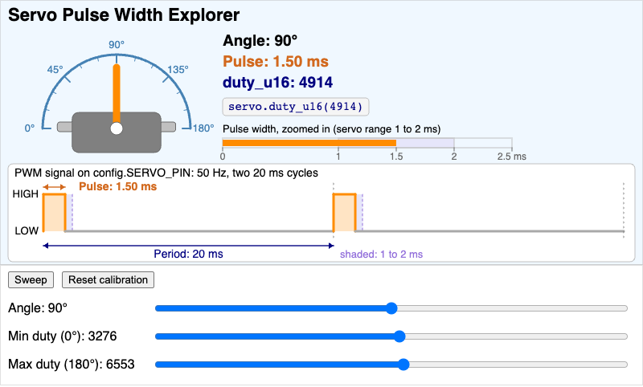

    Move a servo arm from 0 to 180 degrees and see how the angle sets a 1 to 2 ms pulse inside a 20 ms PWM period and a duty_u16 value from 3276 to 6553.

-   **[Sleep vs Timer Explorer](./sleep-vs-ticks-explorer/index.md)**

    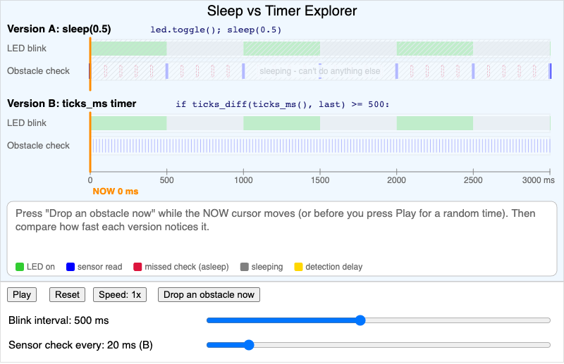

    Compare a robot that blinks its LED with sleep() against one that uses a ticks_ms() timer, drop an obstacle, and measure how long each one takes to notice it.

-   **[Socket Server Lifecycle](./socket-server-lifecycle/index.md)**

    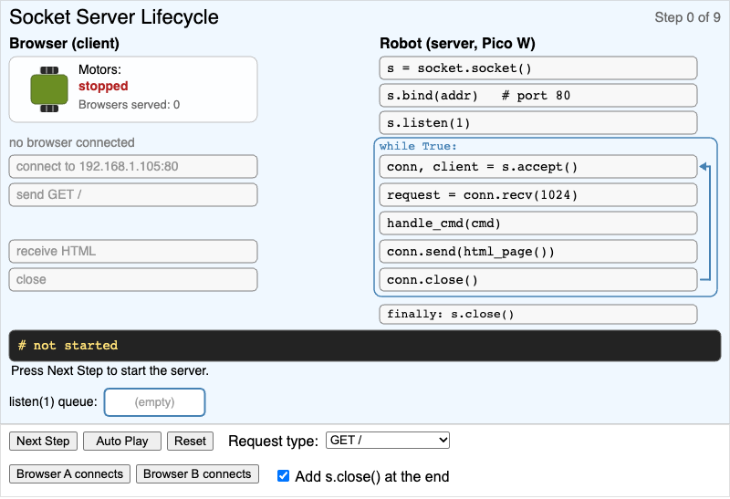

    A step-by-step view of the robot web server's socket calls, showing that accept() blocks, that listen(1) queues one browser, and why the robot serves one browser at a time.

-   **[Swarm Collective Behaviors](./swarm-collective-behaviors/index.md)**

    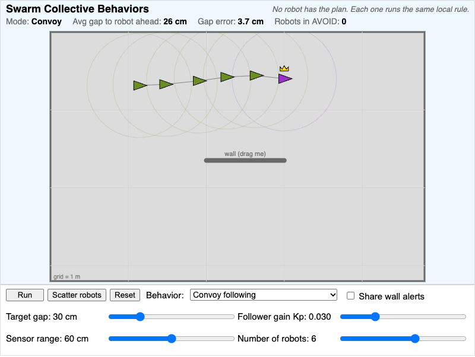

    Change the one local rule that every robot runs and watch a convoy, collective obstacle avoidance, or a leader-broadcast group emerge, with live gap and AVOID readouts.

-   **[Swarm Robot State Machine](./swarm-robot-state-machine/index.md)**

    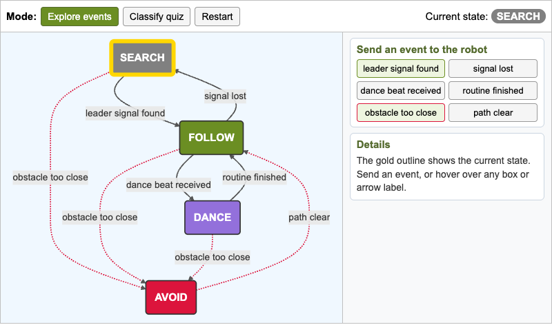

    Interactive state machine for a swarm robot's SEARCH, FOLLOW, DANCE, and AVOID modes, with event buttons that step the robot through transitions and a quiz that asks students to classify robot situations by state.

-   **[Transistor Switch Explorer](./transistor-switch-explorer/index.md)**

    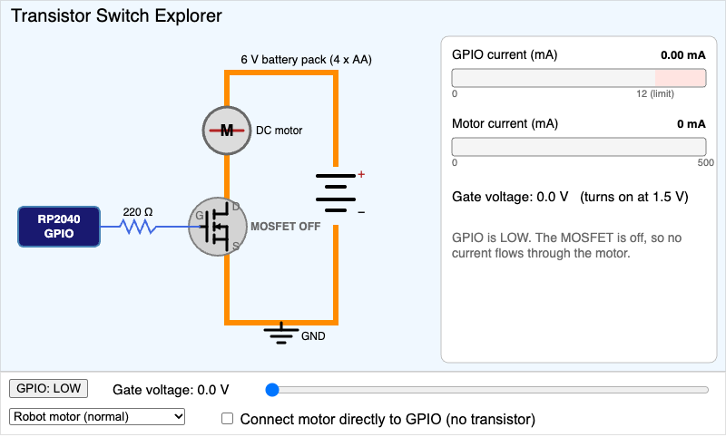

    Raise and lower the voltage on a MOSFET's gate from an RP2040 GPIO pin and watch a tiny control current switch a motor current thousands of times larger.

-   **[Tuple vs List Mutability](./tuple-list-mutability-explorer/index.md)**

    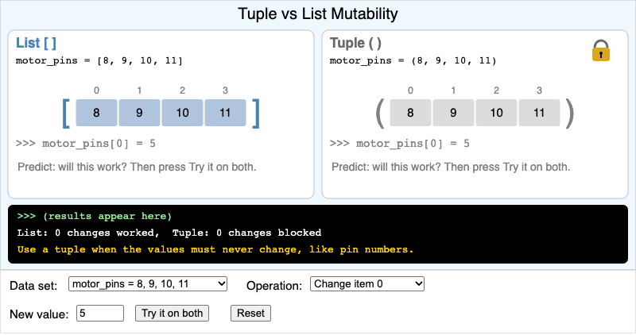

    Run the same operation on a list and a tuple that hold the same robot data, see which changes work and which raise a TypeError, and choose the right container for fixed hardware values.

-   **[Ultrasonic Echo Timing Explorer](./ultrasonic-echo-timing-explorer/index.md)**

    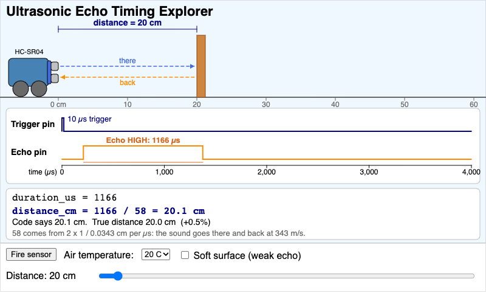

    See the HC-SR04 trigger pulse, the sound's round trip, and the Echo pin on one timeline, and convert the echo time in microseconds to centimeters with duration / 58.

-   **[Variable Assignment Interactive Explorer](./variable-assignment-explorer/index.md)**

    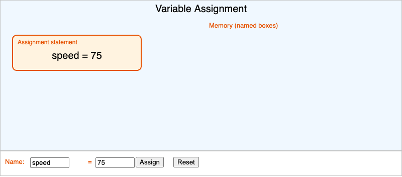

    Type a name and a value, press Assign, and watch the value get stored in a labeled memory box. Assignment stores a value; it does not mean equal.

-   **[Voltage and Current Water Analogy](./voltage-current-water-analogy/index.md)**

    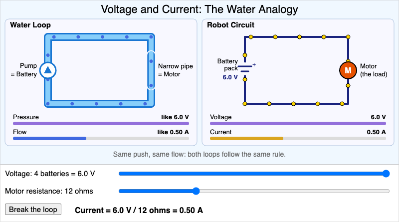

    A water loop and a robot circuit side by side show that voltage works like water pressure and current works like water flow, using the rule current = voltage / resistance.

-   **[Web Server Request-Response Flow](./http-request-response-flow/index.md)**

    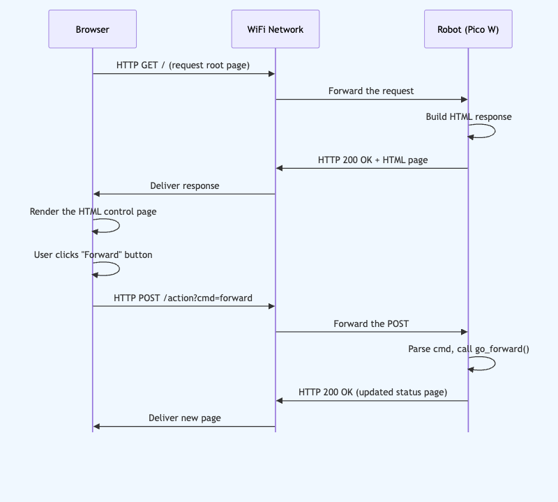

    Step through the messages a web browser and a Pico W robot send over WiFi, from loading the control page to clicking the Forward button.

-   **[What Goes in Git Sorting Activity](./git-what-to-commit-sorter/index.md)**

    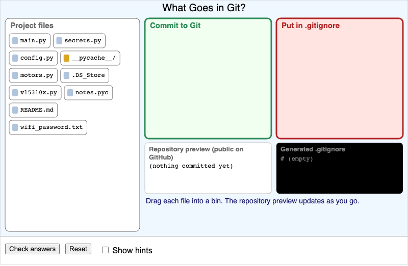

    Drag ten robot project files into "Commit to Git" or "Put in .gitignore", watch the repository preview and the generated .gitignore update, and check which files keep your WiFi password safe.

-   **[WiFi Connect Sequence](./wifi-connect-sequence/index.md)**

    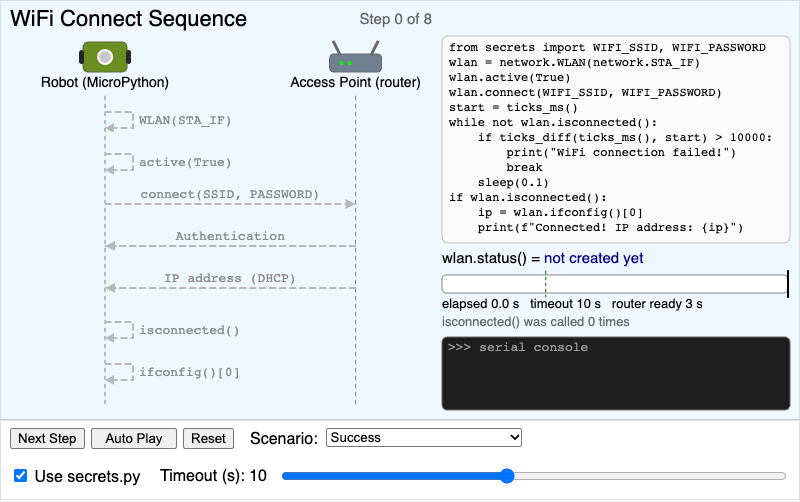

    A step-by-step sequence diagram of the Pico W WiFi connect code, with a running timeout clock and scenarios for success, a wrong password, a missing network, and a slow router.

-   **[WiFi vs BLE Communication Topology](./wifi-vs-ble-topology/index.md)**

    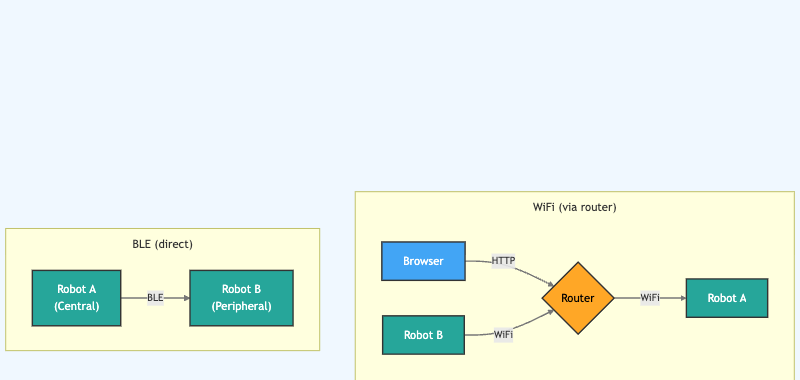

    Compare a WiFi network that talks through a router with a direct Bluetooth Low Energy link between two robots. Hover over each part to learn its role.

