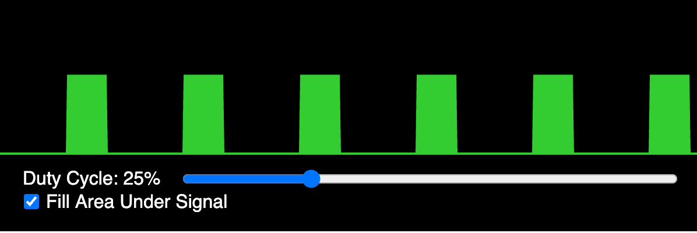

# Pulse-Width Modulation



[Run the Pulse-Width Modulation Demo](./pwm.html){ .md-button .md-button--primary }

Pulse-width modulation is the way for microcontrollers to send a precise signal to a 
device such as a motor controller to control motor speed.  PWM signals
can also be used to change the brightness of an LED.
This simulation has a slider that allows the user to change the "duty cycle" of
a waveform.  The simulation is a bright green line on a black background, just like
the old CRT oscilloscope displays.

## Sample ChatGPT Prompt

```linenums="0"
Generate a p5.js sketch file of a simulation of a static pulse width
   modulation (PWM) waveform on a 600x300 canvas.
Add a range control slider to adjust the Duty Cycle of the waveform.
Make the default Duty Cycle be 50%.
The min should be 0% and the max should be 100%.
Place the range control slider at the bottom of the canvas.
Make the leftSliderMargin be 155.
Make sure the range control slider has a width of canvasWidth-leftSliderMargin-20 using the 
   style attribute.
At the end of the draw() function add a text() function that displays
   the label and value of the duty cycle.
```

I have tested this prompt several times using GPT-4 and it seems to work very well
except for the precise layout of the duty cycle label, value and slider positioning.
I had to tweak these by hand.

[Edit This MicroSim Using the P5.js Editor](https://editor.p5js.org/dmccreary/sketches/LuroLLnh9)

## Sample Response

```js
/// Pulse Wave Modulation (PWM) simulation
// Made to render like an old oscilloscope - lime green on black
// Most of this sim was generated by GPT-4 with some cleanup on placement of the slider
let canvasWidth = 600;
let canvasHeight = 200;
let dutyCycleSlider;
let dutyCycle = 0.5; // Initialize to 50%
let cycles = 6;
let waveHeight = canvasHeight/3;
let leftSliderMargin = 155; // at 16 point font

function setup() {
  const canvas = createCanvas(canvasWidth, canvasHeight);
  // uncomment if you are placing in an HTML page
  // canvas.parent('canvas-container');
  textSize(16);
  
  dutyCycleSlider = createSlider(0, 1, 0.5, 0.01); // Range from 0 to 1, default value 0.5, step size 0.01
  dutyCycleSlider.position(leftSliderMargin, canvasHeight - 35); // Position slider
  dutyCycleSlider.style('width', canvasWidth - leftSliderMargin - 20 + 'px'); // Set width of slider
}

function draw() {
  background('black');

  // Update duty cycle
  dutyCycle = dutyCycleSlider.value();
  
  // Set stroke for waveform
  stroke('limegreen');
  // disable the fill in the waveform
  noFill();
  // make the line be double wide
  strokeWeight(2);
  
  // Generate PWM waveform
  beginShape();
  for (let x = 0; x < width; x++) {
    // Map x to time period of waveform
    let t = map(x, 0, width, 0, TWO_PI * cycles);
    
    // Calculate value of waveform at this point in time
    // Draw high if in duty cycle, low otherwise
    let y = (sin(t) > 2 * dutyCycle - 1) ? 
        2*height/3 : height/3; 
    
    // Add vertex to waveform
    vertex(x, y);
  }
  endShape();
  
  // Display duty cycle
  fill('white');
  noStroke();
  // Display duty cycle as percentage
  text("Duty Cycle: " + nf(dutyCycle*100, 0, 0) + "%", 20, height - 20); 
}
```

## Key Learnings from the Simulation

1. We can use the ```map()``` function to transform the x coordinate into the time period of a waverform (t.)
1. We can draw a square wave using a ```sin()``` function with a threshold test.
2. We can use the ```beginShape()``` and ```endShape()``` around as set of ```vertex()``` point placements to generate waveforms.
3. We can use the "number format" function [```nf()```](https://p5js.org/reference/#/p5/nf) 
to display the percentage without a decimal point.

## Lesson Plan

### Lesson Plan Prompt

```linenums="0"
I have a webpage that simulates a pulse-width-modulation waveform. 
The page has a slider that allows students to change the duty cycle from 0% to 100%.
When the students change the slider, the waveform is updated with the duty cycle.
Generate a lesson plan for a 9th-grade robotics class that uses this simulation.
For follow up activities, we have Raspberry Pi Picos that we program with MicroPython.
Return the response in a single raw markdown file.
```

### Lesson Plan: Understanding Pulse-Width Modulation in Robotics

#### Objective:
Students will understand the concept of PWM and its application in controlling robotic components like motors and LEDs.

#### Materials Needed:
- Computers with internet access for the PWM simulation webpage.
- Projector for demonstrations.
- Optional: Physical components such as a small motor, LED, and Arduino for real-world demonstration.

#### Duration:
1 hour

### Lesson Outline:

#### 1. Introduction to PWM (15 minutes)
- Begin with a brief overview of PWM and its significance in robotics.
- Explain key terms: duty cycle, frequency, analog vs. digital signals.

#### 2. Demonstration of PWM Simulation (10 minutes)
- Project the PWM simulation on the screen.
- Show how changing the duty cycle affects the waveform.
- Relate this to how it would affect a motor's speed or an LED's brightness.

#### 3. Hands-On Activity with the Simulation (20 minutes)
- Students will use the simulation on their computers.
- Tasks:
  - Set the duty cycle to various levels (0%, 25%, 50%, 75%, 100%) and observe changes.
  - Students note their observations regarding the waveform changes.

#### 4. Real-World Application Discussion (10 minutes)
- Discuss how PWM is used in real-world robotics.
- If available, demonstrate using a motor or LED with an Arduino.
- Encourage students to think of examples where PWM might be used in everyday technology.

#### 5. Reflection and Q&A (5 minutes)
- Encourage students to ask questions.
- Discuss the importance of PWM in precise control in robotics.

### Assessment:
- Students will submit a brief report on their findings from the simulation.
- Include a few quiz questions at the end of the session to gauge understanding.

### Extension Activity:
- For advanced students or as a follow-up lesson, introduce a Python program that uses PWM to control a motor speed using a motor driver chip such as an L293D or control an LED brightness.

### Notes:
- Ensure that all students understand the basic concepts before moving to the hands-on activity.
- Assist students who might have difficulty with the simulation or concepts.
- Encourage group discussions and peer learning.

